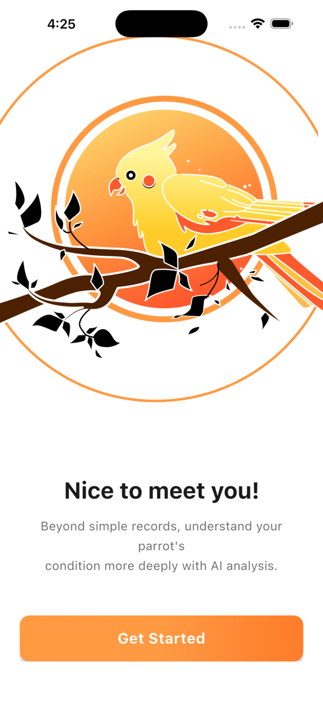
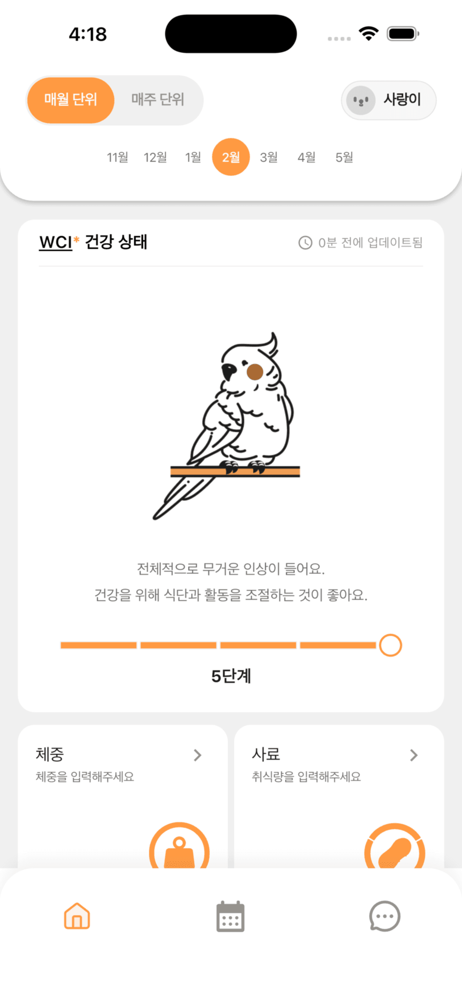

# Perch Care

> AI-powered companion bird health management — track weight, diet, and hydration to generate a real-time Bird Health Index (BHI).

[](https://perch.ai.kr/ko)
[](https://apps.apple.com/us/app/%ED%8D%BC%EC%B9%98%EC%BC%80%EC%96%B4/id6758549078?l=ko)
[](https://flutter.dev)
[](https://fastapi.tiangolo.com)
[](https://www.postgresql.org)

**[Homepage](https://perch.ai.kr/ko)** | **[App Store](https://apps.apple.com/us/app/%ED%8D%BC%EC%B9%98%EC%BC%80%EC%96%B4/id6758549078?l=ko)**

<p align="center">
  
  &nbsp;&nbsp;&nbsp;&nbsp;
  
</p>

## About

Perch Care is a healthcare app for companion bird owners (parrots, cockatiels, etc.). It quantifies health status through a proprietary BHI mathematical model based on daily records, and provides AI-powered health consultations. **Live on the App Store with 250+ registered users.**

## Key Features

| Feature | Description |
|---------|-------------|
| **BHI Health Index** | Proprietary composite score (0–100) combining weight, food, and water data with growth-stage-aware formulas. [View model →](docs/BHI.md) |
| **AI Encyclopedia** | RAG-enhanced OpenAI chatbot for bird health consultations with multi-language support |
| **Weight Tracking** | Multiple daily recordings with weekly/monthly/yearly chart visualization (fl_chart) |
| **Diet & Hydration** | Dual-mode food tracking (serving vs eating) with consumption rate calculation, water intake monitoring |
| **Push Notifications** | FCM-based daily reminders at 5 PM KST targeting users with no records for the day |
| **Multi-language** | Korean, English, Chinese — automatic locale detection with manual override |
| **Analytics** | Firebase Analytics (10 custom events), In-App Review integration |
| **Social Login** | Google Sign-In, Apple Sign-In with JWT token management |

## Architecture

```
┌──────────────────────────────────────────────┐
│                 Flutter App                   │
│                                               │
│   Screens ──→ Services ──→ Models             │
│      │            │                           │
│      │     ┌──────┴──────┐                    │
│      │     │  ApiClient  │  LocalCache        │
│      │     │  (JWT auth) │  (SQLite/SharedPref)│
│      │     └──────┬──────┘                    │
└──────────────────┬───────────────────────────┘
                   │ HTTPS
┌──────────────────▼───────────────────────────┐
│               FastAPI Backend                 │
│                                               │
│   Routers ──→ Services ──→ Models (SQLAlchemy)│
│                   │                           │
│            ┌──────▼──────┐                    │
│            │ PostgreSQL  │                    │
│            └─────────────┘                    │
│                                               │
│   Jobs: Daily reminder cron (FCM)             │
│   AI: OpenAI API + LangChain                 │
└───────────────────────────────────────────────┘
```

**20 Flutter services** with cache-first strategy (5-min TTL, 4-tier fallback) and **26 screens** covering the full user journey from onboarding to health analytics.

## Tech Stack

| Category | Technologies |
|----------|-------------|
| **Frontend** | Flutter 3.8, Dart, Material 3, go_router, fl_chart, sqflite |
| **Backend** | FastAPI, SQLAlchemy, Alembic, PostgreSQL |
| **AI** | OpenAI API, LangChain, RAG |
| **Firebase** | Cloud Messaging (FCM), Analytics, In-App Review |
| **Auth** | JWT (access + refresh), Google Sign-In, Apple Sign-In |
| **Infra** | Docker, Railway, Nginx |
| **Storage** | flutter_secure_storage, SharedPreferences, SQLite (local images & chat) |

## Project Structure

```
perch_care/
├── lib/
│   ├── main.dart
│   └── src/
│       ├── config/          # Environment & app config
│       ├── models/          # Data models (Pet, WeightRecord, BhiResult, ...)
│       ├── router/          # go_router navigation (route names, paths, router)
│       ├── screens/         # 26 screens (splash, login, home, weight, food, ...)
│       ├── services/        # 20 services (auth, pet, bhi, ai, push, analytics, ...)
│       ├── theme/           # Material 3 design system (colors, typography, spacing, ...)
│       └── widgets/         # Reusable components (BottomNavBar, CoachMark, ...)
├── backend/
│   ├── app/
│   │   ├── main.py          # FastAPI entrypoint
│   │   ├── models/          # SQLAlchemy models
│   │   ├── routers/         # API endpoints
│   │   ├── schemas/         # Pydantic schemas
│   │   ├── services/        # Business logic (BHI calculation, AI, push)
│   │   └── jobs/            # Cron jobs (daily reminder)
│   ├── alembic/             # DB migrations
│   └── docker-compose.yml
├── assets/images/           # App resources (SVG, PNG)
└── docs/                    # Documentation (BHI model, dev logs, plans)
```

## Getting Started

### Flutter App

```bash
flutter pub get
cp .env.example .env    # Set API_BASE_URL
flutter run
```

### Backend

```bash
cd backend
cp .env.example .env    # Set DATABASE_URL, JWT_SECRET, OPENAI_API_KEY
docker compose up -d
```

### OAuth Setup

| Provider | Configuration |
|----------|--------------|
| Google | Google Cloud Console → OAuth Client |
| Apple | Apple Developer → Sign in with Apple |

## License

Private project — All rights reserved.
