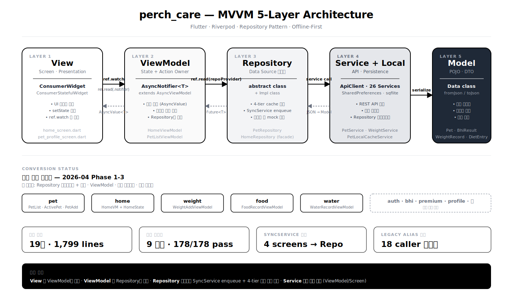

<p align="center">
  <a href="https://perch.ai.kr/ko"></a>
</p>

<h3 align="center">
  <a href="https://perch.ai.kr/ko">perch.ai.kr →</a>
</h3>

<p align="center">
  <b>AI-powered health companion for pet birds.</b><br/>
  <sub>Track weight · food · water → get a 0–100 Bird Health Index → ask an AI vet in Korean / English / 中文.</sub>
</p>

<p align="center">
  <b>우리 새의 건강을 숫자로, AI로, 매일의 기록으로.</b><br/>
  <sub>체중 · 식사 · 음수량을 기록하면 Bird Health Index가 건강 상태를 알려줍니다.</sub>
</p>

<!-- Project / Meta -->
<p align="center">
  <a href="https://perch.ai.kr/ko"></a>
  <a href="https://apps.apple.com/br/app/%ED%8D%BC%EC%B9%98%EC%BC%80%EC%96%B4/id6758549078"></a>
  
  <a href="LICENSE"></a>
</p>

<!-- Client -->
<p align="center">
  
  
  
  
</p>

<!-- Backend -->
<p align="center">
  
  
  
  
</p>

<!-- AI & Infra -->
<p align="center">
  
  
  
  
  
</p>

<br/>

## 📸 Screenshots

<table align="center">
  <tr>
    <td align="center" width="25%">
      <br/>
      <sub><b>Onboarding</b><br/>펫 등록 & 초기 설정</sub>
    </td>
    <td align="center" width="25%">
      <br/>
      <sub><b>Bird Health Index</b><br/>0-100 건강 점수</sub>
    </td>
    <td align="center" width="25%">
      <br/>
      <sub><b>Weight Tracking</b><br/>주·월·연간 추이 차트</sub>
    </td>
    <td align="center" width="25%">
      <br/>
      <sub><b>AI Chatbot</b><br/>RAG 기반 건강 상담</sub>
    </td>
  </tr>
</table>

<p align="center">
  <br/>
  <sub><b>AI Health Check</b> — 사진 한 장으로 전신·부위·배설물·먹이 안전성 4가지를 분석</sub>
</p>

<br/>

## 📋 Table of Contents

- [Features](#-features)
- [Architecture](#-architecture)
- [MVVM Architecture](#-mvvm-architecture)
- [Network & Communication Pipeline](#-network--communication-pipeline)
- [AI / RAG Engine](#-ai--rag-engine)
- [Premium Quota Model](#-premium-quota-model)
- [Tech Stack](#-tech-stack)
- [Project Structure](#-project-structure)
- [Getting Started](#-getting-started)
- [Development](#-development)
- [Documentation](#-documentation)
- [Download](#-download)
- [License](#-license)

<br/>

## ✨ Features

### 🏥 Health Tracking
- **Bird Health Index (BHI)** — 체중(60%) · 식사(25%) · 음수(15%)를 조합한 0-100 건강 점수. 성장 단계별 수식을 적용해 성조·유조를 구분합니다. [모델 상세 →](docs/BHI.md)
- **체중 기록 & 차트** — 하루에 여러 번 기록, 주·월·연간 차트를 `fl_chart`로 시각화
- **식사 & 음수 기록** — 급여량과 섭취량을 분리 기록, 섭취율 자동 계산

### 🤖 AI-Powered
- **AI 건강 상담** — OpenAI 기반 RAG 챗봇, SSE 스트리밍으로 실시간 응답. 한국어 · English · 中文 지원
- **AI 건강 검진** — GPT-4V로 사진 분석 (전신 · 부위 · 배설물 · 먹이 안전성)
- **AI 백과사전** — 30+ 종 프로필 + 50+ 질병 지식베이스, pgvector로 유사도 검색

### 🔔 Engagement
- **FCM 푸시** — 매일 17:00, 오늘 기록이 없는 사용자에게 알림
- **다국어** — `flutter_localizations`로 ko / en / zh 자동 전환 (기기 로케일 기반)
- **Coachmarks** — 첫 실행 시 핵심 기능 온보딩 가이드

### 💎 Premium
- **Monthly Quota 모델** — 무료 사용자도 월간 기본 수량 사용 가능, 초과 시 안내
- **In-App Purchase** — App Store / Play Store 결제 연동 (`in_app_purchase: ^3.2.0`)

### 📱 Offline-First
- **Sync Queue** — 서버 전송 실패 시 로컬 큐에 저장, 앱 재시작 시 자동 재전송
- **4-tier Cache** — 메모리(5분 TTL) → SharedPreferences → SQLite → Remote API fallback

<br/>

## 🏗 Architecture

```
Flutter App — MVVM 5-layer + Riverpod DI
  ├── View       (Screens, ConsumerWidget)         ← Presentation
  ├── ViewModel  (AsyncNotifier<T>, state + action) ← State owner
  ├── Repository (abstract + impl)                 ← Data source 추상화
  ├── Services (26)                                ← API 호출 · 비즈니스 로직
  └── ApiClient                                    ← Network (4-tier cache-first)
         │ HTTPS + JWT
         ▼
FastAPI Backend (Railway)
  ├── Routers                ← HTTP endpoints
  ├── Services               ← Business logic
  ├── SQLAlchemy / Alembic   ← ORM + migrations
  ├── RAG pipeline           ← OpenAI embedding + pgvector retrieval
  └── FCM cron               ← Daily reminder (17:00 KST)
         │
         ▼
   PostgreSQL + pgvector
```

**Design principles**: MVVM layered architecture · Repository pattern · Cache-first 네트워크 · Offline-first 쓰기 (큐 보장) · freemium 쿼터 우선 UX.

<br/>

## 🧱 MVVM Architecture

2026-04 기준 표준 **MVVM 5-layer** 아키텍처를 점진적으로 도입 중이며, 핵심 도메인(pet · home · weight · food · water)은 전환 완료. 상세 리팩터링 기록은 [`2026-04-18-mvvm-architecture-adoption.md`](docs/development-logs/2026-04-18-mvvm-architecture-adoption.md) 참조.

<p align="center">
  
</p>

### 레이어 계약

```
View (Screen: ConsumerWidget)
  ↓ ref.watch(xxxViewModelProvider)     — state 구독
  ↓ ref.read(xxx.notifier).action()     — 사용자 액션
ViewModel (AsyncNotifier<T>)
  ↓ ref.read(xxxRepositoryProvider)     — 데이터 의존
Repository (abstract + impl)
  ├── Service (REST API, 기존 26개 유지)
  └── LocalDataSource (SharedPreferences / SQLite)
        ↓
     Model (POJO)
```

- **View**: UI만. `setState` 금지, ViewModel state를 `ref.watch`로 구독.
- **ViewModel**: 상태 소유 + 액션 노출. **Repository 인터페이스만 의존** (Service 직접 호출 금지).
- **Repository**: 데이터 소스 추상화. SyncService enqueue · 4-tier 캐시 폴백 등 데이터 정책 캡슐화.
- **Service / LocalDataSource**: 원본 API · 영속화. Repository 안에서만 호출.

### 전환 현황

| 도메인 | 상태 | Repository | ViewModel |
|---|---|---|---|
| **pet** | ✅ 완료 | `PetRepository` | `PetListViewModel` · `ActivePetViewModel` · `PetAddViewModel` |
| **home** | ✅ 완료 | `HomeRepository` (aggregated facade) + `HomeState` | `HomeViewModel` |
| **weight** | ✅ 완료 | `WeightRepository` | `WeightAddViewModel` |
| **food** | ✅ 완료 | `FoodRepository` | `FoodRecordViewModel` |
| **water** | ✅ 완료 | `WaterRepository` | `WaterRecordViewModel` |
| 그 외 (auth · bhi · health_check · ai_encyclopedia · premium · profile) | 🚧 점진 전환 | — | — |

### 핵심 패턴

- **`AsyncViewModel<T>` base** ([lib/src/view_models/base/async_view_model.dart](lib/src/view_models/base/async_view_model.dart)) — `runLoad(loader)` 헬퍼로 `AsyncLoading.copyWithPrevious + AsyncValue.guard` 보일러플레이트 제거.
- **SyncService 책임 이관** — 기존 4개 Screen에 흩어져 있던 `SyncService.enqueue()` 직접 호출을 Repository 내부로 전부 이관. Weight는 fire-and-forget, Food/Water는 `SaveOutcome { online, offline }` 반환으로 UI가 스낵바 분기.
- **Legacy provider alias** — 기존 `activePetProvider` / `petListProvider` 이름을 새 ViewModel provider의 alias로 유지 → 18개 caller 무변경 호환.
- **State mirroring** — 1500 lines의 거대한 화면(`home_screen.dart`)은 UI 위젯 재작성 없이 ViewModel state를 build 시점에 인스턴스 필드로 mirror.

### 테스트 전략

```dart
// Repository만 mock하면 순수 Dart 단위 테스트 가능
final container = ProviderContainer(overrides: [
  petRepositoryProvider.overrideWithValue(MockPetRepository()),
]);
final pets = await container.read(petListViewModelProvider.future);
```

ViewModel 단위 테스트 9개 작성 (Pet 3 · Home 4 · Weight 2). 전체 `flutter test`: **178/178 pass**.

<br/>

## 🔗 Network & Communication Pipeline

클라이언트-서버 간 5가지 핵심 통신 흐름.

### 7.1 Authentication (JWT + OAuth + Deep Link)

```
Client                  Backend                 OAuth Provider
  │  POST /auth/login                                  │
  ├─────────────────────▶                              │
  │                      │  (OAuth only)               │
  │                      ├────────────────────────────▶│
  │                      │◀─── authorization code ─────┤
  │◀── access + refresh token ──┤                      │
  │   flutter_secure_storage    │                      │
  │                             │                      │
  │  (이후 요청) Authorization: Bearer <jwt>            │
  │  ◀─── 401 감지 → refresh 자동 갱신 → 재시도 ────────│
```

- **Storage**: `flutter_secure_storage` (iOS Keychain / Android Keystore)
- **OAuth providers**: Google · Apple · Kakao
- **Deep link**: `perchcare://auth-callback` (iOS `Info.plist`, Android `AndroidManifest.xml`)
- **Token refresh**: `ApiClient` 인터셉터에서 401 감지 → refresh token 재발급 → 원 요청 재시도

### 7.2 API Communication (4-tier cache-first fallback)

```
UI request
  ├─▶ [1] Memory cache (5min TTL)     HIT → return
  ├─▶ [2] SharedPreferences           HIT → return + warm memory
  ├─▶ [3] SQLite (sqflite)            HIT → return + warm upper layers
  └─▶ [4] Remote API (FastAPI)        HIT → persist all 3 layers, return
                                      FAIL (write op) → SyncService.enqueue()
```

네트워크 실패 시 쓰기 요청은 자동으로 오프라인 큐에 적재 (§7.5 참조).

### 7.3 AI Chatbot (RAG Streaming)

```
User message
  └─▶ Flutter chat_screen
       └─▶ POST /chat/stream  (SSE)
            ├─ embed(query)  via text-embedding-3-large
            ├─ pgvector similarity search (top-k chunks)
            ├─ prompt = system + retrieved + history + user
            ├─ OpenAI (primary) / DeepSeek (fallback)
            └─ stream tokens → SSE events
  ◀── Flutter: append chunks to message bubble (실시간 렌더)
```

- **Streaming**: Server-Sent Events (SSE) — 토큰 단위 전송
- **Model routing**: OpenAI 우선, 장애/비용 상황에 DeepSeek fallback

### 7.4 Push Notification (FCM Daily Reminder)

```
App start
  └─▶ firebase_messaging.getToken()
       └─▶ POST /fcm/register  (서버에 토큰 저장)

Backend cron (매일 17:00 KST)
  ├─ query users with no record today
  ├─ send FCM to device tokens
  └─ user taps notification
       └─▶ deep link → 기록 화면 진입
```

### 7.5 Offline Sync Queue

```
Write request (food / water / weight)
  ├─ try POST → success → done
  └─ fail    → SyncService.enqueue(SyncItem)
                └─ SharedPreferences 'sync_queue'

App next start / resume
  └─ SyncService.processQueue()
       ├─ 큐 순회 (세션당 최대 5회 retry)
       ├─ success → item 삭제
       └─ fail    → item 보존 (다음 세션 재시도)

최초 1회 (펫별):
  └─ syncLocalRecordsIfNeeded(petId) — 오프라인 누적분 일괄 업로드
```

- **Queue key**: `sync_queue` (SharedPreferences StringList)
- **Retry budget**: 세션당 5회, 실패해도 삭제하지 않음
- **Initial sync flag**: `sync_initial_done_{petId}` (펫별 1회 전체 업로드)

<br/>

## 🧠 AI / RAG Engine

| 구성요소 | 기술 |
|---|---|
| **Embedding** | `text-embedding-3-large` (OpenAI) |
| **Vector store** | PostgreSQL + pgvector 익스텐션 |
| **Knowledge base** | `knowledge/` (한/영) + `knowledge-zh/` (中) — 30+ 종 · 50+ 질병 |
| **Breed standard** | 품종별 건강 기준 (무게 · 수명 · 질병 취약성) |
| **Model routing** | OpenAI primary → DeepSeek fallback |
| **Streaming** | SSE 토큰 단위 전송 |
| **Vision** | GPT-4V — 전신 · 부위 · 배설물 · 먹이 안전성 4개 분석 |

Bird Health Index 수식과 임계값은 [`docs/BHI.md`](docs/BHI.md) 참조.

<br/>

## 💎 Premium Quota Model

### 배경 (App Store 3.1.1 피벗)

> 초기에는 "premium upgrade" 게이팅 모델이었으나 **App Store 3.1.1 리젝 대응**으로 "월간 한도" UX로 전환. 무료 사용자도 기본 수량 사용 가능, 초과 시 다국어 안내 메시지를 표시.

### 구현

- **쿼터 모델**: `EncyclopediaQuota`, `VisionQuota` — 월별 사용량/한도 추적
- **무제한 표시**: `monthlyLimit == -1` 이면 unlimited
- **결제**: `PremiumService` + `IAPService` (`in_app_purchase: ^3.2.0`)
- **현재 상태**: **restore-only 모드** (심사 대응 기간)
- **한도 도달 메시지**: `premium_healthCheckBlocked` ("이번 달 사용 한도에 도달했어요")
- **UI**: [`lib/src/widgets/quota_badge.dart`](lib/src/widgets/quota_badge.dart) — 업그레이드 CTA 제거, 현재 사용량만 표시

<br/>

## 🛠 Tech Stack

| Layer | Technology |
|---|---|
| **Frontend** | Flutter `^3.8.1` · Dart · Material 3 · Riverpod 2.6 · go_router 14.6 · fl_chart · sqflite |
| **Backend** | FastAPI · SQLAlchemy · Alembic · PostgreSQL + pgvector |
| **AI** | OpenAI (GPT + embeddings + Vision) · DeepSeek (fallback) · LangChain · pgvector RAG |
| **Auth** | JWT (access + refresh) · Google / Apple / Kakao OAuth · `flutter_secure_storage` |
| **Storage** | `flutter_secure_storage` (tokens) · `shared_preferences` (sync queue, cache) · `sqflite` (local DB) |
| **Payment** | `in_app_purchase: ^3.2.0` (App Store / Play Store) |
| **Infra** | Docker · Railway · Firebase (FCM + Analytics) |

<br/>

## 📂 Project Structure

```
perch_care/
├── lib/src/
│   ├── config/         환경 변수 (.env) + 앱 설정
│   ├── models/         데이터 모델 (Pet · WeightRecord · DailyRecord …)
│   ├── router/         go_router (app_router · route_names · route_paths)
│   ├── screens/        21개 도메인 화면 (auth · home · pet · weight · food · water · ai_* · premium · …)
│   ├── view_models/    MVVM ViewModel (base · pet · home · weight · food · water) ← Phase 1-3 (2026-04)
│   ├── repositories/   Repository 추상화 + 구현 (pet · home · weight · food · water + SaveOutcome)
│   ├── services/       26개 서비스 (auth · api · sync · premium · ai · chat · bhi · breed · fcm · …)
│   ├── providers/      Riverpod DI (service · auth · pet · premium · locale · bhi · repository)
│   ├── theme/          Material 3 (colors · typography · spacing · shadows · icons)
│   └── widgets/        재사용 컴포넌트 (quota_badge · charts · …)
│
├── test/
│   ├── view_models/    ViewModel 단위 테스트 (Mock Repository)
│   ├── services/       Service 단위 테스트 (sync · weight)
│   ├── features/       화면/피쳐 통합 테스트
│   └── models/         모델 직렬화 테스트
│
├── backend/app/
│   ├── routers/        HTTP 엔드포인트
│   ├── services/       비즈니스 로직 + RAG 파이프라인
│   ├── models/         SQLAlchemy 모델
│   ├── jobs/           FCM 크론 (daily reminder)
│   └── alembic/        DB 마이그레이션
│
├── knowledge/          RAG 지식베이스 (한/영)
├── knowledge-zh/       RAG 지식베이스 (中)
├── docs/               BHI · 분석 리포트 · 개발 로그 · 기획 문서
└── assets/             이미지 · 로고 · 온보딩 벡터
```

<br/>

## 🚀 Getting Started

### Frontend (Flutter)

```bash
flutter pub get
cp .env.example .env        # API_BASE_URL 설정
flutter run
```

필수 환경변수: `API_BASE_URL` (예: `https://perchcare-production.up.railway.app/api/v1`)

### Backend (FastAPI)

```bash
cd backend
cp .env.example .env
docker compose up -d
```

필수 환경변수: `DATABASE_URL` · `JWT_SECRET` · `OPENAI_API_KEY` · `GOOGLE_CLIENT_ID` · `APPLE_CLIENT_ID` · `KAKAO_CLIENT_ID` / `KAKAO_CLIENT_SECRET` · SMTP · Apple IAP · Google IAP

### OAuth 설정

| Provider | Setup |
|---|---|
| Google | [Google Cloud Console](https://console.cloud.google.com) — OAuth 동의 화면 + 클라이언트 ID |
| Apple | [Apple Developer](https://developer.apple.com) — Sign in with Apple capability |
| Kakao | [Kakao Developers](https://developers.kakao.com) — 네이티브 앱 키 |

### Deep Link 설정

- **iOS**: `ios/Runner/Info.plist` — URL scheme `perchcare`
- **macOS**: `macos/Runner/Info.plist` — URL scheme `perchcare`
- **Android**: `android/app/src/main/AndroidManifest.xml` — intent filter `perchcare://auth-callback`

<br/>

## 🧪 Development

```bash
flutter analyze            # 정적 분석
flutter test               # 테스트
flutter build apk          # Android 빌드
flutter build ios          # iOS 빌드 (macOS 필요)
flutter build macos        # macOS 빌드
flutter clean              # 캐시 초기화
```

<br/>

## 📚 Documentation

| 문서 | 내용 |
|---|---|
| [`docs/BHI.md`](docs/BHI.md) | Bird Health Index 수식 (체중·식사·음수 가중치, 성장 단계별 수식, 5-tier 레벨) |
| [`docs/project-analysis-report.md`](docs/project-analysis-report.md) | 전체 프로젝트 분석 리포트 (모델·서비스·라우터·화면·데이터 스키마) |
| [`docs/development-logs/2026-04-18-mvvm-architecture-adoption.md`](docs/development-logs/2026-04-18-mvvm-architecture-adoption.md) | **MVVM 5-layer 도입** — 설계 결정, 레이어 계약, 리팩터링 패턴, 테스트 전략 |
| [`docs/development-logs/`](docs/development-logs/) | 60+ 개발 로그 (성능 최적화, RAG 업그레이드, App Store 3.1.1 대응, MVVM 전환 등) |
| [`docs/plans/`](docs/plans/) | 기획 문서 (AI 업그레이드 최종 설계, Monetization PRD, GraphRAG 평가) |
| [`CLAUDE.md`](CLAUDE.md) | Claude Code 작업 가이드 (아키텍처·컨벤션·커맨드) |
| [`LICENSE`](LICENSE) | Proprietary 라이선스 (Perch 독점 소유, 소스 열람만 허용) |

<br/>

## 📱 Download

<p align="center">
  <a href="https://apps.apple.com/br/app/%ED%8D%BC%EC%B9%98%EC%BC%80%EC%96%B4/id6758549078">
    
  </a>
</p>

<p align="center">
  <sub>Google Play: 출시 준비 중</sub>
</p>

<br/>

## 📜 License

<p align="center">
  <a href="LICENSE"></a>
  <a href="LICENSE"></a>
  <a href="LICENSE"></a>
</p>

이 프로젝트는 **Perch의 독점 소유 소프트웨어(Proprietary Software)** 입니다.

| 허용 | 금지 |
|---|---|
| ✅ 소스 코드 열람 | ❌ 상업적 사용 |
| ✅ 개인 학습 목적 fork | ❌ 복제·수정·재배포 |
| ✅ 참고·평가용 검토 | ❌ 서비스 호스팅·운영 |
|  | ❌ Perch 상표·로고 사용 |

전체 조항은 [`LICENSE`](LICENSE) 파일을 참조하세요. 라이선스 문의: [perch.ai.kr](https://perch.ai.kr)

---

<p align="center">
  <sub>© 2025-2026 Perch. All rights reserved. · Made with 💛 for companion birds.</sub>
</p>
