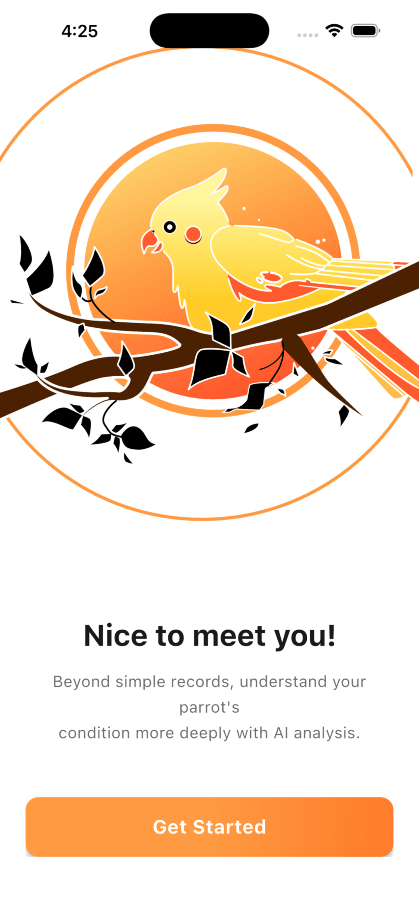
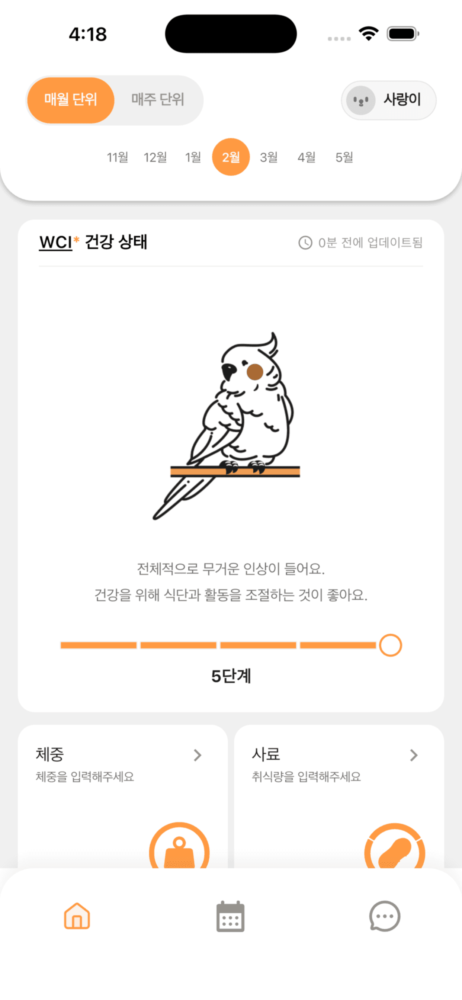

<p align="center">
  
</p>

<h1 align="center">Perch Care</h1>

<p align="center">
  <b>우리 새의 건강을 숫자로, AI로, 매일의 기록으로.</b><br/>
  체중 · 식사 · 음수량을 기록하면 Bird Health Index가 건강 상태를 알려줍니다.
</p>

<p align="center">
  <a href="https://perch.ai.kr/ko"></a>
  <a href="https://apps.apple.com/us/app/%ED%8D%BC%EC%B9%98%EC%BC%80%EC%96%B4/id6758549078?l=ko"></a>
  <a href="https://flutter.dev"></a>
</p>

<br/>

<p align="center">
  
  &nbsp;&nbsp;&nbsp;&nbsp;&nbsp;
  
</p>

<br/>

## Features

**Bird Health Index** — 체중(60%) · 식사(25%) · 음수(15%)를 조합한 건강 점수(0-100)를 산출합니다. 성장 단계별로 다른 수식을 적용해 성조와 유조를 구분합니다. [모델 상세 →](docs/BHI.md)

**AI 건강 상담** — OpenAI 기반 RAG 챗봇이 반려조 건강에 대한 질문에 답합니다. 한국어, 영어, 중국어를 지원합니다.

**체중 기록 & 차트** — 하루에 여러 번 체중을 기록하고, 주간 · 월간 · 연간 추이를 차트로 확인합니다.

**식사 & 음수 기록** — 급여량과 섭취량을 구분해 기록하고, 섭취율을 계산합니다.

**푸시 알림** — 오후 5시, 오늘 기록이 없는 사용자에게 FCM 알림을 보냅니다.

**다국어** — 한국어 · English · 中文, 기기 언어에 맞춰 자동 전환됩니다.

<br/>

## Architecture

```
Flutter App
  Screens → Services → Models
                │
          ┌─────┴─────┐
          │  ApiClient │  LocalCache
          │  (JWT)     │  (SQLite / SharedPref)
          └─────┬─────┘
                │ HTTPS
FastAPI Backend
  Routers → Services → SQLAlchemy Models → PostgreSQL
                │
          OpenAI + LangChain (RAG)
          FCM Daily Reminder Cron
```

20개 서비스가 cache-first 전략(5분 TTL, 4단계 fallback)으로 동작하며, 26개 화면이 온보딩부터 건강 분석까지 전체 사용자 여정을 커버합니다.

<br/>

## Tech Stack

| | |
|---|---|
| **Frontend** | Flutter 3.8 · Dart · Material 3 · go_router · fl_chart · sqflite |
| **Backend** | FastAPI · SQLAlchemy · Alembic · PostgreSQL |
| **AI** | OpenAI API · LangChain · RAG |
| **Auth** | JWT (access + refresh) · Google Sign-In · Apple Sign-In |
| **Infra** | Docker · Railway · FCM · Firebase Analytics |

<br/>

## Getting Started

```bash
# Flutter
flutter pub get
cp .env.example .env       # API_BASE_URL 설정
flutter run

# Backend
cd backend
cp .env.example .env       # DATABASE_URL, JWT_SECRET, OPENAI_API_KEY 설정
docker compose up -d
```

OAuth 설정은 [Google Cloud Console](https://console.cloud.google.com)(Google)과 [Apple Developer](https://developer.apple.com)(Apple Sign-In)에서 진행합니다.

<br/>

## Project Structure

```
lib/src/
  ├── config/       환경 설정
  ├── models/       데이터 모델
  ├── router/       go_router 네비게이션
  ├── screens/      26개 화면
  ├── services/     20개 서비스
  ├── theme/        Material 3 디자인 시스템
  └── widgets/      재사용 컴포넌트

backend/app/
  ├── routers/      API 엔드포인트
  ├── services/     비즈니스 로직
  ├── models/       SQLAlchemy 모델
  └── jobs/         크론 작업
```

<br/>

---

<p align="center">
  <sub>Private project — All rights reserved.</sub>
</p>
