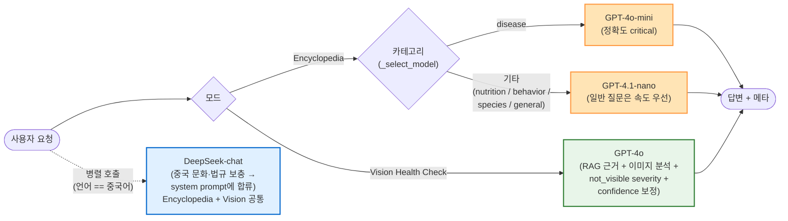
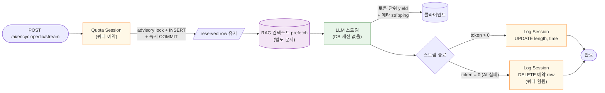
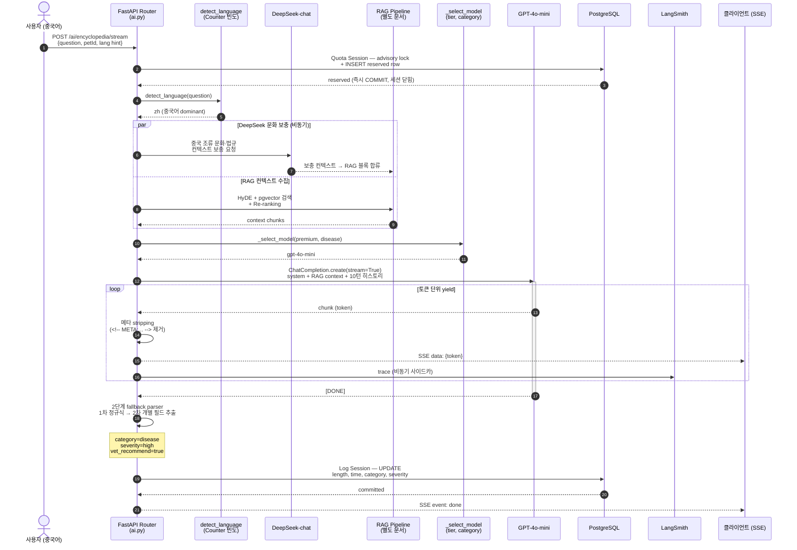
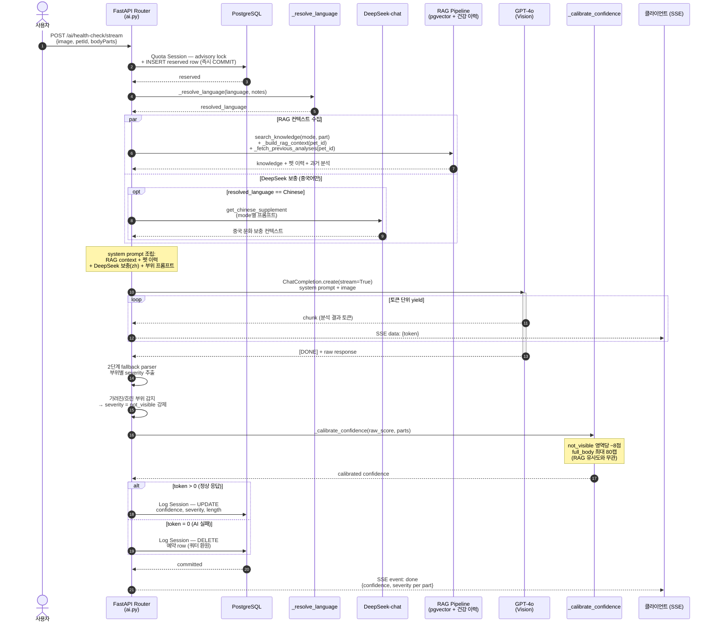

# Hybrid LLM Pipeline

> 챗봇(앵박사)과 비전(Health Check) 서비스의 **LLM 라우팅 · SSE 응답 · 세션 분리**. RAG 컨텍스트 수집 파이프라인은 [rag-pipeline.md](rag-pipeline.md)에서 별도로 다룬다.
>
> **갱신** — 2026-05-14

## Key Contributions

**설명**
하이브리드 LLM 구조: 중국 조류 문화·법규 표현 보충은 **DeepSeek**이 담당하고, 메인 추론·요약은 **GPT 계열**이 처리한다. 카테고리별 모델 라우팅·SSE 토큰 스트리밍·LangSmith 트레이싱을 묶어 production-grade 다국어 AI 어시스턴트(앵박사)를 구축했다. 사용자는 중국어로 물어도 자연스럽고 문화적으로 정합한 답을, 질병 질문에는 더 정확한 모델의 답을, 일상 질문에는 빠르고 저렴한 모델의 답을 받는다.

**사용 기술 스택**
OpenAI **GPT-4o-mini / GPT-4.1-nano / GPT-4o**, **DeepSeek-chat**, **LangSmith** 트레이싱, **FastAPI SSE**, async/await + 다중 DB 세션 분리.

**트러블슈팅**

*문제*: 초기 단일 LLM(GPT-only) 구조는 영어·한국어 학습 비중이 높아 중국 시장향 사용자에게 정확도와 문화적 자연스러움이 떨어졌고, 모든 질문에 동일 모델을 쓰는 구조라 질병처럼 정확도가 critical한 도메인과 일반 질문 사이의 비용·품질 트레이드오프를 조정할 수 없었다. 응답 메타데이터(`<!-- META:category=...|severity=...|vet=... -->`) 파싱이 단일 정규식에 의존해 형식이 조금만 달라져도 카테고리·심각도 정보가 null로 떨어졌다. SSE 스트림 응답 도중에는 DB 세션을 잡은 채로 토큰을 흘려보내고 있어, 응답이 길어지면 connection pool이 고갈될 위험도 있었다. 비전(Health Check) 쪽도 흐릿하거나 부위가 가려진 이미지를 정상이라고 답하면서 높은 confidence를 함께 돌려주는 환각 문제가 있었다.

*해결법*: 하이브리드 라우팅으로 분기했다. 언어 감지를 단순 문자 범위 체크에서 `Counter` 빈도 기반 분류로 바꿔 혼합 언어 오탐을 줄이고, 중국어가 가장 많은 입력이면 비동기로 DeepSeek-chat에 중국 조류 문화·법규 컨텍스트 보충을 요청해 RAG 블록에 합류시켰다. 카테고리별 모델 라우팅도 도입해 `_select_model(tier, category)`에서 disease는 더 정확한 gpt-4o-mini로, 일반 질문은 속도가 빠른 gpt-4.1-nano로, 비전 분석은 gpt-4o로 분기했다. SSE 흐름은 Quota / Log 두 DB 세션으로 분리해 LLM 스트림 진행 중에는 DB 커넥션을 점유하지 않도록 했다.

*정합성 개선*: 메타데이터 파싱은 1차 정규식 → 2차 `<!-- ... -->` 블록 내 개별 필드 추출의 2단계 fallback parser로 강화해 형식 변동에도 견디게 했다. 컨텍스트 오버플로우는 최근 10턴 슬라이딩 윈도우 + 트림 알림 시스템 노트로 대처했고, 비전 쪽은 보이지 않는 부위에 `not_visible` severity를 강제하고 `_calibrate_confidence()`로 자체 보고 confidence를 보정(not_visible 영역당 -8점, full_body 80캡)해 거짓 음성과 과대 신뢰도를 동시에 차단했다.

---

## 1. 모델 라우팅 결정 트리

질문 카테고리·tier·언어·모드에 따라 어떤 LLM 조합을 호출할지 결정.

## 2. SSE 응답 + DB 세션 분리

LLM 응답이 길어져도 DB connection pool이 고갈되지 않도록 짧은 세션으로 분리. RAG 컨텍스트 prefetch는 [rag-pipeline.md](rag-pipeline.md) 참조.

## 3. Encyclopedia 전체 흐름 — 중국어 Premium 사용자 (시퀀스)

중국어 Premium 사용자가 질병 질문을 보냈을 때의 end-to-end 시퀀스. DeepSeek 병렬 호출 · Quota/Log 세션 분리 · 메타 stripping이 한 흐름에서 어떻게 맞물리는지 보여준다.

### 3-B. 전체 파이프라인 기능별 구조 (통합 Flowchart)

```mermaid
flowchart LR
    subgraph INPUT["사용자 입력"]
        U(["사용자 요청"])
    end

    subgraph MODE["모드 분기"]
        U --> ModeDet{"모드"}
        ModeDet -- "질문 (텍스트)" --> ENC["Encyclopedia"]
        ModeDet -- "이미지 업로드" --> VIS["Vision Health Check"]
    end

    subgraph LANG["언어 감지 (Encyclopedia)"]
        ENC --> Det{"Counter 빈도 분류"}
        Det -- "zh dominant" --> ZH["중국어"]
        Det -- "ko / en" --> OTHER["한국어 · 영어"]
    end

    subgraph CONTEXT["컨텍스트 수집"]
        ZH -- "premium" --> DS["DeepSeek-chat<br/>문화·법규 보충"]
        ZH --> RAG1["RAG<br/>HyDE + pgvector"]
        OTHER --> RAG2["RAG<br/>HyDE + pgvector"]
        DS --> MRG[/"합류"/]
        RAG1 --> MRG
        RAG2 --> MRG
    end

    subgraph VPREP["Vision 전처리"]
        VIS --> VLang{"언어 감지"}
        VLang -- "zh" --> VDS["DeepSeek-chat<br/>중국 문화 보충<br/>(mode별 프롬프트)"]
        VLang --> VRAG["RAG<br/>search_knowledge +<br/>펫 건강 이력 + 과거 분석"]
        VDS --> VMRG[/"합류"/]
        VRAG --> VMRG
        VLang -- "ko / en" --> VRAG
    end

    subgraph MODEL["모델 라우팅 · _select_model()"]
        MRG --> Route{"카테고리"}
        Route -- "disease" --> M1["GPT-4o-mini<br/>정확도 우선"]
        Route -- "nutrition / behavior /<br/>species / general" --> M2["GPT-4.1-nano<br/>속도·비용 우선"]
        VMRG --> M3["GPT-4o Vision<br/>RAG + 이미지 분석"]
    end

    subgraph DELIVER["SSE 응답 전달"]
        M1 --> SSE["SSE 토큰 스트림<br/>(DB 세션 없음)"]
        M2 --> SSE
        M3 --> SSE
        SSE --> Strip["메타 stripping<br/>클라이언트에 태그 비공개"]
        SSE --> LS["LangSmith trace<br/>(비동기)"]
        Strip --> Client(["클라이언트"])
    end

    subgraph POST["후처리"]
        SSE --> Parse["2단계 fallback parser"]
        Parse --> EncPost["category · severity<br/>· vet_recommend 추출"]
        Parse --> VisPost{"가려진/흐린 부위?"}
        VisPost -- "Yes" --> Force["not_visible 강제"]
        VisPost -- "No" --> Cal
        Force --> Cal["_calibrate_confidence()<br/>영역당 −8점 · full_body 80캡"]
    end

    subgraph DB["DB 세션 분리"]
        direction TB
        Q["Quota Session<br/>advisory lock → 즉시 COMMIT"] -.-> SSE
        EncPost --> Log{"token > 0?"}
        Cal --> Log
        Log -- "Yes" --> L1["Log Session · UPDATE"]
        Log -- "No" --> L2["Log Session · DELETE<br/>쿼터 환원"]
    end

    classDef gpt fill:#FFE4B5,stroke:#FF9A42,stroke-width:2px
    classDef deepseek fill:#E0F0FF,stroke:#0066CC,stroke-width:2px
    classDef vision fill:#E8F5E9,stroke:#2E7D32,stroke-width:2px
    classDef session fill:#FFF8E7,stroke:#FF9A42
    classDef stream fill:#E8F5E9,stroke:#2E7D32
    classDef trace fill:#F3E5F5,stroke:#7B1FA2
    classDef alert fill:#FFEBEE,stroke:#C62828,stroke-width:2px
    class M1,M2 gpt
    class DS deepseek
    class M3 vision
    class Q,L1,L2 session
    class SSE,Strip stream
    class LS,RAG1,RAG2,VRAG trace
    class VDS deepseek
    class Force,VisPost alert
```

## 4. Vision Health Check 흐름 — confidence 보정 (시퀀스)

이미지 기반 건강 검진에서 `not_visible` severity 강제와 `_calibrate_confidence()` 보정이 환각을 차단하는 흐름.

---

## 핵심 메시지

- **하이브리드 라우팅**: 중국어 + Premium → DeepSeek 보충(병렬), 메인 추론은 GPT, disease는 mini로 정확하게, 일반은 nano로 빠르게, 비전은 gpt-4o로
- **SSE 안전성**: Quota / Log 세션 분리 + advisory lock 즉시 COMMIT으로 응답이 길어도 DB 커넥션 점유 X
- **거짓 정보 방지**: 메타 stripping으로 내부 분류 태그는 클라에 비공개, AI가 토큰 0개로 끝나면 예약 row를 삭제해 쿼터 환원
- **비전 환각 차단**: `not_visible` severity + confidence 보정으로 안 보이는 부위에 대한 정상 판정 차단

## 참고 문서

- [rag-pipeline.md](rag-pipeline.md) — HyDE + pgvector + Re-ranking + KB 모니터링
- [quota-system.md](quota-system.md) — 쿼터 예약 패턴 상세
- [sequence-diagrams.md](sequence-diagrams.md) 섹션 8.1 / 8.2 — SSE 시퀀스

**핵심 코드**: `backend/app/services/ai_service.py`, `backend/app/routers/ai.py`
