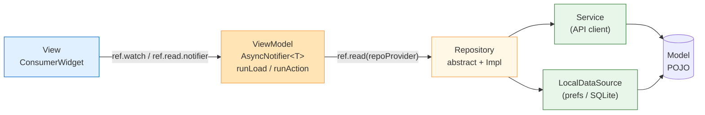
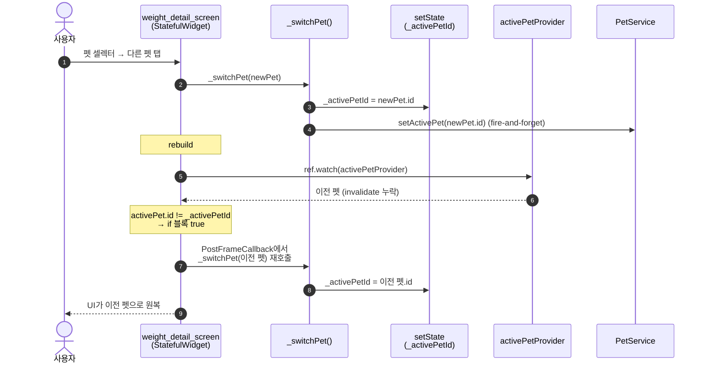
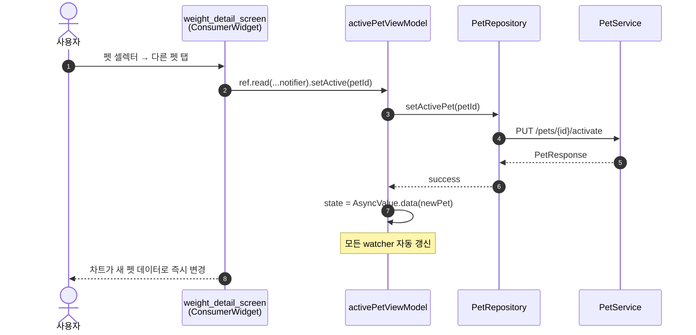

# MVVM 5-Layer Migration

> Riverpod 기반 "부분 MVVM"(Provider + Service 싱글턴 직접 호출 혼재)에서 표준 MVVM 5-layer 구조로의 점진 승격. 핵심 도메인(pet / home / weight / food / water) 우선 전환 완료.
>
> **갱신** — 2026-05-14

## Key Contributions

**설명**
ViewModel ↔ Repository 계층 격리로 View가 Service 싱글턴을 직접 호출하지 않는 표준 MVVM 구조로 전환했다. 마이그레이션을 진행한 이유는 다음 다섯 가지다.

1. **테스트 용이성** — ViewModel은 Repository만 mock하면 순수 단위 테스트 가능. Service 싱글턴 mocking이 까다로웠던 이전 구조 대비 명확한 개선.
2. **레이어 격리** — ViewModel이 Repository에만 의존하므로 백엔드 API 변경이 View에 직접 전파되지 않는다.
3. **연관 데이터 자동 갱신** — 저장/삭제 성공 시 `ref.invalidate(relatedViewModelProvider)` 한 줄로 모든 watcher 동기화.
4. **오프라인 큐 통합** — Repository 내부에서 `SyncService` 자동 처리. Screen 코드에서 `SyncService.instance.enqueue()` 직접 호출 패턴 제거(Phase 3 일괄 정리).
5. **공통 비동기 처리** — `AsyncViewModel.runLoad()` / `runAction()` 헬퍼로 로딩·에러·`AsyncValue.copyWithPrevious` 자동화.

**사용 기술 스택**
flutter_riverpod 2.6.1 (`AsyncNotifier`), Repository 추상화 + Impl, `xxxRepositoryProvider` DI, `AsyncValue.guard`, `AsyncValue.copyWithPrevious`, `SaveOutcome { online, offline }` enum.

**트러블슈팅**

*문제*: AI에게 마이그레이션을 맡기고 단위 테스트만 보고 배포한 게 화근이었다. 체중 차트 페이지(`weight_detail_screen.dart`)에서 상단 셀렉터로 다른 펫을 누르면 **선택 직후 자동으로 이전 펫으로 원복**되어, 사용자는 프로필 화면을 우회해 펫을 바꿔야 했다. 원인은 이 화면만 마이그레이션 전 패턴(`StatefulWidget + setState + activePetProvider watch` 혼용)으로 남아 있었기 때문 — `build()` 내부의 자동 동기화 블록이 race를 일으킨다.

```dart
final activePet = ref.watch(activePetProvider).valueOrNull;
if (activePet != null && activePet.id != _activePetId) {
  WidgetsBinding.instance.addPostFrameCallback((_) {
    _switchPet(activePet);  // ← provider 값으로 강제 동기화
  });
}
```

`_switchPet()`이 `_activePetId`를 새 펫으로 setState하지만, 다음 rebuild의 `ref.watch(activePetProvider)`는 여전히 이전 값을 반환(`setActivePet()` 후 invalidate 누락) → 위 블록이 `_switchPet(이전펫)`을 다시 호출해 원복.

*해결법*:
- **즉시 패치** — `_switchPet()` 끝에 `ref.invalidate(activePetProvider)` 한 줄 추가.
- **MVVM 완성 (권장)** — `_activePetId` local state 제거, `activePetViewModelProvider.notifier.setActive(petId)` 호출로 race 여지 자체 제거.

*정합성 개선*: ① 마이그레이션 화면마다 펫 전환·오프라인 저장 수동 dogfooding 체크리스트, ② `ConsumerStatefulWidget + local state + provider watch` 혼용 패턴을 코드 리뷰 차단 항목 등록, ③ 도메인별 마이그레이션 상태를 CLAUDE.md "전환 현황" 표로 영구 추적.

---

## 1. 5-Layer 구조 (After)



## 2. 펫 전환 버그 — 현재 흐름(잘못된 동작)



## 3. 해결 후 흐름 (MVVM 완성)



---

## 도메인 전환 현황

| 도메인 | 상태 | Repository | ViewModel |
|---|---|---|---|
| pet | 완료 (2026-04) | `PetRepository` | `PetListViewModel`, `ActivePetViewModel`, `PetAddViewModel` |
| home | 완료 (2026-04) | `HomeRepository` + `HomeState` | `HomeViewModel` |
| weight | 완료 (2026-04) | `WeightRepository` | `WeightAddViewModel` |
| food | 완료 (2026-04) | `FoodRepository` | `FoodRecordViewModel` |
| water | 완료 (2026-04) | `WaterRepository` | `WaterRecordViewModel` |
| **weight_detail (화면)** | **미완료** | — | 버그 (#2/#3) |
| 그 외 (auth/health_check/ai_encyclopedia/bhi/premium 등) | 필요 시 점진 전환 | — | — |

## 핵심 파일

- `lib/src/view_models/base/async_view_model.dart` — `runLoad` / `runAction` 헬퍼
- `lib/src/repositories/save_outcome.dart` — `SaveOutcome { online, offline }`
- `lib/src/repositories/` — 도메인별 Repository 추상 + Impl
- `lib/src/providers/repository_providers.dart` — DI
- `lib/src/view_models/` — 도메인별 ViewModel (pet/, home/, weight/ 등)
- `test/view_models/pet/pet_list_view_model_test.dart` — Repository mock 단위 테스트 예시

**버그 위치**: `lib/src/screens/weight/weight_detail_screen.dart` (line 197 `_switchPet`, line 360~367 build 내 자동 동기화 블록)

**관련**: [use-case-diagrams.md](use-case-diagrams.md), [sequence-diagrams.md](sequence-diagrams.md)
