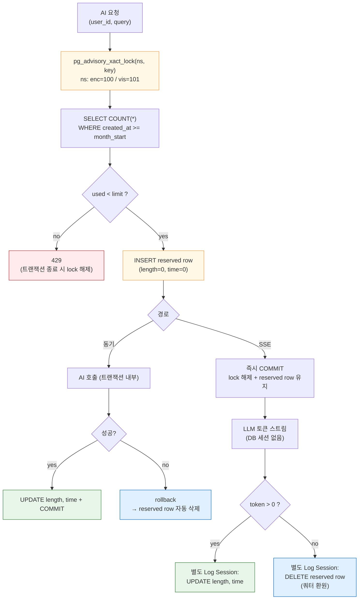
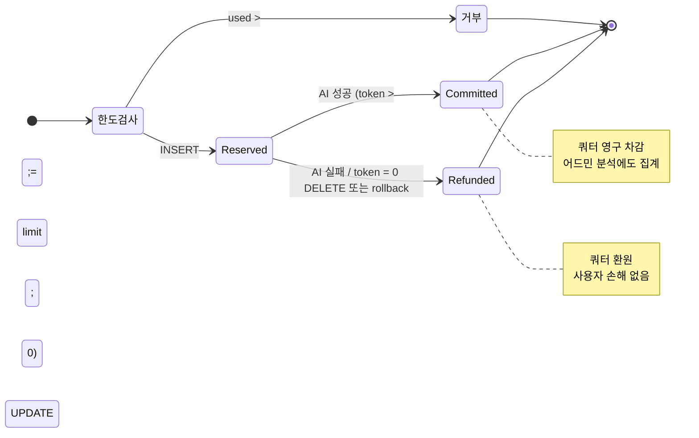

# Quota System — Advisory Lock + Reservation Pattern

> 전체 사용자의 AI 백과사전·Vision 월간 한도를 동시 요청 race 없이 정확히 차감하고, AI 실패 시 환원까지 보장하는 쿼터 시스템.
>
> **갱신** — 2026-07-05 (프리미엄 tier 전면 제거 — 전원 동일 free 한도 적용, 쿼터는 LLM 비용 안전장치로 유지)

## Key Contributions

**설명**
모든 사용자에게 AI 월간 사용 한도(백과사전 30회/비전 10회)를 부여해 LLM 비용을 통제하되, 동시 요청 상황에서도 한도가 정확히 지켜지고 AI 호출이 실패했을 때는 사용자가 쿼터를 손해 보지 않는 production-grade 쿼터 시스템을 설계·구현했다. 별도 quota 테이블 없이 기존 사용량 로그(`AiEncyclopediaLog` / `AiVisionLog`)를 단일 source of truth로 활용해 쿼터 차감과 분석 데이터의 일관성을 보장한다.

**사용 기술 스택**
FastAPI · PostgreSQL `pg_advisory_xact_lock` · SQLAlchemy AsyncSession · SSE · async/await

**트러블슈팅**

*문제*: 단순 COUNT 후 비교 방식은 race condition에 노출된다. 한도가 1개 남은 사용자가 동시 두 요청을 보내면 둘 다 `used < limit` 검사를 통과해 한도 초과가 발생한다. SSE 응답 중 advisory lock을 응답 종료까지 잡으면 동일 사용자의 다음 요청이 long block되고, AI가 실제로 실패한 경우 쿼터가 차감된 채로 남으면 사용자가 손해를 본다.

*해결법*: `pg_advisory_xact_lock(ns, key)`로 사용자별 호출을 직렬화하는 슬롯 예약 패턴으로 전환. 네임스페이스(encyclopedia=100 / vision=101)를 분리해 도메인 간섭을 없애고, UUID를 31-bit positive int로 매핑해 lock key로 사용했다. lock 획득 후 사용량 재조회 → 통과 시 reserved row INSERT. SSE 흐름은 advisory lock을 잡은 트랜잭션을 즉시 COMMIT해 lock만 해제하고 reserved row는 유지함으로써 응답이 길어져도 동시 요청을 차단하지 않게 했다.

*정합성 개선*: 동기 경로는 `Depends(get_db)` 트랜잭션 rollback으로 reserved row가 자동 삭제되지만, SSE 경로는 메인 세션이 중간에 닫히므로 별도 Log Session에서 `try/finally`로 명시적 DELETE를 보장한다. AI가 토큰 0개로 끝난 경우(스트림 정상 종료 + LLM 응답 실패)에도 이 경로로 환원된다. 월 경계 계산은 UTC 기준으로 통일. (프리미엄 tier 및 `/premium/tier` 엔드포인트는 2026-07 제거 — 전원 동일 free 한도 적용.)

---

## 1. 메인 플로우 — Advisory Lock + Reservation

## 2. 슬롯 라이프사이클

reserved row 한 건이 어떤 종착 상태로 가는지. 사용자 손해(쿼터만 차감되고 답은 못 받음) 방지의 핵심.

---

## 핵심 메시지

- **race 차단** — `pg_advisory_xact_lock` 사용자별 직렬화, 네임스페이스 분리로 encyclopedia ↔ vision 간섭 없음
- **long-hold 회피** — SSE는 응답 시작 전 즉시 COMMIT으로 lock만 해제, reserved row는 유지
- **손해 방지** — 동기는 rollback, SSE는 별도 Log Session의 명시적 DELETE로 환원
- **Single source of truth** — 별도 quota 테이블 없이 사용량 로그를 카운터로 활용 → 분석 데이터와 항상 일치
- **전원 동일 한도** — 프리미엄 tier 제거(2026-07) 후 모든 사용자에게 free 한도 적용(백과사전 30/비전 10). 클라이언트는 사전 차단 UI 없이 서버 429/403 수신 시에만 중립 메시지로 안내

## 핵심 파일

- `backend/app/services/quota_service.py` — `check_and_reserve_encyclopedia()` / `check_and_reserve_vision()`
- `backend/app/routers/ai.py` — `/ai/encyclopedia[/stream]`, `/ai/vision/analyze`
- `backend/app/models/ai_encyclopedia_log.py`, `ai_vision_log.py` — 카운터 + 분석 source

**관련**: [hybrid-llm-pipeline.md](hybrid-llm-pipeline.md), [sequence-diagrams.md](sequence-diagrams.md) (8.1 쿼터 예약 + RAG 준비)
