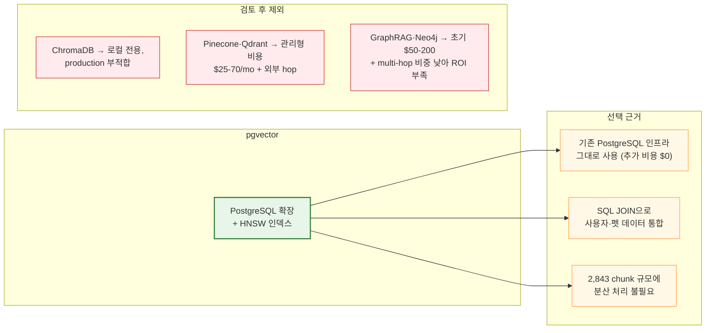
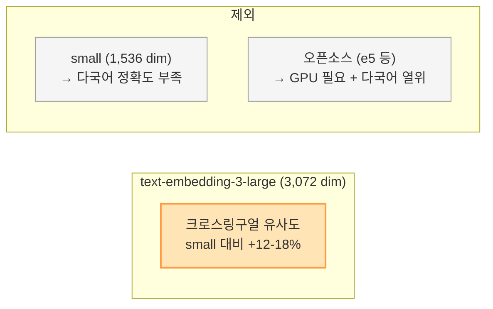
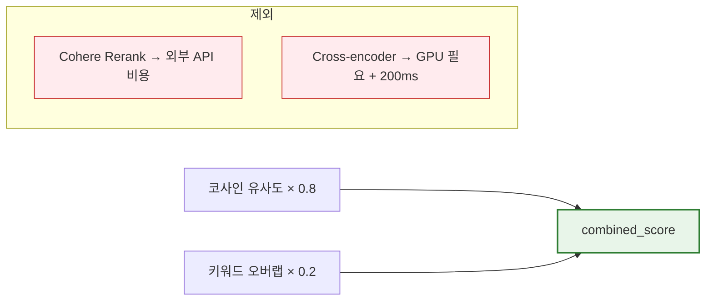
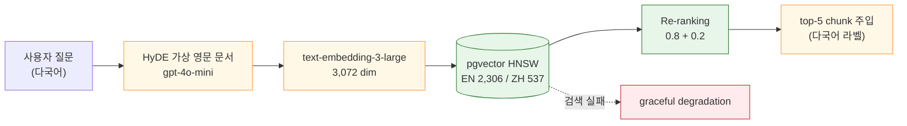
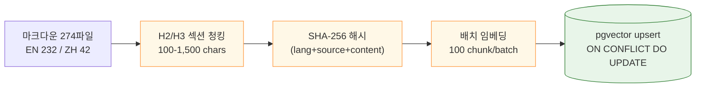
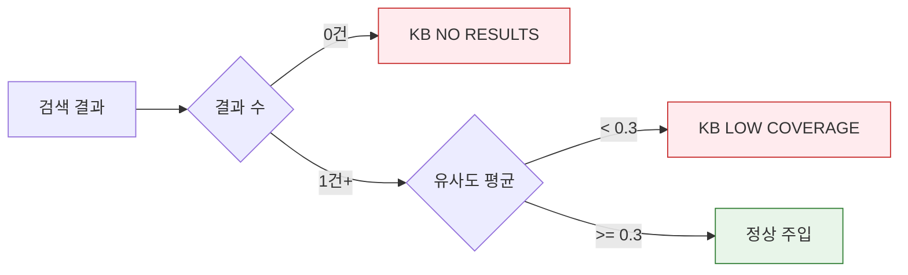

# RAG Pipeline — HyDE + pgvector

> 앵박사 백과사전·비전 분석의 **RAG 컨텍스트 수집 파이프라인**. LLM 라우팅·SSE 응답은 [hybrid-llm-pipeline.md](hybrid-llm-pipeline.md) 참조.
>
> **갱신** — 2026-05-14

---

## Key Contributions

### 설명

HyDE 가상 문서 → 임베딩 → pgvector HNSW 검색 → Re-ranking → top-5 컨텍스트 주입의 production-grade RAG 파이프라인을 구축했다. EN 2,306 / ZH 537 chunk가 하나의 vector space에 공존해 사용자 언어와 무관하게 양쪽 지식을 동시 검색하며, 유사도 로깅으로 KB 커버리지 격차를 운영 단에서 추적한다.

### 사용 기술 스택

| 구성 요소 | 기술 | 핵심 파라미터 |
|-----------|------|-------------|
| 벡터 DB | PostgreSQL **pgvector** + HNSW | 코사인 거리, top_k=5, min_sim=0.3 |
| 임베딩 | OpenAI **text-embedding-3-large** | 3,072 dim |
| HyDE 생성 | **gpt-4o-mini** | temp=0.0, 150-300 words |
| Re-ranking | 임베딩 0.8 + 키워드 0.2 blending | 외부 API 없음 |
| 청킹 | H2/H3 섹션 기반 분할 | 100-1,500 chars |
| 비동기 | async/await + AsyncSession | DB 세션 분리 |

### 설계 디자인

각 구성 요소를 **왜 이 기술로 결정했는지**, 검토한 대안과 함께 정리한다.

#### pgvector — 벡터 데이터베이스

이미 Railway에서 PostgreSQL을 운영하고 있었다. pgvector 확장만 켜면 별도 서비스 없이 벡터 검색이 가능하고, KB 규모(2,843 chunk)에 전용 벡터 DB의 분산 처리는 과하다. ChromaDB는 Phase 2 로컬 벤치마크용으로 쓴 뒤 Phase 4에서 pgvector로 전환했고, GraphRAG는 단일 hop 위주인 현 질의 패턴에 비용 대비 효과가 낮아 보류했다.

#### text-embedding-3-large — 임베딩 모델

수의학 전문 용어(약품명·종명·증상어)의 세밀한 의미 구분이 필요하다. `large`는 `small` 대비 ko/zh → EN KB 검색 유사도가 12-18% 높았고, 전량 임베딩 비용은 ~$0.35로 합리적이다. 오픈소스 모델은 GPU 인프라가 필요하고 다국어 성능이 떨어져 제외했다.

#### gpt-4o-mini — HyDE 가상 문서 생성

HyDE 가상 문서는 사용자에게 노출되지 않는 **검색용 중간 산출물**이다. 최종 답변은 메인 모델이 별도 생성하므로, HyDE에는 속도·비용이 우선이다. gpt-4o 대비 3-4x 빠르고 1/30 비용이면서 영문 수의학 참고 문서 생성에 충분한 품질을 보였다. temp=0.0으로 동일 질문에 대한 검색 일관성도 확보했다.

#### Re-ranking — 임베딩 0.8 + 키워드 0.2

수의학 도메인에서 약품명·종 이름 같은 정확 단어 일치가 임베딩 유사도만큼 중요하다. 키워드 blending은 외부 의존 0, latency ~0ms로 이 문제를 해결한다. top-5 chunk 규모에서 cross-encoder의 정밀도 이점은 미미했다.

---

## 파이프라인 흐름

## HyDE 효과

```mermaid
%%{init: {'theme': 'base', 'themeVariables': {'primaryColor': '#FF9A42'}}}%%
xychart-beta
    title "HyDE 도입 전후 코사인 유사도"
    x-axis ["ko → EN KB", "zh → EN KB", "en → EN KB"]
    y-axis "유사도" 0 --> 1
    bar "Direct" [0.21, 0.19, 0.68]
    bar "HyDE" [0.85, 0.78, 0.84]
```

| 질문 언어 | Direct | HyDE | 개선폭 |
|-----------|--------|------|--------|
| ko → EN KB | 0.17-0.24 | 0.82-0.87 | **+84-108%** |
| zh → EN KB | 0.15-0.22 | 0.70-0.85 | **+20-38%** |
| en → EN KB | 0.66-0.69 | 0.80-0.88 | +16-33% |

## Ingestion 파이프라인

- 총 2,843 chunk | 임베딩 ~16.5s | `chunk_hash` 기반 증분 로드 지원

## KB 모니터링

---

## 핵심 파일

| 파일 | 역할 |
|------|------|
| `backend/app/services/embedding_service.py` | text-embedding-3-large + HyDE 생성 |
| `backend/app/services/vector_search_service.py` | pgvector 검색 + Re-ranking + KB 모니터링 |
| `backend/scripts/load_knowledge.py` | 마크다운 → 청킹 → 임베딩 → pgvector 적재 |
| `backend/alembic/versions/007_add_pgvector_knowledge.py` | pgvector 확장 + HNSW 인덱스 |
| `backend/app/config.py` | 임베딩 모델·검색 파라미터 설정 |

**관련**: [hybrid-llm-pipeline.md](hybrid-llm-pipeline.md) — LLM 라우팅 / SSE 응답 / 메타 stripping
