# perch_care — Sequence Diagrams (시퀀스 다이어그램)

> **목적** — perch_care 주요 시나리오의 시간 흐름(actor↔system 메시지 교환)을 시퀀스 다이어그램으로 정리. [use-case-diagrams.md](use-case-diagrams.md)가 "누가 무엇을 할 수 있나"를 보여준다면, 본 문서는 "그 일이 실제로 어떻게 진행되나"를 보여줌.
>
> **범위** — 15개 대표 시나리오 (Auth/Pet/Tracking/AI Vision/AI Chat/IAP/Push/Reports/Admin/Sync/Scheduler).
>
> **갱신** — 2026-05-13

## 목차

- [표기법](#표기법)
- [액터 인덱스](#액터-인덱스)
- [1. 신규 사용자 Onboarding (Splash → OAuth → 펫 등록)](#1-신규-사용자-onboarding-splash--oauth--펫-등록)
- [2. 이메일 로그인 + 토큰 자동 갱신](#2-이메일-로그인--토큰-자동-갱신)
- [3. 비밀번호 찾기 (Email/SMS 코드)](#3-비밀번호-찾기-emailsms-코드)
- [4. 펫 등록 + 초기 체중 + 로컬 이미지](#4-펫-등록--초기-체중--로컬-이미지)
- [5. 홈 대시보드 로드 (BHI + 집계)](#5-홈-대시보드-로드-bhi--집계)
- [6. 일일 데이터 기록 + 오프라인 동기화](#6-일일-데이터-기록--오프라인-동기화)
- [6.1 큐 적재 & 재전송 (일상 동기화)](#61-큐-적재--재전송-일상-동기화)
- [6.2 초기 백필 (펫별 최초 1회)](#62-초기-백필-펫별-최초-1회)
- [7. AI 건강 체크 분석 (Vision + 쿼터)](#7-ai-건강-체크-분석-vision--쿼터)
- [8.1 쿼터 예약 + RAG 준비](#81-쿼터-예약--rag-준비)
- [8.2 SSE 스트림 + 로깅](#82-sse-스트림--로깅)
- [9. AI 챗 세션 + RAG 컨텍스트](#9-ai-챗-세션--rag-컨텍스트)
- [10.1 Store 결제 (Paywall → StoreKit)](#101-store-결제-paywall--storekit)
- [10.2 영수증 검증 + tier 활성화](#102-영수증-검증--tier-활성화)
- [11. 프로모션 코드 활성화](#11-프로모션-코드-활성화)
- [12.1 푸시 발송 + 디바이스 수신](#121-푸시-발송--디바이스-수신)
- [12.2 알림 화면 액션](#122-알림-화면-액션)
- [13. 리포트 공유 링크 → Public Viewer](#13-리포트-공유-링크--public-viewer)
- [14. 어드민 프리미엄 코드 발급](#14-어드민-프리미엄-코드-발급)
- [15.1 Scheduler cron — 주간 인사이트 생성](#151-scheduler-cron--주간-인사이트-생성)
- [15.2 사용자 조회 + Lazy fallback](#152-사용자-조회--lazy-fallback)
- [부록. 시나리오 ↔ 백엔드 endpoint 매트릭스](#부록-시나리오--백엔드-endpoint-매트릭스)

---

## 표기법

Mermaid `sequenceDiagram` 사용. 본 문서 전체 컨벤션:

| 요소 | 문법 | 의미 |
|---|---|---|
| `actor` | `actor U as Free User` | 사람 액터 (사람 모양 아이콘) |
| `participant` | `participant App as Flutter App` | 시스템/외부 액터 (사각형) |
| 동기 메시지 | `A->>B: msg` | 실선 + 채워진 화살촉 |
| 응답 메시지 | `B-->>A: msg` | 점선 + 채워진 화살촉 |
| 자기 호출 | `A->>A: msg` | self-call (객체 내부 처리) |
| 병렬 | `par ... and ... end` | 동시 실행 트랙 |
| 분기 | `alt 조건 ... else ... end` | if/else |
| 옵션 | `opt 조건 ... end` | if-only |
| 루프 | `loop 조건 ... end` | 반복 |
| Note | `Note over A,B: 텍스트` | 설명 박스 |
| 번호 | `autonumber` | 메시지에 1, 2, 3 자동 부여 |

**예시 (간단):**

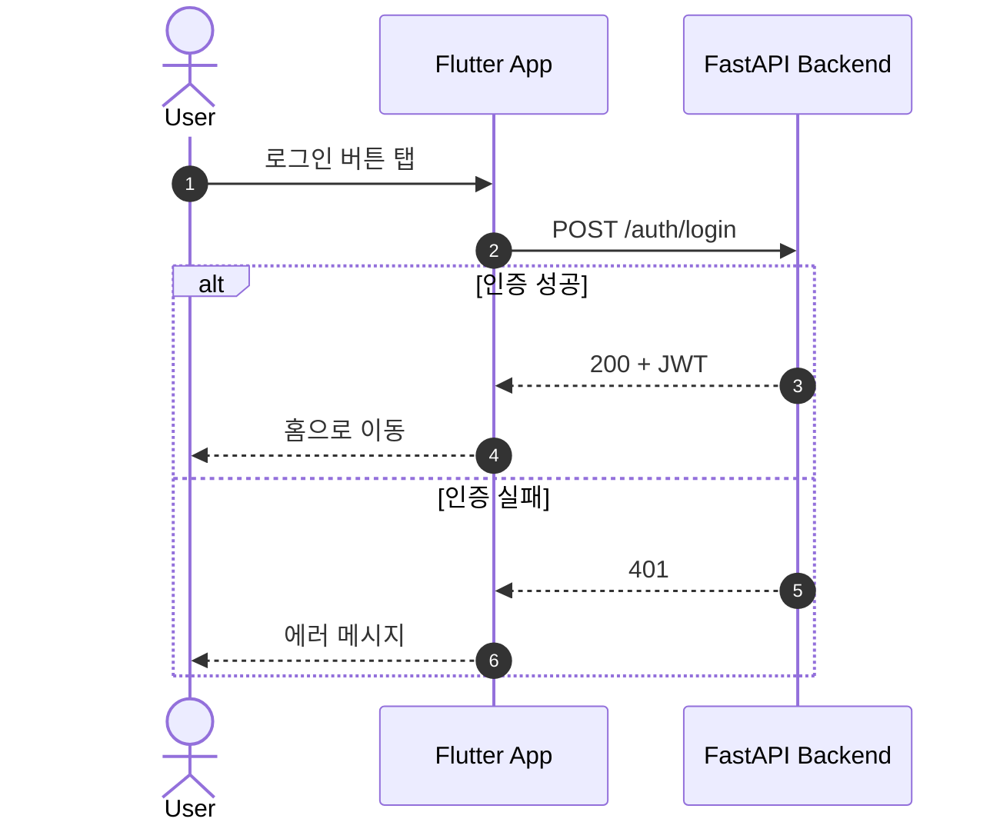
```mermaid
sequenceDiagram
    autonumber
    actor U as User
    participant App as Flutter App
    participant API as FastAPI Backend

    U->>App: 로그인 버튼 탭
    App->>API: POST /auth/login
    alt 인증 성공
        API-->>App: 200 + JWT
        App-->>U: 홈으로 이동
    else 인증 실패
        API-->>App: 401
        App-->>U: 에러 메시지
    end
```

---

## 액터 인덱스

본 문서 전반에 등장하는 참여자 목록. 시나리오별로 부분집합만 등장.

### Primary actors (사람)

| ID | 액터 | 시나리오 |
|---|---|---|
| Guest | 미로그인 사용자 | 1, 2, 3 |
| FreeUser | 로그인 + 무료 | 4~13 |
| PremiumUser | 로그인 + 구독 | 7, 8, 9, 10, 13 |
| Admin | 어드민 API key 보유 | 14 |
| PublicViewer | 미인증 외부인 (수의사 등) | 13 |

### Internal participants (perch_care 시스템 내부)

| ID | 라벨 | 비고 |
|---|---|---|
| App | Flutter App (Screens + ViewModel) | 화면별 ConsumerWidget |
| Repo | Repository Layer | API + LocalDataSource 추상화 |
| API | FastAPI Backend | `/api/v1/*` |
| DB | Postgres | UserTier·Pet·WeightRecord 등 |
| Vector | pgvector DB | `knowledge_chunks` |
| Sync | SyncService | 오프라인 큐 (SharedPreferences) |
| Local | Local Storage | SharedPreferences + SecureStorage + SQLite |
| Token | TokenService | JWT 저장/읽기 (secure_storage) |
| Quota | Quota Service | encyclopedia/vision 슬롯 예약 |
| Scheduler | Backend Scheduler | `scheduler.py` cron |
| Push | PushNotificationService | flutter_local_notifications |

### External participants (외부 시스템)

| ID | 라벨 |
|---|---|
| Google | Google Sign-In SDK |
| Apple | Apple Sign-In SDK |
| FCM | Firebase Cloud Messaging |
| Analytics | Firebase Analytics |
| AppStore | App Store (StoreKit IAP) |
| PlayStore | Google Play Billing |
| Review | In-App Review |
| VisionLLM | Vision LLM (gpt-4o) |
| EncLLM | Encyclopedia LLM (tier별 동적) |
| Camera | Device Camera/Gallery |
| Email | Email/SMS Service |

---

## 1. 신규 사용자 Onboarding (Splash → OAuth → 펫 등록)

신규 사용자가 앱 첫 실행부터 펫 등록 완료까지 가는 E2E 흐름. Google OAuth 기준.

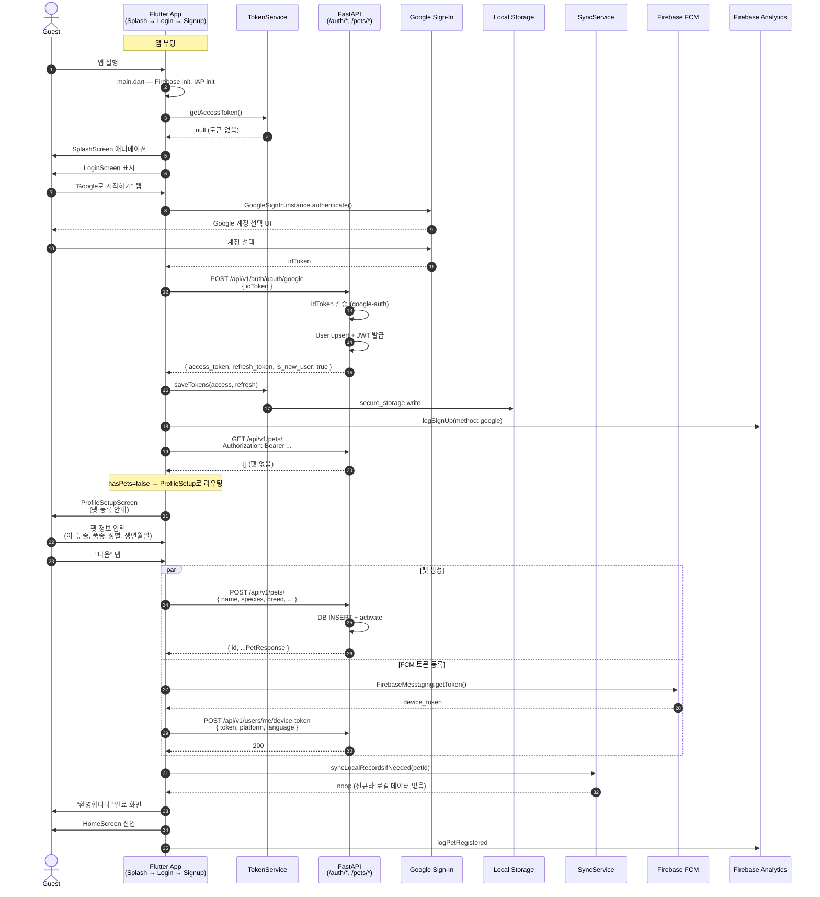
```mermaid
sequenceDiagram
    autonumber
    actor U as Guest
    participant App as Flutter App<br/>(Splash → Login → Signup)
    participant Token as TokenService
    participant API as FastAPI<br/>(/auth/*, /pets/*)
    participant Google as Google Sign-In
    participant Local as Local Storage
    participant Sync as SyncService
    participant FCM as Firebase FCM
    participant Analytics as Firebase Analytics

    Note over App: 앱 부팅
    U->>App: 앱 실행
    App->>App: main.dart — Firebase init, IAP init
    App->>Token: getAccessToken()
    Token-->>App: null (토큰 없음)
    App->>U: SplashScreen 애니메이션
    App->>U: LoginScreen 표시

    U->>App: "Google로 시작하기" 탭
    App->>Google: GoogleSignIn.instance.authenticate()
    Google-->>U: Google 계정 선택 UI
    U->>Google: 계정 선택
    Google-->>App: idToken

    App->>API: POST /api/v1/auth/oauth/google<br/>{ idToken }
    API->>API: idToken 검증 (google-auth)
    API->>API: User upsert + JWT 발급
    API-->>App: { access_token, refresh_token, is_new_user: true }

    App->>Token: saveTokens(access, refresh)
    Token->>Local: secure_storage.write
    App->>Analytics: logSignUp(method: google)

    App->>API: GET /api/v1/pets/<br/>Authorization: Bearer ...
    API-->>App: [] (펫 없음)

    Note over App: hasPets=false → ProfileSetup로 라우팅

    App->>U: ProfileSetupScreen<br/>(펫 등록 안내)
    U->>App: 펫 정보 입력<br/>(이름, 종, 품종, 성별, 생년월일)
    U->>App: "다음" 탭

    par 펫 생성
        App->>API: POST /api/v1/pets/<br/>{ name, species, breed, ... }
        API->>API: DB INSERT + activate
        API-->>App: { id, ...PetResponse }
    and FCM 토큰 등록
        App->>FCM: FirebaseMessaging.getToken()
        FCM-->>App: device_token
        App->>API: POST /api/v1/users/me/device-token<br/>{ token, platform, language }
        API-->>App: 200
    end

    App->>Sync: syncLocalRecordsIfNeeded(petId)
    Sync-->>App: noop (신규라 로컬 데이터 없음)

    App->>U: "환영합니다" 완료 화면
    App->>U: HomeScreen 진입
    App->>Analytics: logPetRegistered
```

**핵심 포인트:**
- `is_new_user=true` 분기로 `/profile-setup` 라우팅 (vs 기존 사용자는 `/home`).
- 펫 생성 + FCM 토큰 등록은 **병렬 실행** (`par`) — 사용자 대기 시간 단축.
- 초기 체중 입력 시 펫 생성 트랜잭션에 weight record 자동 포함 (시나리오 4 참조).

---

## 2. 이메일 로그인 + 토큰 자동 갱신

이메일/비밀번호 로그인 → 후속 API 요청에서 토큰 만료 시 자동 갱신 흐름.

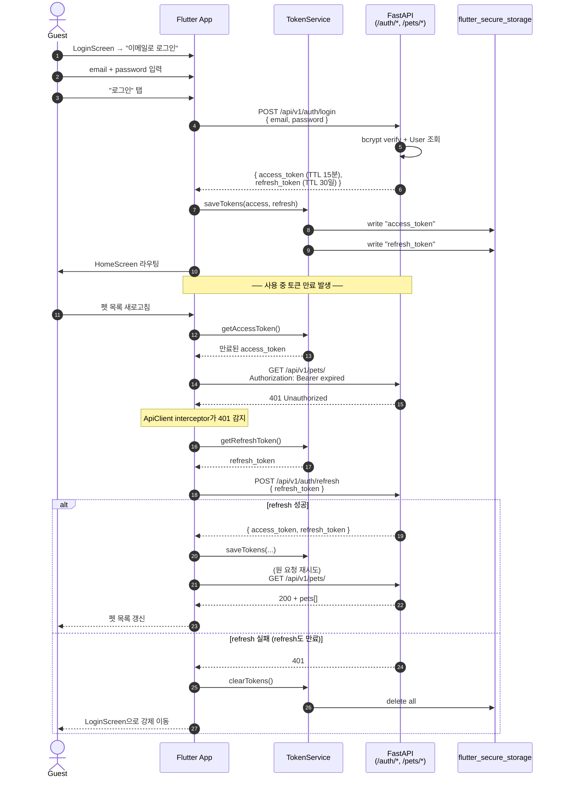
```mermaid
sequenceDiagram
    autonumber
    actor U as Guest
    participant App as Flutter App
    participant Token as TokenService
    participant API as FastAPI<br/>(/auth/*, /pets/*)
    participant Local as flutter_secure_storage

    U->>App: LoginScreen → "이메일로 로그인"
    U->>App: email + password 입력
    U->>App: "로그인" 탭

    App->>API: POST /api/v1/auth/login<br/>{ email, password }
    API->>API: bcrypt verify + User 조회
    API-->>App: { access_token (TTL 15분),<br/>refresh_token (TTL 30일) }

    App->>Token: saveTokens(access, refresh)
    Token->>Local: write "access_token"
    Token->>Local: write "refresh_token"

    App->>U: HomeScreen 라우팅

    Note over App,API: ── 사용 중 토큰 만료 발생 ──

    U->>App: 펫 목록 새로고침
    App->>Token: getAccessToken()
    Token-->>App: 만료된 access_token
    App->>API: GET /api/v1/pets/<br/>Authorization: Bearer expired
    API-->>App: 401 Unauthorized

    Note over App: ApiClient interceptor가 401 감지

    App->>Token: getRefreshToken()
    Token-->>App: refresh_token
    App->>API: POST /api/v1/auth/refresh<br/>{ refresh_token }

    alt refresh 성공
        API-->>App: { access_token, refresh_token }
        App->>Token: saveTokens(...)
        App->>API: (원 요청 재시도)<br/>GET /api/v1/pets/
        API-->>App: 200 + pets[]
        App-->>U: 펫 목록 갱신
    else refresh 실패 (refresh도 만료)
        API-->>App: 401
        App->>Token: clearTokens()
        Token->>Local: delete all
        App-->>U: LoginScreen으로 강제 이동
    end
```

**핵심 포인트:**
- 401 → refresh → 원 요청 재시도 패턴은 `ApiClient`의 interceptor에 구현 (단 1회 재시도).
- refresh token도 만료된 경우 (refresh API가 401) → 모든 토큰 삭제 + 로그인 화면.
- 동시에 여러 API 요청이 401 받으면 단일 refresh로 묶어야 함 (mutex 패턴, race 방지).

---

## 3. 비밀번호 찾기 (Email/SMS 코드)

3단계 플로우: 인증 방법 선택 → 코드 발송/확인 → 새 비밀번호 설정.

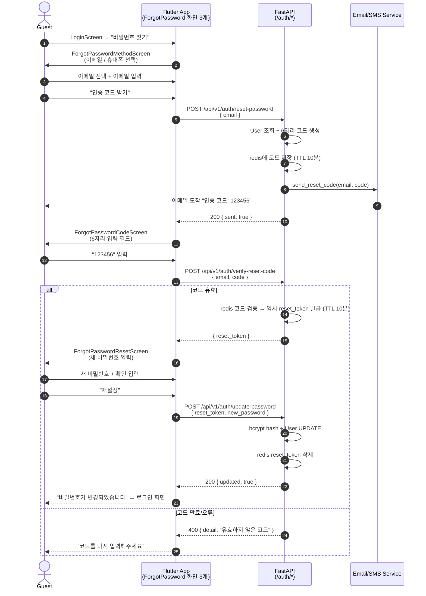
```mermaid
sequenceDiagram
    autonumber
    actor U as Guest
    participant App as Flutter App<br/>(ForgotPassword 화면 3개)
    participant API as FastAPI<br/>(/auth/*)
    participant Email as Email/SMS Service

    U->>App: LoginScreen → "비밀번호 찾기"
    App->>U: ForgotPasswordMethodScreen<br/>(이메일 / 휴대폰 선택)

    U->>App: 이메일 선택 + 이메일 입력
    U->>App: "인증 코드 받기"
    App->>API: POST /api/v1/auth/reset-password<br/>{ email }

    API->>API: User 조회 + 6자리 코드 생성
    API->>API: redis에 코드 저장 (TTL 10분)
    API->>Email: send_reset_code(email, code)
    Email-->>U: 이메일 도착 "인증 코드: 123456"
    API-->>App: 200 { sent: true }

    App->>U: ForgotPasswordCodeScreen<br/>(6자리 입력 필드)

    U->>App: "123456" 입력
    App->>API: POST /api/v1/auth/verify-reset-code<br/>{ email, code }

    alt 코드 유효
        API->>API: redis 코드 검증 → 임시 reset_token 발급 (TTL 10분)
        API-->>App: { reset_token }
        App->>U: ForgotPasswordResetScreen<br/>(새 비밀번호 입력)

        U->>App: 새 비밀번호 + 확인 입력
        U->>App: "재설정"
        App->>API: POST /api/v1/auth/update-password<br/>{ reset_token, new_password }
        API->>API: bcrypt hash + User UPDATE
        API->>API: redis reset_token 삭제
        API-->>App: 200 { updated: true }
        App-->>U: "비밀번호가 변경되었습니다" → 로그인 화면
    else 코드 만료/오류
        API-->>App: 400 { detail: "유효하지 않은 코드" }
        App-->>U: "코드를 다시 입력해주세요"
    end
```

**핵심 포인트:**
- 코드는 Redis에 TTL 10분 저장 (DB 영구화 X — 보안).
- 코드 확인 단계에서 임시 `reset_token` 발급 → 새 비밀번호 설정 단계와 분리 (사용자가 코드만 알아도 비밀번호 못 바꿈).
- SMS 경로는 Email 대신 SMS Service만 다름, 시퀀스 동일.

---

## 4. 펫 등록 + 초기 체중 + 로컬 이미지

펫 등록 폼에서 사진 + 초기 체중을 함께 입력하는 풀 시나리오.

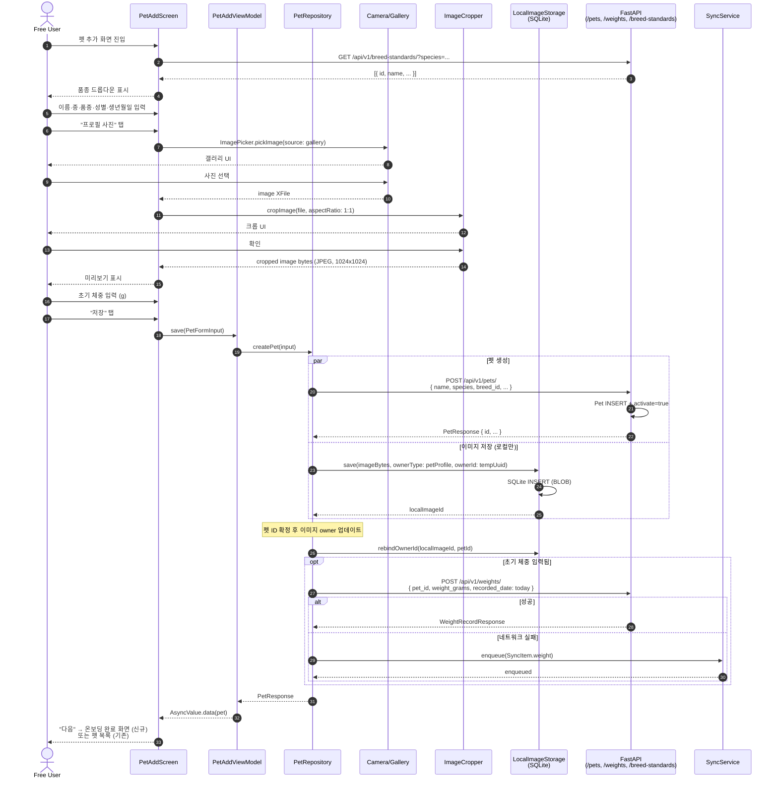
```mermaid
sequenceDiagram
    autonumber
    actor U as Free User
    participant App as PetAddScreen
    participant VM as PetAddViewModel
    participant Repo as PetRepository
    participant Cam as Camera/Gallery
    participant Crop as ImageCropper
    participant LocalImg as LocalImageStorage<br/>(SQLite)
    participant API as FastAPI<br/>(/pets, /weights, /breed-standards)
    participant Sync as SyncService

    U->>App: 펫 추가 화면 진입
    App->>API: GET /api/v1/breed-standards/?species=...
    API-->>App: [{ id, name, ... }]
    App-->>U: 품종 드롭다운 표시

    U->>App: 이름·종·품종·성별·생년월일 입력
    U->>App: "프로필 사진" 탭
    App->>Cam: ImagePicker.pickImage(source: gallery)
    Cam-->>U: 갤러리 UI
    U->>Cam: 사진 선택
    Cam-->>App: image XFile

    App->>Crop: cropImage(file, aspectRatio: 1:1)
    Crop-->>U: 크롭 UI
    U->>Crop: 확인
    Crop-->>App: cropped image bytes (JPEG, 1024x1024)

    App-->>U: 미리보기 표시
    U->>App: 초기 체중 입력 (g)
    U->>App: "저장" 탭

    App->>VM: save(PetFormInput)
    VM->>Repo: createPet(input)

    par 펫 생성
        Repo->>API: POST /api/v1/pets/<br/>{ name, species, breed_id, ... }
        API->>API: Pet INSERT + activate=true
        API-->>Repo: PetResponse { id, ... }
    and 이미지 저장 (로컬만)
        Repo->>LocalImg: save(imageBytes, ownerType: petProfile, ownerId: tempUuid)
        LocalImg->>LocalImg: SQLite INSERT (BLOB)
        LocalImg-->>Repo: localImageId
    end

    Note over Repo: 펫 ID 확정 후 이미지 owner 업데이트
    Repo->>LocalImg: rebindOwnerId(localImageId, petId)

    opt 초기 체중 입력됨
        Repo->>API: POST /api/v1/weights/<br/>{ pet_id, weight_grams, recorded_date: today }
        alt 성공
            API-->>Repo: WeightRecordResponse
        else 네트워크 실패
            Repo->>Sync: enqueue(SyncItem.weight)
            Sync-->>Repo: enqueued
        end
    end

    Repo-->>VM: PetResponse
    VM-->>App: AsyncValue.data(pet)
    App-->>U: "다음" → 온보딩 완료 화면 (신규)<br/>또는 펫 목록 (기존)
```

**핵심 포인트:**
- **이미지는 로컬 SQLite에만 저장** — 백엔드 업로드 X (트래픽 절감). 화면 표시 시 `LocalImageAvatar` 위젯이 로컬 BLOB 로드.
- **펫 생성 + 이미지 저장은 병렬** — 이미지는 temp UUID로 저장한 뒤 pet ID 확정 후 owner 재바인딩.
- 초기 체중은 **선택 입력**. 입력된 경우에만 weight POST. 실패 시 즉시 SyncService 큐에 적재 (Repository 내부에서 자동).

---

## 5. 홈 대시보드 로드 (BHI + 집계)

홈 진입 시 활성 펫 + BHI + 건강 요약 + 인사이트를 병렬 로드하는 흐름.

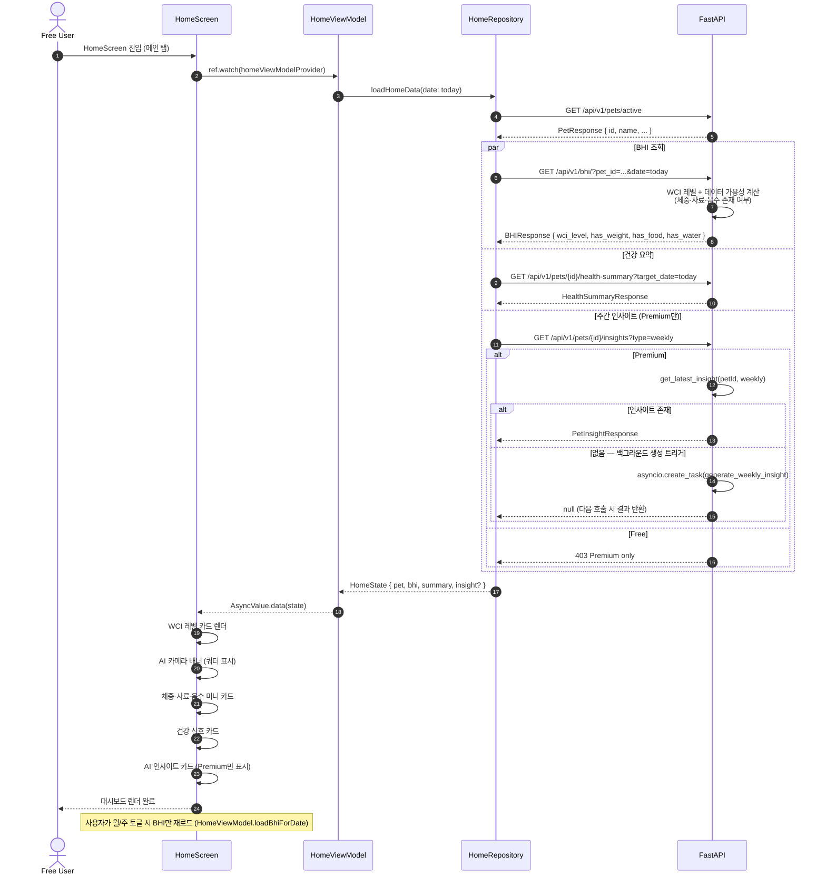
```mermaid
sequenceDiagram
    autonumber
    actor U as Free User
    participant App as HomeScreen
    participant VM as HomeViewModel
    participant Repo as HomeRepository
    participant API as FastAPI

    U->>App: HomeScreen 진입 (메인 탭)
    App->>VM: ref.watch(homeViewModelProvider)
    VM->>Repo: loadHomeData(date: today)

    Repo->>API: GET /api/v1/pets/active
    API-->>Repo: PetResponse { id, name, ... }

    par BHI 조회
        Repo->>API: GET /api/v1/bhi/?pet_id=...&date=today
        API->>API: WCI 레벨 + 데이터 가용성 계산<br/>(체중·사료·음수 존재 여부)
        API-->>Repo: BHIResponse { wci_level, has_weight, has_food, has_water }
    and 건강 요약
        Repo->>API: GET /api/v1/pets/{id}/health-summary?target_date=today
        API-->>Repo: HealthSummaryResponse
    and 주간 인사이트 (Premium만)
        Repo->>API: GET /api/v1/pets/{id}/insights?type=weekly
        alt Premium
            API->>API: get_latest_insight(petId, weekly)
            alt 인사이트 존재
                API-->>Repo: PetInsightResponse
            else 없음 — 백그라운드 생성 트리거
                API->>API: asyncio.create_task(generate_weekly_insight)
                API-->>Repo: null (다음 호출 시 결과 반환)
            end
        else Free
            API-->>Repo: 403 Premium only
        end
    end

    Repo-->>VM: HomeState { pet, bhi, summary, insight? }
    VM-->>App: AsyncValue.data(state)

    App->>App: WCI 레벨 카드 렌더
    App->>App: AI 카메라 배너 (쿼터 표시)
    App->>App: 체중·사료·음수 미니 카드
    App->>App: 건강 신호 카드
    App->>App: AI 인사이트 카드 (Premium만 표시)
    App-->>U: 대시보드 렌더 완료

    Note over App: 사용자가 월/주 토글 시 BHI만 재로드 (HomeViewModel.loadBhiForDate)
```

**핵심 포인트:**
- 3개 API 호출 **병렬** — 사용자 대기 시간 = max(개별 응답 시간).
- 인사이트는 **Lazy generation** — DB에 없으면 `asyncio.create_task`로 백그라운드 생성 + 즉시 null 반환. 다음 호출에서 결과.
- 오프라인 시: BHI 조회 실패 → 로컬 캐시 기반 부분 렌더 + "오프라인" 배지 (시나리오 6의 큐는 read에 영향 없음).

---

## 6. 일일 데이터 기록 + 오프라인 동기화

체중 기록 추가 시 네트워크 실패 → 큐 적재 → 앱 재시작 시 재전송하는 흐름.

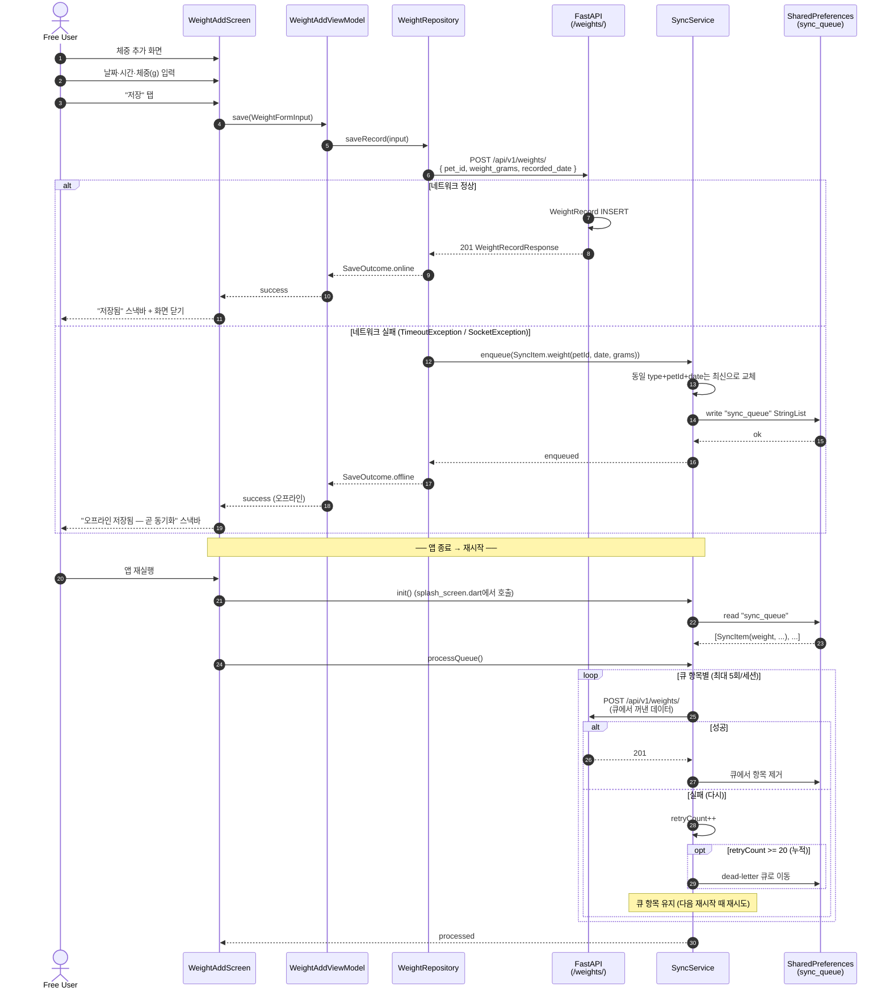
```mermaid
sequenceDiagram
    autonumber
    actor U as Free User
    participant App as WeightAddScreen
    participant VM as WeightAddViewModel
    participant Repo as WeightRepository
    participant API as FastAPI<br/>(/weights/)
    participant Sync as SyncService
    participant Local as SharedPreferences<br/>(sync_queue)

    U->>App: 체중 추가 화면
    U->>App: 날짜·시간·체중(g) 입력
    U->>App: "저장" 탭

    App->>VM: save(WeightFormInput)
    VM->>Repo: saveRecord(input)

    Repo->>API: POST /api/v1/weights/<br/>{ pet_id, weight_grams, recorded_date }

    alt 네트워크 정상
        API->>API: WeightRecord INSERT
        API-->>Repo: 201 WeightRecordResponse
        Repo-->>VM: SaveOutcome.online
        VM-->>App: success
        App-->>U: "저장됨" 스낵바 + 화면 닫기
    else 네트워크 실패 (TimeoutException / SocketException)
        Repo->>Sync: enqueue(SyncItem.weight(petId, date, grams))
        Sync->>Sync: 동일 type+petId+date는 최신으로 교체
        Sync->>Local: write "sync_queue" StringList
        Local-->>Sync: ok
        Sync-->>Repo: enqueued
        Repo-->>VM: SaveOutcome.offline
        VM-->>App: success (오프라인)
        App-->>U: "오프라인 저장됨 — 곧 동기화" 스낵바
    end

    Note over App,Sync: ── 앱 종료 → 재시작 ──

    U->>App: 앱 재실행
    App->>Sync: init() (splash_screen.dart에서 호출)
    Sync->>Local: read "sync_queue"
    Local-->>Sync: [SyncItem(weight, ...), ...]

    App->>Sync: processQueue()

    loop 큐 항목별 (최대 5회/세션)
        Sync->>API: POST /api/v1/weights/<br/>(큐에서 꺼낸 데이터)
        alt 성공
            API-->>Sync: 201
            Sync->>Local: 큐에서 항목 제거
        else 실패 (다시)
            Sync->>Sync: retryCount++
            opt retryCount >= 20 (누적)
                Sync->>Local: dead-letter 큐로 이동
            end
            Note over Sync: 큐 항목 유지 (다음 재시작 때 재시도)
        end
    end

    Sync-->>App: processed
```

**핵심 포인트:**
- `SaveOutcome { online, offline }` enum으로 ViewModel→View가 스낵바 분기 (다국어: `snackbar_saved` vs `snackbar_savedOffline`).
- 큐 dedup: 동일 `type+petId+date` 키는 최신 값으로 교체 → 사용자가 같은 날짜에 여러 번 수정해도 마지막 값만 동기화됨.
- `processQueue()`는 splash + 포그라운드 복귀 시 자동 호출 (`didChangeAppLifecycleState`).
- 누적 실패 20회 초과 시 별도 `dead_letter` 큐로 이동 — 무한 재시도 방지.

---

## 6.1 큐 적재 & 재전송 (일상 동기화)

write 실패 시 큐에 쌓고, 부팅/포그라운드 복귀 시 자동으로 비우는 흐름.

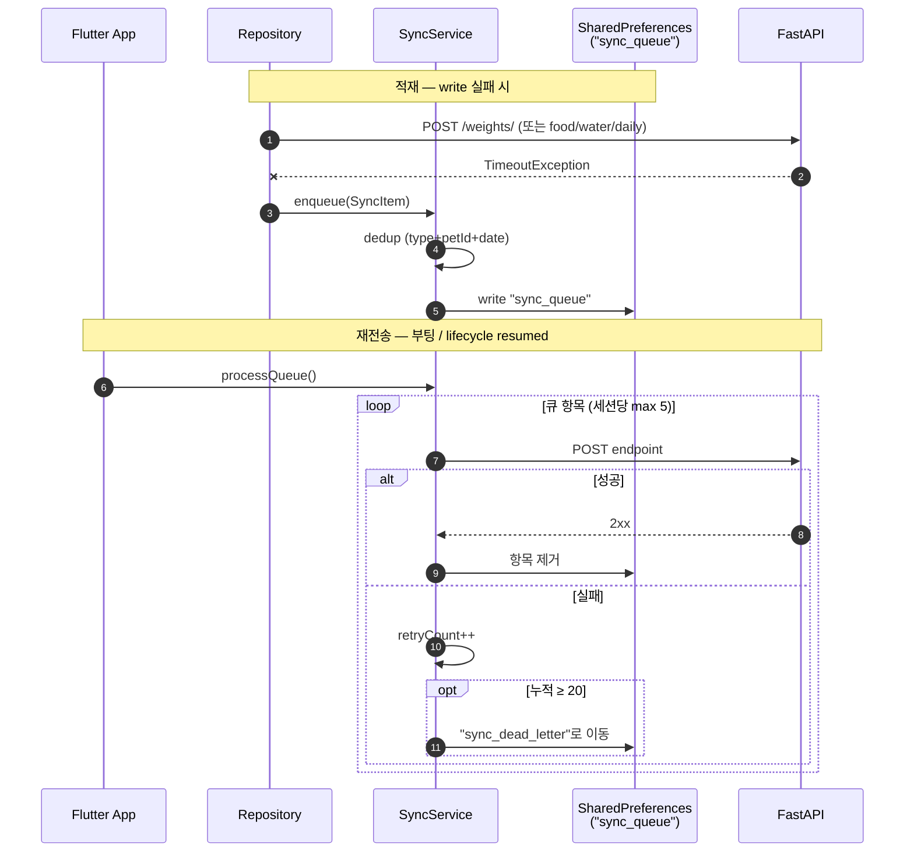
```mermaid
sequenceDiagram
    autonumber
    participant App as Flutter App
    participant Repo as Repository
    participant Sync as SyncService
    participant Local as SharedPreferences<br/>("sync_queue")
    participant API as FastAPI

    Note over Repo,Local: 적재 — write 실패 시
    Repo->>API: POST /weights/ (또는 food/water/daily)
    API--xRepo: TimeoutException
    Repo->>Sync: enqueue(SyncItem)
    Sync->>Sync: dedup (type+petId+date)
    Sync->>Local: write "sync_queue"

    Note over App,API: 재전송 — 부팅 / lifecycle resumed
    App->>Sync: processQueue()
    loop 큐 항목 (세션당 max 5)
        Sync->>API: POST endpoint
        alt 성공
            API-->>Sync: 2xx
            Sync->>Local: 항목 제거
        else 실패
            Sync->>Sync: retryCount++
            opt 누적 ≥ 20
                Sync->>Local: "sync_dead_letter"로 이동
            end
        end
    end
```

**핵심:**
- **dedup** — 동일 `type+petId+date`는 최신으로 덮어씀
- **재시도 한도** — 세션당 5회 / 누적 20회 초과 시 `sync_dead_letter`로 격리
- **트리거** — `init()` 직후 + `didChangeAppLifecycleState(resumed)` (사용자 명시 호출 X)

---

## 6.2 초기 백필 (펫별 최초 1회)

서버에 없는 과거 로컬 기록을 펫별로 1회만 일괄 업로드. 플래그로 중복 방지.

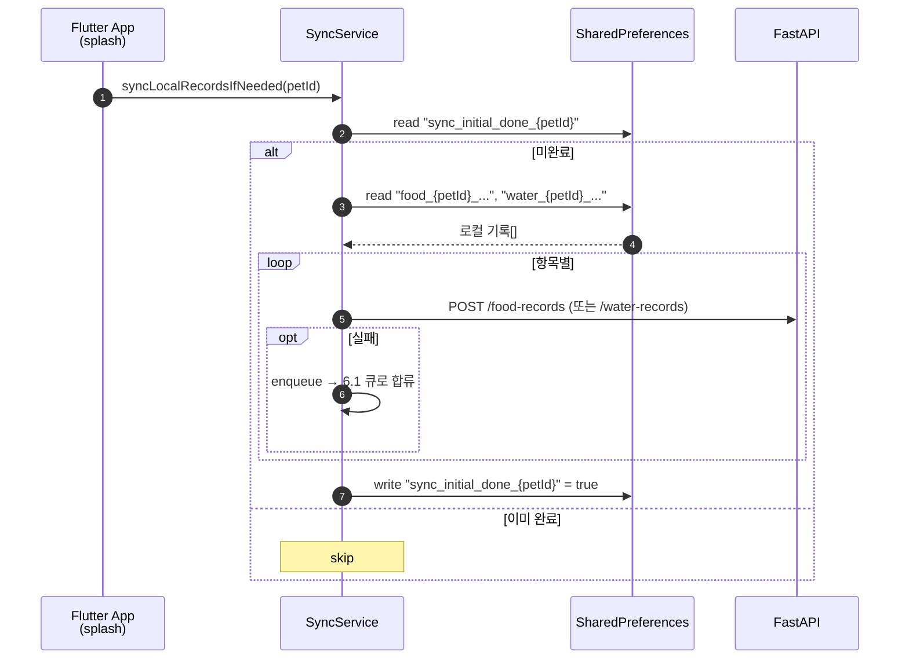
```mermaid
sequenceDiagram
    autonumber
    participant App as Flutter App<br/>(splash)
    participant Sync as SyncService
    participant Local as SharedPreferences
    participant API as FastAPI

    App->>Sync: syncLocalRecordsIfNeeded(petId)
    Sync->>Local: read "sync_initial_done_{petId}"

    alt 미완료
        Sync->>Local: read "food_{petId}_...", "water_{petId}_..."
        Local-->>Sync: 로컬 기록[]
        loop 항목별
            Sync->>API: POST /food-records (또는 /water-records)
            opt 실패
                Sync->>Sync: enqueue → 6.1 큐로 합류
            end
        end
        Sync->>Local: write "sync_initial_done_{petId}" = true
    else 이미 완료
        Note over Sync: skip
    end
```

**핵심:**
- **펫별 1회만** — `sync_initial_done_{petId}` 플래그로 게이팅
- **실패는 6.1 큐로 합류** — 본 흐름에서 처리하지 않고 재시도는 위임
- **호출 시점** — 스플래시에서 `getMyPets()` 결과 루프 안에서 펫마다 호출

---

## 7. AI 건강 체크 분석 (Vision + 쿼터)

이미지 촬영 → 쿼터 슬롯 예약 → Vision LLM 분석 → 결과 저장 풀 흐름. Free 사용자 기준.

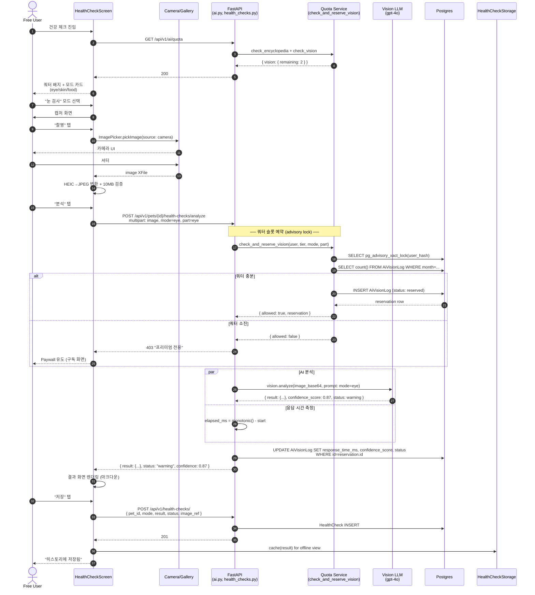
```mermaid
sequenceDiagram
    autonumber
    actor U as Free User
    participant App as HealthCheckScreen
    participant Cam as Camera/Gallery
    participant API as FastAPI<br/>(ai.py, health_checks.py)
    participant Quota as Quota Service<br/>(check_and_reserve_vision)
    participant LLM as Vision LLM<br/>(gpt-4o)
    participant DB as Postgres
    participant Local as HealthCheckStorage

    U->>App: 건강 체크 진입
    App->>API: GET /api/v1/ai/quota
    API->>Quota: check_encyclopedia + check_vision
    Quota-->>API: { vision: { remaining: 2 } }
    API-->>App: 200
    App-->>U: 쿼터 배지 + 모드 카드<br/>(eye/skin/food)

    U->>App: "눈 검사" 모드 선택
    App->>U: 캡처 화면
    U->>App: "촬영" 탭
    App->>Cam: ImagePicker.pickImage(source: camera)
    Cam-->>U: 카메라 UI
    U->>Cam: 셔터
    Cam-->>App: image XFile

    App->>App: HEIC→JPEG 변환 + 10MB 검증

    U->>App: "분석" 탭

    App->>API: POST /api/v1/pets/{id}/health-checks/analyze<br/>multipart: image, mode=eye, part=eye

    Note over API,Quota: ── 쿼터 슬롯 예약 (advisory lock) ──
    API->>Quota: check_and_reserve_vision(user, tier, mode, part)
    Quota->>DB: SELECT pg_advisory_xact_lock(user_hash)
    Quota->>DB: SELECT count() FROM AiVisionLog WHERE month=...
    alt 쿼터 충분
        Quota->>DB: INSERT AiVisionLog (status: reserved)
        DB-->>Quota: reservation row
        Quota-->>API: { allowed: true, reservation }
    else 쿼터 소진
        Quota-->>API: { allowed: false }
        API-->>App: 403 "프리미엄 전용"
        App-->>U: Paywall 유도 (구독 화면)
    end

    par AI 분석
        API->>LLM: vision.analyze(image_base64, prompt: mode=eye)
        LLM-->>API: { result: {...}, confidence_score: 0.87, status: warning }
    and 응답 시간 측정
        API->>API: elapsed_ms = monotonic() - start
    end

    API->>DB: UPDATE AiVisionLog SET response_time_ms, confidence_score, status<br/>WHERE id=reservation.id

    API-->>App: { result: {...}, status: "warning", confidence: 0.87 }

    App->>App: 결과 화면 렌더링 (마크다운)
    U->>App: "저장" 탭
    App->>API: POST /api/v1/health-checks/<br/>{ pet_id, mode, result, status, image_ref }
    API->>DB: HealthCheck INSERT
    API-->>App: 201

    App->>Local: cache(result) for offline view
    App-->>U: "히스토리에 저장됨"
```

**핵심 포인트:**
- **쿼터 예약 = 동시 요청 race 방지**: PostgreSQL `pg_advisory_xact_lock`으로 동일 사용자 동시 호출 직렬화.
- 분석 실패 시 트랜잭션 rollback → 예약 row 자동 삭제 → 슬롯 반환 (사용자 손해 없음).
- food 모드는 별도 endpoint(`/api/v1/ai/vision/analyze`) + 펫 컨텍스트 없이 호출 + DB 영구화 안 함.
- 저장은 분석과 별도 단계 (사용자가 "저장" 누른 경우만).

---

## 8.1 쿼터 예약 + RAG 준비

요청 수신 → 별도 DB 세션으로 쿼터 예약 → RAG 컨텍스트 prefetch → SSE 응답 헤더 전송. **DB 세션을 짧게 끊는 게 핵심**.

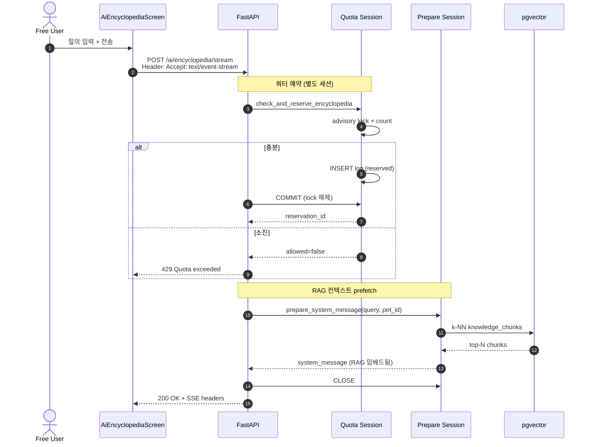
```mermaid
sequenceDiagram
    autonumber
    actor U as Free User
    participant App as AiEncyclopediaScreen
    participant API as FastAPI
    participant QuotaDB as Quota Session
    participant Pre as Prepare Session
    participant Vector as pgvector

    U->>App: 질의 입력 + 전송
    App->>API: POST /ai/encyclopedia/stream<br/>Header: Accept: text/event-stream

    Note over API,QuotaDB: 쿼터 예약 (별도 세션)
    API->>QuotaDB: check_and_reserve_encyclopedia
    QuotaDB->>QuotaDB: advisory lock + count
    alt 충분
        QuotaDB->>QuotaDB: INSERT log (reserved)
        API->>QuotaDB: COMMIT (lock 해제)
        QuotaDB-->>API: reservation_id
    else 소진
        QuotaDB-->>API: allowed=false
        API-->>App: 429 Quota exceeded
    end

    Note over API,Pre: RAG 컨텍스트 prefetch
    API->>Pre: prepare_system_message(query, pet_id)
    Pre->>Vector: k-NN knowledge_chunks
    Vector-->>Pre: top-N chunks
    Pre-->>API: system_message (RAG 임베드됨)
    API->>Pre: CLOSE

    API-->>App: 200 OK + SSE headers
```

**핵심:**
- 쿼터 예약은 **즉시 COMMIT** → advisory lock 해제, reserved row만 유지. SSE 응답 중에도 다른 요청 진입 가능.
- prepare 세션은 RAG 검색만 빠르게 끝내고 닫음 → 다음 단계(스트림)는 DB 커넥션 X.

---

## 8.2 SSE 스트림 + 로깅

LLM 토큰 스트림 수신 → 메타데이터 stripping → 클라에 전송 → 종료 후 별도 세션으로 로그 기록.

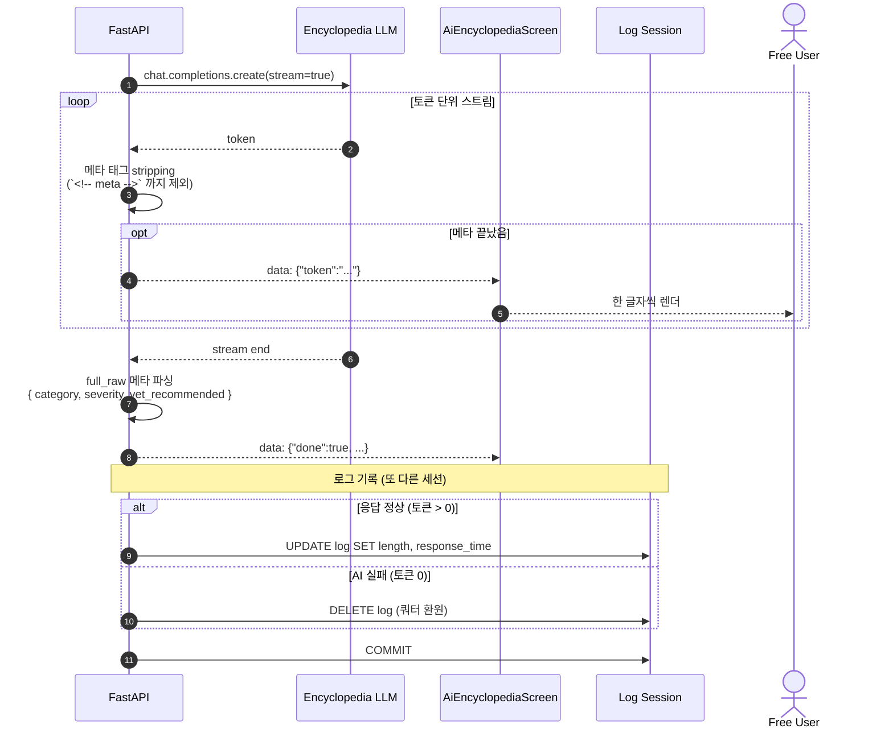
```mermaid
sequenceDiagram
    autonumber
    participant API as FastAPI
    participant LLM as Encyclopedia LLM
    participant App as AiEncyclopediaScreen
    participant LogDB as Log Session
    actor U as Free User

    API->>LLM: chat.completions.create(stream=true)

    loop 토큰 단위 스트림
        LLM-->>API: token
        API->>API: 메타 태그 stripping<br/>(`<!-- meta -->` 까지 제외)
        opt 메타 끝났음
            API-->>App: data: {"token":"..."}
            App-->>U: 한 글자씩 렌더
        end
    end

    LLM-->>API: stream end
    API->>API: full_raw 메타 파싱<br/>{ category, severity, vet_recommended }
    API-->>App: data: {"done":true, ...}

    Note over API,LogDB: 로그 기록 (또 다른 세션)
    alt 응답 정상 (토큰 > 0)
        API->>LogDB: UPDATE log SET length, response_time
    else AI 실패 (토큰 0)
        API->>LogDB: DELETE log (쿼터 환원)
    end
    API->>LogDB: COMMIT
```

**핵심:**
- 스트림 진행 중 **DB 커넥션 점유 X** → 응답이 길어도 DB pool 고갈 위험 없음.
- 메타 stripping: AI가 응답 앞에 `<!-- category: ... -->` 메타를 붙임 → 클라에 비공개, 서버는 done 이벤트에 별도 필드로.
- 토큰 0개 응답 시 예약 row 삭제 → 쿼터 환원 (사용자 손해 없음).

---

## 9. AI 챗 세션 + RAG 컨텍스트

채팅 세션 생성 → 메시지 전송 시 RAG 검색이 어떻게 일어나는지.

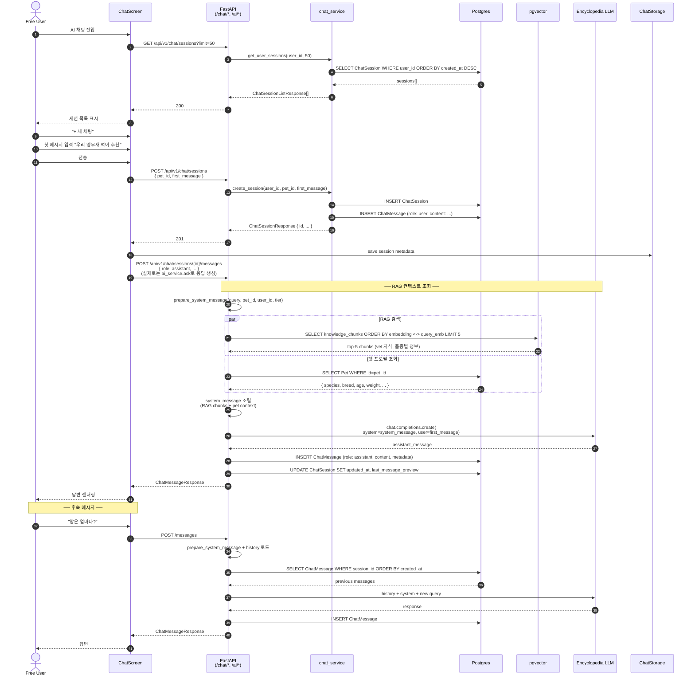
```mermaid
sequenceDiagram
    autonumber
    actor U as Free User
    participant App as ChatScreen
    participant API as FastAPI<br/>(/chat/*, /ai/*)
    participant Service as chat_service
    participant DB as Postgres
    participant Vector as pgvector
    participant LLM as Encyclopedia LLM
    participant Local as ChatStorage

    U->>App: AI 채팅 진입
    App->>API: GET /api/v1/chat/sessions?limit=50
    API->>Service: get_user_sessions(user_id, 50)
    Service->>DB: SELECT ChatSession WHERE user_id ORDER BY created_at DESC
    DB-->>Service: sessions[]
    Service-->>API: ChatSessionListResponse[]
    API-->>App: 200

    App-->>U: 세션 목록 표시
    U->>App: "+ 새 채팅"

    U->>App: 첫 메시지 입력 "우리 앵무새 먹이 추천"
    U->>App: 전송

    App->>API: POST /api/v1/chat/sessions<br/>{ pet_id, first_message }
    API->>Service: create_session(user_id, pet_id, first_message)
    Service->>DB: INSERT ChatSession
    Service->>DB: INSERT ChatMessage (role: user, content: ...)
    Service-->>API: ChatSessionResponse { id, ... }
    API-->>App: 201

    App->>Local: save session metadata
    App->>API: POST /api/v1/chat/sessions/{id}/messages<br/>{ role: assistant, ... }<br/>(실제로는 ai_service.ask로 응답 생성)

    Note over API,LLM: ── RAG 컨텍스트 조회 ──
    API->>API: prepare_system_message(query, pet_id, user_id, tier)
    par RAG 검색
        API->>Vector: SELECT knowledge_chunks ORDER BY embedding <-> query_emb LIMIT 5
        Vector-->>API: top-5 chunks (vet 지식, 품종별 정보)
    and 펫 프로필 조회
        API->>DB: SELECT Pet WHERE id=pet_id
        DB-->>API: { species, breed, age, weight, ... }
    end
    API->>API: system_message 조립<br/>(RAG chunks + pet context)

    API->>LLM: chat.completions.create(<br/>system=system_message, user=first_message)
    LLM-->>API: assistant_message

    API->>DB: INSERT ChatMessage (role: assistant, content, metadata)
    API->>DB: UPDATE ChatSession SET updated_at, last_message_preview
    API-->>App: ChatMessageResponse

    App-->>U: 답변 렌더링

    Note over U,App: ── 후속 메시지 ──
    U->>App: "양은 얼마나?"
    App->>API: POST /messages
    API->>API: prepare_system_message + history 로드
    API->>DB: SELECT ChatMessage WHERE session_id ORDER BY created_at
    DB-->>API: previous messages
    API->>LLM: history + system + new query
    LLM-->>API: response
    API->>DB: INSERT ChatMessage
    API-->>App: ChatMessageResponse
    App-->>U: 답변
```

**핵심 포인트:**
- 채팅은 **세션 단위로 history 유지** — DB에 메시지 누적 → 매 호출마다 전체 history를 LLM 컨텍스트로 전달.
- RAG는 **모든 메시지마다 재검색** — 새 query에 맞는 새 chunks 가져옴 (긴 대화에서도 컨텍스트 유지).
- 펫 컨텍스트(species, breed, age 등)도 system_message에 임베드 → "우리 새" 같은 대명사도 정확히 해석.

---

## 10.1 Store 결제 (Paywall → StoreKit)

Paywall 진입 → IAP product 로드 → 사용자가 플랜 선택 → StoreKit 결제 완료. **클라이언트 측 흐름만**.

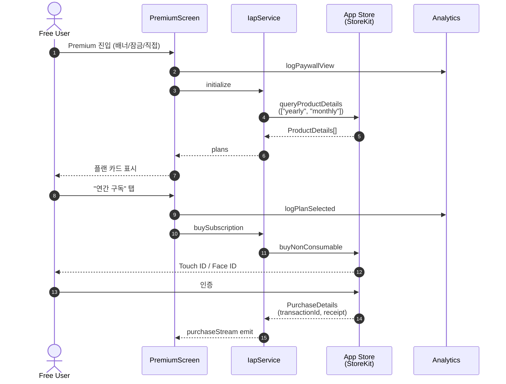
```mermaid
sequenceDiagram
    autonumber
    actor U as Free User
    participant App as PremiumScreen
    participant IAP as IapService
    participant AppStore as App Store<br/>(StoreKit)
    participant Analytics

    U->>App: Premium 진입 (배너/잠금/직접)
    App->>Analytics: logPaywallView
    App->>IAP: initialize
    IAP->>AppStore: queryProductDetails<br/>(["yearly", "monthly"])
    AppStore-->>IAP: ProductDetails[]
    IAP-->>App: plans
    App-->>U: 플랜 카드 표시

    U->>App: "연간 구독" 탭
    App->>Analytics: logPlanSelected
    App->>IAP: buySubscription
    IAP->>AppStore: buyNonConsumable
    AppStore-->>U: Touch ID / Face ID
    U->>AppStore: 인증
    AppStore-->>IAP: PurchaseDetails<br/>(transactionId, receipt)
    IAP-->>App: purchaseStream emit
```

**핵심:**
- Store 결제는 **클라가 직접 처리** — 백엔드 개입 없음.
- 결과는 `purchaseStream`으로 비동기 전달 → 다음 단계(10.2)로 넘어감.

---

## 10.2 영수증 검증 + tier 활성화

클라가 받은 receipt를 백엔드로 전달 → 백엔드가 Store API로 재검증 → UserTier 활성화 → 캐시 갱신.

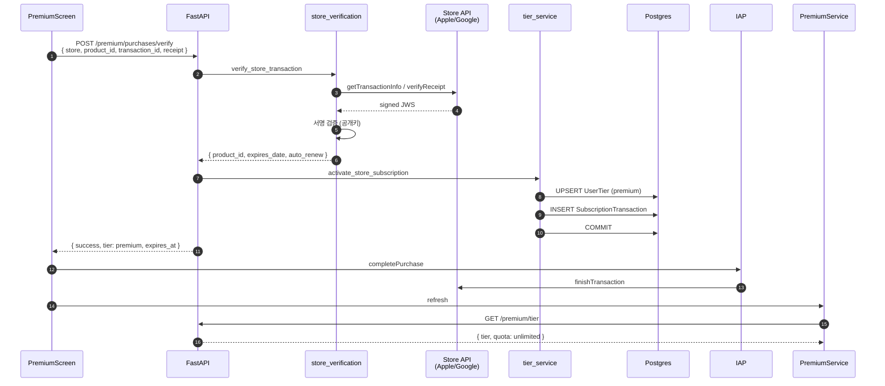
```mermaid
sequenceDiagram
    autonumber
    participant App as PremiumScreen
    participant API as FastAPI
    participant Verify as store_verification
    participant Store as Store API<br/>(Apple/Google)
    participant Tier as tier_service
    participant DB as Postgres
    participant IAP
    participant Premium as PremiumService

    App->>API: POST /premium/purchases/verify<br/>{ store, product_id, transaction_id, receipt }
    API->>Verify: verify_store_transaction
    Verify->>Store: getTransactionInfo / verifyReceipt
    Store-->>Verify: signed JWS
    Verify->>Verify: 서명 검증 (공개키)
    Verify-->>API: { product_id, expires_date, auto_renew }

    API->>Tier: activate_store_subscription
    Tier->>DB: UPSERT UserTier (premium)
    Tier->>DB: INSERT SubscriptionTransaction
    Tier->>DB: COMMIT
    API-->>App: { success, tier: premium, expires_at }

    App->>IAP: completePurchase
    IAP->>Store: finishTransaction

    App->>Premium: refresh
    Premium->>API: GET /premium/tier
    API-->>Premium: { tier, quota: unlimited }
```

**핵심:**
- **이중 검증** — 클라 receipt + 서버가 Store API로 재검증 (영수증 위변조 방지).
- `completePurchase`는 **백엔드 검증 성공 후에만** 호출 → 실패 시 purchaseStream이 재emit, 재시도 가능.
- `SubscriptionTransaction` 테이블에 모든 이벤트 기록 → 어드민 추적 가능.

---

## 11. 프로모션 코드 활성화

`PERCH-XXXX-XXXX` 형식 코드 입력 → 백엔드 검증 → tier 즉시 업그레이드.

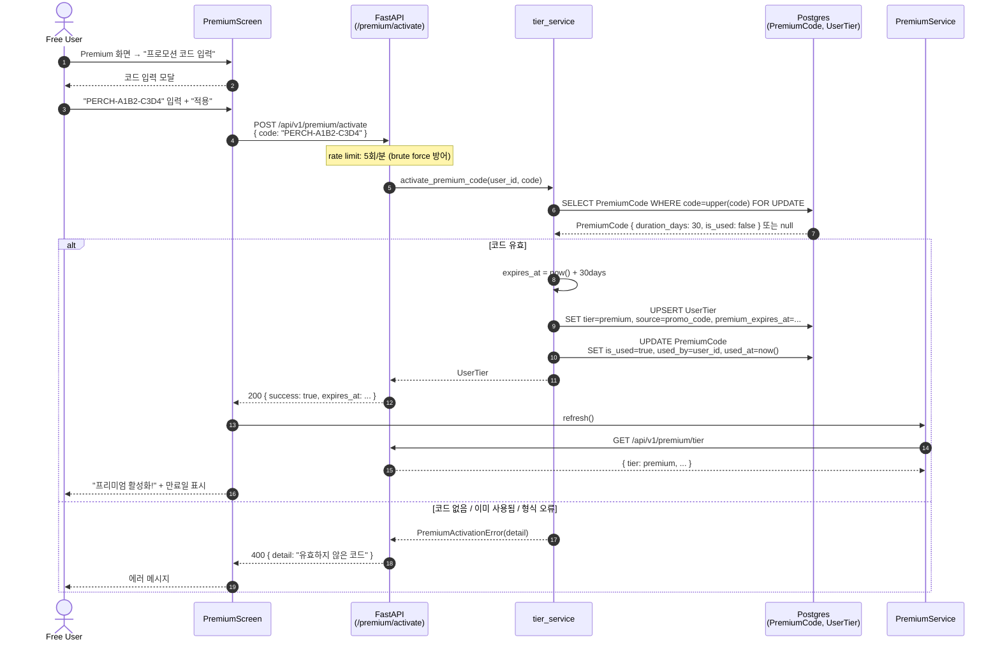
```mermaid
sequenceDiagram
    autonumber
    actor U as Free User
    participant App as PremiumScreen
    participant API as FastAPI<br/>(/premium/activate)
    participant Tier as tier_service
    participant DB as Postgres<br/>(PremiumCode, UserTier)
    participant Premium as PremiumService

    U->>App: Premium 화면 → "프로모션 코드 입력"
    App-->>U: 코드 입력 모달

    U->>App: "PERCH-A1B2-C3D4" 입력 + "적용"
    App->>API: POST /api/v1/premium/activate<br/>{ code: "PERCH-A1B2-C3D4" }

    Note over API: rate limit: 5회/분 (brute force 방어)

    API->>Tier: activate_premium_code(user_id, code)
    Tier->>DB: SELECT PremiumCode WHERE code=upper(code) FOR UPDATE
    DB-->>Tier: PremiumCode { duration_days: 30, is_used: false } 또는 null

    alt 코드 유효
        Tier->>Tier: expires_at = now() + 30days
        Tier->>DB: UPSERT UserTier<br/>SET tier=premium, source=promo_code, premium_expires_at=...
        Tier->>DB: UPDATE PremiumCode<br/>SET is_used=true, used_by=user_id, used_at=now()
        Tier-->>API: UserTier
        API-->>App: 200 { success: true, expires_at: ... }

        App->>Premium: refresh()
        Premium->>API: GET /api/v1/premium/tier
        API-->>Premium: { tier: premium, ... }
        App-->>U: "프리미엄 활성화!" + 만료일 표시

    else 코드 없음 / 이미 사용됨 / 형식 오류
        Tier-->>API: PremiumActivationError(detail)
        API-->>App: 400 { detail: "유효하지 않은 코드" }
        App-->>U: 에러 메시지
    end
```

**핵심 포인트:**
- `FOR UPDATE` 로우 잠금 → 동일 코드 동시 사용 시 한 명만 성공.
- rate limit 5회/분 → 코드 brute force 시도 차단.
- 결제 없이 tier 변경되므로 `SubscriptionTransaction` 기록 X — 별도 `PremiumCode.used_*` 컬럼으로 추적.
- 어드민이 코드 발급(시나리오 14) → 사용자가 활성화하는 양방향 흐름.

---

## 12.1 푸시 발송 + 디바이스 수신

Scheduler → 백엔드 알림 INSERT → FCM 전송 → 디바이스 OS → **앱 상태(BG/FG/종료)에 따라 다른 핸들러**.

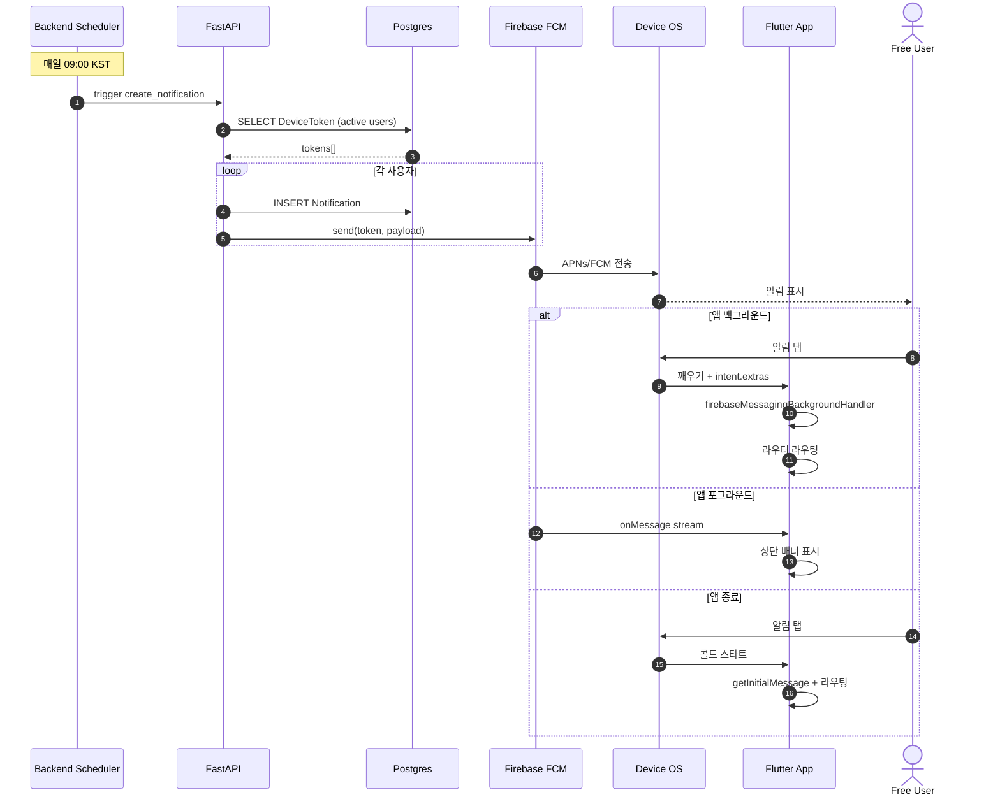
```mermaid
sequenceDiagram
    autonumber
    participant Scheduler as Backend Scheduler
    participant API as FastAPI
    participant DB as Postgres
    participant FCM as Firebase FCM
    participant OS as Device OS
    participant App as Flutter App
    actor U as Free User

    Note over Scheduler: 매일 09:00 KST

    Scheduler->>API: trigger create_notification
    API->>DB: SELECT DeviceToken (active users)
    DB-->>API: tokens[]
    loop 각 사용자
        API->>DB: INSERT Notification
        API->>FCM: send(token, payload)
    end
    FCM->>OS: APNs/FCM 전송
    OS-->>U: 알림 표시

    alt 앱 백그라운드
        U->>OS: 알림 탭
        OS->>App: 깨우기 + intent.extras
        App->>App: firebaseMessagingBackgroundHandler
        App->>App: 라우터 라우팅
    else 앱 포그라운드
        FCM->>App: onMessage stream
        App->>App: 상단 배너 표시
    else 앱 종료
        U->>OS: 알림 탭
        OS->>App: 콜드 스타트
        App->>App: getInitialMessage + 라우팅
    end
```

**핵심:**
- 알림 생성은 **사용자 직접 호출 X** — Scheduler 또는 백엔드 비즈니스 로직만 트리거.
- FCM payload에 `route` 필드 → 탭 시 자동 라우팅 (`/home/health-check/result?id=...` 등).
- 3가지 앱 상태(BG/FG/종료) 모두 별도 핸들러로 대응.

---

## 12.2 알림 화면 액션

사용자가 알림 목록 진입 → 조회/읽음/삭제. CRUD만 다루는 단순 흐름.

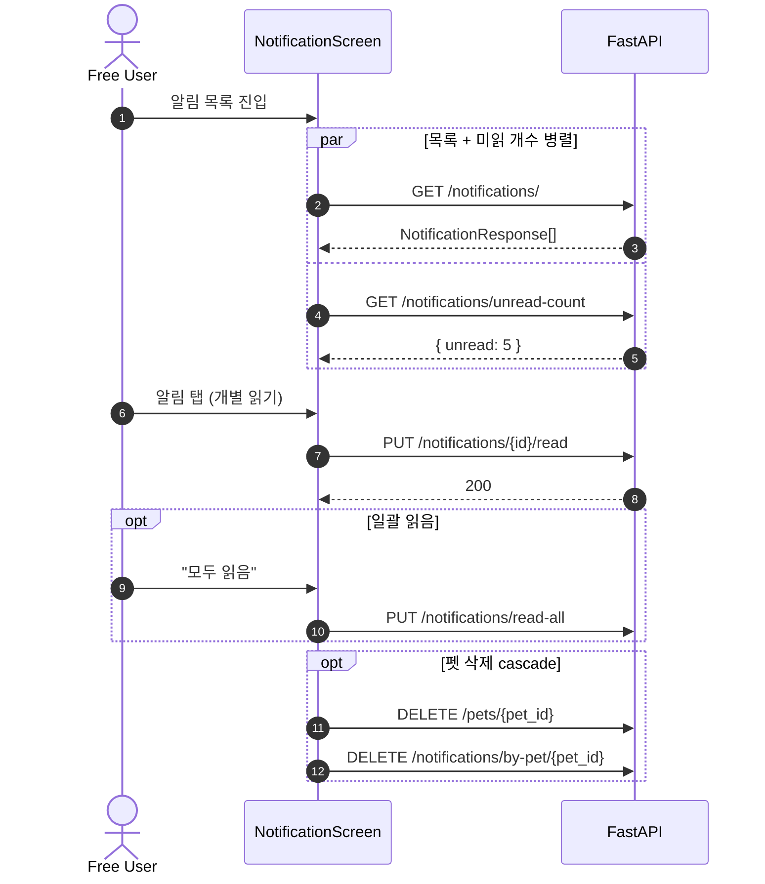
```mermaid
sequenceDiagram
    autonumber
    actor U as Free User
    participant App as NotificationScreen
    participant API as FastAPI

    U->>App: 알림 목록 진입
    par 목록 + 미읽 개수 병렬
        App->>API: GET /notifications/
        API-->>App: NotificationResponse[]
    and
        App->>API: GET /notifications/unread-count
        API-->>App: { unread: 5 }
    end

    U->>App: 알림 탭 (개별 읽기)
    App->>API: PUT /notifications/{id}/read
    API-->>App: 200

    opt 일괄 읽음
        U->>App: "모두 읽음"
        App->>API: PUT /notifications/read-all
    end

    opt 펫 삭제 cascade
        App->>API: DELETE /pets/{pet_id}
        App->>API: DELETE /notifications/by-pet/{pet_id}
    end
```

**핵심:**
- 목록 + 미읽 개수는 **병렬 조회** → 뱃지/리스트 동시 갱신.
- 펫 삭제 시 관련 알림 cascade 정리 (`by-pet/{pet_id}` 일괄 DELETE).

---

## 13. 리포트 공유 링크 → Public Viewer

Premium 사용자가 수의사 요약 공유 링크 생성 → 외부인(수의사)이 비로그인으로 조회.

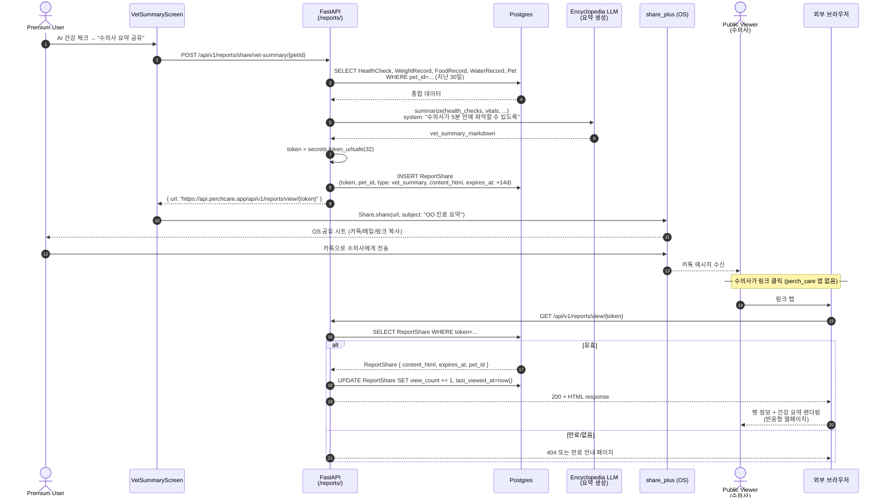
```mermaid
sequenceDiagram
    autonumber
    actor U as Premium User
    participant App as VetSummaryScreen
    participant API as FastAPI<br/>(/reports/)
    participant DB as Postgres
    participant LLM as Encyclopedia LLM<br/>(요약 생성)
    participant Share as share_plus (OS)
    actor V as Public Viewer<br/>(수의사)
    participant Browser as 외부 브라우저

    U->>App: AI 건강 체크 → "수의사 요약 공유"
    App->>API: POST /api/v1/reports/share/vet-summary/{petId}

    API->>DB: SELECT HealthCheck, WeightRecord, FoodRecord, WaterRecord, Pet<br/>WHERE pet_id=... (지난 30일)
    DB-->>API: 종합 데이터

    API->>LLM: summarize(health_checks, vitals, ...)<br/>system: "수의사가 5분 안에 파악할 수 있도록"
    LLM-->>API: vet_summary_markdown

    API->>API: token = secrets.token_urlsafe(32)
    API->>DB: INSERT ReportShare<br/>(token, pet_id, type: vet_summary, content_html, expires_at: +14d)
    API-->>App: { url: "https://api.perchcare.app/api/v1/reports/view/{token}" }

    App->>Share: Share.share(url, subject: "OO 진료 요약")
    Share-->>U: OS 공유 시트 (카톡/메일/링크 복사)

    U->>Share: 카톡으로 수의사에게 전송
    Share-->>V: 카톡 메시지 수신

    Note over V,Browser: ── 수의사가 링크 클릭 (perch_care 앱 없음) ──

    V->>Browser: 링크 탭
    Browser->>API: GET /api/v1/reports/view/{token}
    API->>DB: SELECT ReportShare WHERE token=...
    alt 유효
        DB-->>API: ReportShare { content_html, expires_at, pet_id }
        API->>DB: UPDATE ReportShare SET view_count += 1, last_viewed_at=now()
        API-->>Browser: 200 + HTML response
        Browser-->>V: 펫 정보 + 건강 요약 렌더링<br/>(반응형 웹페이지)
    else 만료/없음
        API-->>Browser: 404 또는 만료 안내 페이지
    end
```

**핵심 포인트:**
- 공유 토큰은 32바이트 URL-safe 랜덤 → URL 추측 불가능.
- 만료 기본 14일 → 무한 노출 방지.
- HTML은 백엔드에서 렌더링 (Jinja2 template 추정) → 외부인이 별도 앱 설치 없이 접근 가능.
- 조회수 카운팅 → 어드민이 공유 활용도 분석 가능.

---

## 14. 어드민 프리미엄 코드 발급

Admin이 마케팅용 프로모션 코드를 대량 발급하는 흐름.

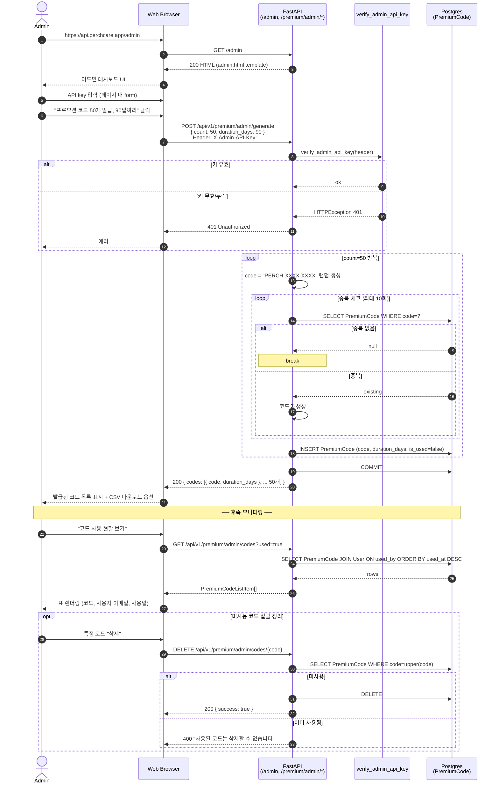
```mermaid
sequenceDiagram
    autonumber
    actor A as Admin
    participant Browser as Web Browser
    participant API as FastAPI<br/>(/admin, /premium/admin/*)
    participant Auth as verify_admin_api_key
    participant DB as Postgres<br/>(PremiumCode)

    A->>Browser: https://api.perchcare.app/admin
    Browser->>API: GET /admin
    API-->>Browser: 200 HTML (admin.html template)
    Browser-->>A: 어드민 대시보드 UI

    A->>Browser: API key 입력 (페이지 내 form)
    A->>Browser: "프로모션 코드 50개 발급, 90일짜리" 클릭

    Browser->>API: POST /api/v1/premium/admin/generate<br/>{ count: 50, duration_days: 90 }<br/>Header: X-Admin-API-Key: ...

    API->>Auth: verify_admin_api_key(header)
    alt 키 유효
        Auth-->>API: ok
    else 키 무효/누락
        Auth-->>API: HTTPException 401
        API-->>Browser: 401 Unauthorized
        Browser-->>A: 에러
    end

    loop count=50 반복
        API->>API: code = "PERCH-XXXX-XXXX" 랜덤 생성
        loop 중복 체크 (최대 10회)
            API->>DB: SELECT PremiumCode WHERE code=?
            alt 중복 없음
                DB-->>API: null
                Note over API: break
            else 중복
                DB-->>API: existing
                API->>API: 코드 재생성
            end
        end
        API->>DB: INSERT PremiumCode (code, duration_days, is_used=false)
    end

    API->>DB: COMMIT
    API-->>Browser: 200 { codes: [{ code, duration_days }, ... 50개] }

    Browser-->>A: 발급된 코드 목록 표시 + CSV 다운로드 옵션

    Note over A,DB: ── 후속 모니터링 ──

    A->>Browser: "코드 사용 현황 보기"
    Browser->>API: GET /api/v1/premium/admin/codes?used=true
    API->>DB: SELECT PremiumCode JOIN User ON used_by ORDER BY used_at DESC
    DB-->>API: rows
    API-->>Browser: PremiumCodeListItem[]
    Browser-->>A: 표 렌더링 (코드, 사용자 이메일, 사용일)

    opt 미사용 코드 일괄 정리
        A->>Browser: 특정 코드 "삭제"
        Browser->>API: DELETE /api/v1/premium/admin/codes/{code}
        API->>DB: SELECT PremiumCode WHERE code=upper(code)
        alt 미사용
            API->>DB: DELETE
            API-->>Browser: 200 { success: true }
        else 이미 사용됨
            API-->>Browser: 400 "사용된 코드는 삭제할 수 없습니다"
        end
    end
```

**핵심 포인트:**
- `X-Admin-API-Key` 헤더 인증 — JWT 사용자 인증과 별개 (어드민은 사람 사용자 ID가 없음).
- 코드 생성 시 중복 방지 10회 재시도 후 실패 시 500 — 코드 공간이 충분히 커서 실질적으로 발생 X.
- 사용된 코드는 삭제 불가 — 활성화된 사용자의 tier 이력 추적용.

---

## 15.1 Scheduler cron — 주간 인사이트 생성

매주 월요일 06:00 KST에 cron이 모든 활성 펫에 대해 인사이트를 미리 생성. 사용자 호출 전에 캐시 채우기.

```mermaid
sequenceDiagram
    autonumber
    participant Cron as APScheduler
    participant Job as weekly_insights_job
    participant DB as Postgres
    participant LLM as Encyclopedia LLM

    Note over Cron: 매주 월요일 06:00 KST

    Cron->>Job: generate_weekly_insights()
    Job->>DB: SELECT Pet WHERE active_user<br/>(지난 7일 활동)
    DB-->>Job: pets[]

    loop 각 펫
        Job->>DB: SELECT 주간 데이터<br/>(weight/food/water/health-check, last 7d)
        DB-->>Job: 데이터
        Job->>LLM: generate_insight(data, language: user.lang)
        LLM-->>Job: insight_markdown<br/>{ highlights[], recommendations[] }
        Job->>DB: UPSERT PetInsight (type: weekly)
    end
```

**핵심:**
- 비활성 펫(지난 7일 활동 없음)은 제외 → LLM 비용 절감.
- 사용자 언어 기준 LLM 호출 → 다국어 인사이트.
- UPSERT로 같은 주 중복 생성 방지 (cron 재실행 안전).

---

## 15.2 사용자 조회 + Lazy fallback

사용자 홈 진입 시 미리 생성된 인사이트 반환. 캐시 miss(cron 누락/신규 펫) 시 lazy 생성 + 즉시 null.

```mermaid
sequenceDiagram
    autonumber
    actor U as Premium User
    participant App as HomeScreen
    participant API as FastAPI
    participant DB as Postgres
    participant LLM as Encyclopedia LLM

    U->>App: 홈 진입
    App->>API: GET /pets/{petId}/insights?type=weekly

    alt tier != premium
        API-->>App: 403 Premium only
        App-->>U: 카드 미표시 + Premium 배너
    else
        API->>DB: SELECT PetInsight (최신)
        alt 캐시 hit
            DB-->>API: PetInsight
            API-->>App: 200 (인사이트)
            App-->>U: 인사이트 카드
        else 캐시 miss
            API->>API: pending_keys.add + asyncio.create_task(generate)
            API-->>App: 200 null
            App-->>U: 카드 미표시
            Note over API,LLM: 백그라운드 (새 DB 세션)<br/>LLM 호출 → PetInsight INSERT
        end
    end
```

**핵심:**
- **Premium 전용** — Free는 403, 클라가 카드 자체 숨김.
- **Lazy generation**: 캐시 miss 시 사용자는 기다리지 않음. 다음 진입 시 캐시 hit.
- `_pending_insight_keys` in-memory set으로 동일 펫 중복 생성 방지 (단일 인스턴스 한정).

---

## 부록. 시나리오 ↔ 백엔드 endpoint 매트릭스

각 시나리오가 호출하는 백엔드 endpoint와 [use-case-diagrams.md](use-case-diagrams.md) 부록 B의 UC ID 매핑.

| # | 시나리오 | 주요 endpoint | UC ID |
|---|---|---|---|
| 1 | 신규 Onboarding | `/auth/oauth/{provider}`, `/pets/`, `/users/me/device-token` | UC-AUTH-04/05, UC-PET-01, UC-NT-01 |
| 2 | 이메일 로그인 + 갱신 | `/auth/login`, `/auth/refresh` | UC-AUTH-03, UC-AUTH-06 |
| 3 | 비밀번호 찾기 | `/auth/reset-password`, `/verify-reset-code`, `/update-password` | UC-AUTH-07, 08, 09 |
| 4 | 펫 등록 + 초기 체중 | `/breed-standards/`, `/pets/`, `/weights/` | UC-PET-01, UC-PET-07, UC-PET-10, UC-WT-01 |
| 5 | 홈 대시보드 | `/pets/active`, `/bhi/`, `/pets/{id}/health-summary`, `/pets/{id}/insights` | UC-PET-05, UC-BHI-01, UC-PET-08, UC-PET-09 |
| 6 | 일일 기록 + 동기화 | `/weights/` (+ 다른 write 동일 패턴) | UC-WT-01, UC-SY-01, UC-SY-02 |
| 7 | AI 건강 체크 | `/ai/quota`, `/pets/{id}/health-checks/analyze`, `/health-checks/` | UC-HC-01..05, UC-HC-11 |
| 8 | AI 백과사전 SSE | `/ai/encyclopedia/stream` | UC-AE-02, UC-AE-03 |
| 9 | AI 챗 + RAG | `/chat/sessions`, `/chat/sessions/{id}/messages` | UC-CHAT-01..05 |
| 10 | IAP 구독 결제 | `/premium/purchases/verify`, `/premium/tier` | UC-PR-01, UC-PR-03 |
| 11 | 프로모션 코드 | `/premium/activate`, `/premium/tier` | UC-PR-01, UC-PR-02 |
| 12 | FCM 푸시 수신 | `/notifications/`, `/unread-count`, `/{id}/read` | UC-NT-03..06, UC-NT-11 |
| 13 | 리포트 공유 | `/reports/share/vet-summary/{petId}`, `/reports/view/{token}` | UC-RP-02, UC-RP-03 |
| 14 | 어드민 코드 발급 | `/admin`, `/premium/admin/generate`, `/codes` | UC-ADM-01..04 |
| 15 | 주간 인사이트 cron | `/pets/{id}/insights` (조회), 내부 cron job | UC-PET-09 |

## 변경 이력

| 날짜 | 변경 | 비고 |
|---|---|---|
| 2026-05-13 | 최초 작성 | 15개 시나리오 (Auth/Pet/Tracking/AI/IAP/Push/Reports/Admin/Sync/Scheduler) |
