# perch_care — Use Case Diagrams (유스케이스 다이어그램)

> **목적** — perch_care 시스템 전체(Flutter 앱 + FastAPI 백엔드 + 외부 통합)의 액터-유스케이스 관계를 UML Use Case Diagram으로 표현. HCI 수업 산출물 및 신규 합류 엔지니어 온보딩 자료 겸용.
>
> **범위** — Flutter 앱 모든 화면/액션 + FastAPI 16개 라우터(약 100개 endpoint) + 외부 통합 14개 + 어드민 대시보드.
>
> **마지막 갱신** — 2026-05-13 (Railway `superb-kindness/staging` 기준).

## 목차

- [표기법](#표기법)
- [액터 인덱스](#액터-인덱스)
- [0. 시스템 개요 (System Overview)](#0-시스템-개요-system-overview)
- [1. 인증 & 계정 (Auth & Account)](#1-인증--계정-auth--account)
- [2. 펫 관리 (Pet Management)](#2-펫-관리-pet-management)
- [3. 일상 트래킹 (Daily Tracking)](#3-일상-트래킹-daily-tracking)
- [4. AI 건강 체크 (Health Check Vision)](#4-ai-건강-체크-health-check-vision)
- [5. AI 백과사전 & 채팅 (Encyclopedia & Chat)](#5-ai-백과사전--채팅-encyclopedia--chat)
- [6. 프리미엄 & IAP](#6-프리미엄--iap)
- [7. 알림 & 일정 (Notifications & Schedules)](#7-알림--일정-notifications--schedules)
- [8. 리포트 & 공유 (Reports)](#8-리포트--공유-reports)
- [9. 어드민 대시보드 (Admin)](#9-어드민-대시보드-admin)
- [10. 동기화 & 오프라인 (Sync — Cross-cutting)](#10-동기화--오프라인-sync--cross-cutting)
- [부록 A. 액터 ↔ 다이어그램 매트릭스](#부록-a-액터--다이어그램-매트릭스)
- [부록 B. 유스케이스 ID 전체 인덱스](#부록-b-유스케이스-id-전체-인덱스)
- [부록 C. 백엔드 endpoint → 유스케이스 매핑](#부록-c-백엔드-endpoint--유스케이스-매핑)

---

## 표기법

Mermaid는 native UML use case diagram 문법이 없으므로 **flowchart** 기반으로 표현한다. 본 문서 전체에서 동일한 컨벤션을 적용:

| 요소 | Mermaid 문법 | 의미 |
|---|---|---|
| Primary actor (사람) | `((라벨))` + classDef `actor` | 원형, 브랜드 컬러 (`#FF9A42`) |
| Secondary actor (외부 시스템) | `((라벨))` + classDef `extActor` | 원형, 회색 |
| 유스케이스 | `(["라벨"])` | 양 끝 둥근 사각형 — 전통 UML의 oval 근사 |
| 시스템 경계 | `subgraph SYS["perch_care 시스템"]` | 한 다이어그램에 1개, 외부 액터는 밖에 |
| Association (액터 ↔ UC) | `---` | 방향 없는 실선 |
| «include» | `-.->|«include»|` | 점선 + 화살표 + 라벨 (의존성) |
| «extend» | `-.->|«extend»|` | 점선 + 화살표 (확장) |
| Generalization (액터 상속) | `-->|«inherits»|` | 실선 + 화살표 |

**예시:**

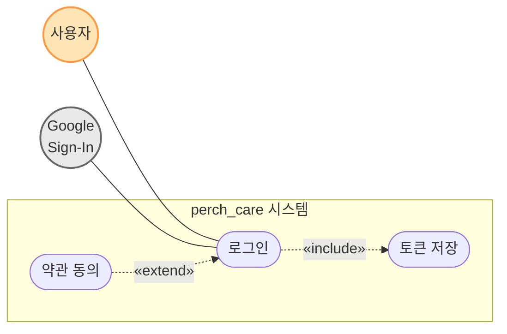

---

## 액터 인덱스

### Primary actors (사람 — 시스템 내부)

| ID | 액터 | 설명 |
|---|---|---|
| A1 | **Guest** | 미로그인. 스플래시·로그인·회원가입·약관·비밀번호 찾기만 접근 가능 |
| A2 | **Free User** | 로그인 + IAP 미구독. AI 백과사전/Vision에 월간 쿼터 적용 |
| A3 | **Premium User** | 구독 활성. 무제한 쿼터 + 수의사 요약 + 인사이트 (`«inherits»` Free User) |
| A4 | **Admin** | 백엔드 어드민 (`X-Admin-API-Key` 헤더 필요). `/admin` HTML + `/api/v1/premium/admin/*` |
| A5 | **Public Viewer** | 미인증 외부인. 리포트 공유 토큰으로 `/api/v1/reports/view/{token}` 접근 |

### Secondary actors (외부 시스템)

| ID | 액터 | 역할 |
|---|---|---|
| S1 | Google Sign-In | OAuth 2.0 ID Token 발급 |
| S2 | Apple Sign-In | Sign in with Apple (identityToken + 최초 fullName) |
| S3 | Firebase Cloud Messaging | 푸시 알림 전송 토큰·전달 |
| S4 | Firebase Analytics | 이벤트 트래킹 (로그인/구매/쿼터/페이월 등) |
| S5 | App Store IAP | iOS StoreKit (subscription product) |
| S6 | Google Play Billing | Android Billing Library |
| S7 | ⭐ In-App Review | StoreKit Review API (체중 5회 기록 후 호출) |
| S8 | AI Vision LLM | GPT-4o / Gemini Vision (백엔드 프록시 경유) |
| S9 | AI Encyclopedia LLM | gpt-4o-mini/gpt-4.1-nano/gpt-4o/deepseek (모델은 tier별 동적 선택) |
| S10 | pgvector DB | `knowledge_chunks` 벡터 검색 (RAG) |
| S11 | Device Camera/Gallery | `image_picker` + 카메라/사진 라이브러리 권한 |
| S12 | Local Storage | SharedPreferences + flutter_secure_storage + SQLite (이미지/캐시/큐) |
| S13 | Email/SMS Service | 비밀번호 재설정 코드 송신 |
| S14 | ⏰ Backend Scheduler | `app/scheduler.py` cron (주간 인사이트 등) |

---

## 0. 시스템 개요 (System Overview)

전체 액터 + 도메인 클러스터의 한눈 보기. 개별 유스케이스 대신 도메인 박스로 추상화.

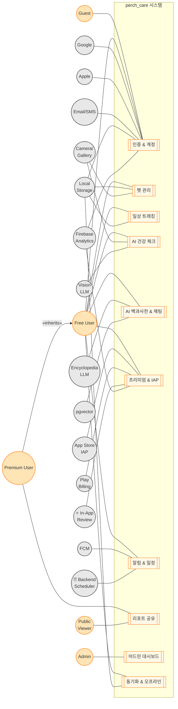

**시스템 경계 설명:**

- 박스 안 = perch_care가 직접 책임지는 기능 (Flutter 앱 + FastAPI 백엔드 모두 포함). **백엔드는 Railway에 호스팅** — `superb-kindness/staging` 또는 `noble-liberation`/`intelligent-wholeness`(production 후보) 중 환경별 분리.
- 박스 밖 = 외부 시스템. 백엔드를 통해 간접 호출되는 LLM도 외부 액터로 모델링 (Vision LLM, Encyclopedia LLM, pgvector).
- Premium User → Free User 일반화(Generalization): Premium은 Free의 모든 유스케이스를 사용할 수 있고, 추가로 D8 리포트 등 Premium 전용 유스케이스에 참여.

---

## 1. 인증 & 계정 (Auth & Account)

### 액터

- **Primary** — Guest, Free User, Premium User
- **Secondary** — Google Sign-In, Apple Sign-In, Email/SMS Service, Local Storage (Secure), Firebase Analytics

### 유스케이스 표

| UC ID | 이름 | 백엔드 endpoint | 화면 경로 |
|---|---|---|---|
| UC-AUTH-01 | 스플래시 자동 인증 | (없음 — 토큰 검증 + `GET /pets/`) | `/splash` |
| UC-AUTH-02 | 회원가입 (이메일) | `POST /api/v1/auth/signup` | `/signup` |
| UC-AUTH-03 | 이메일 로그인 | `POST /api/v1/auth/login` | `/login/email` |
| UC-AUTH-04 | Google 로그인 | `POST /api/v1/auth/oauth/google` | `/login` |
| UC-AUTH-05 | Apple 로그인 | `POST /api/v1/auth/oauth/apple` | `/login` |
| UC-AUTH-06 | 토큰 갱신 (자동) | `POST /api/v1/auth/refresh` | (백그라운드) |
| UC-AUTH-07 | 비밀번호 찾기 요청 | `POST /api/v1/auth/reset-password` | `/forgot-password/method` |
| UC-AUTH-08 | 인증 코드 확인 | `POST /api/v1/auth/verify-reset-code` | `/forgot-password/code` |
| UC-AUTH-09 | 비밀번호 재설정 | `POST /api/v1/auth/update-password` | `/forgot-password/reset` |
| UC-AUTH-10 | 로그아웃 | (로컬 토큰/캐시 삭제만) | 프로필 화면 |
| UC-AUTH-11 | 약관 조회 | (정적 컨텐츠) | `/terms/detail`, `/home/terms/detail` |
| UC-AUTH-12 | 프로필 조회/수정 | `GET\|PUT /api/v1/users/me/profile` | `/home/profile` |
| UC-AUTH-13 | 소셜 계정 연동/해제 | `POST\|GET\|DELETE /api/v1/users/me/social-accounts[/{provider}]` | 설정 |
| UC-AUTH-14 | 계정 삭제 | `DELETE /api/v1/users/me` | 설정 |
| UC-AUTH-15 | 온보딩 슬라이드 | (정적) | `/onboarding` |

### 다이어그램

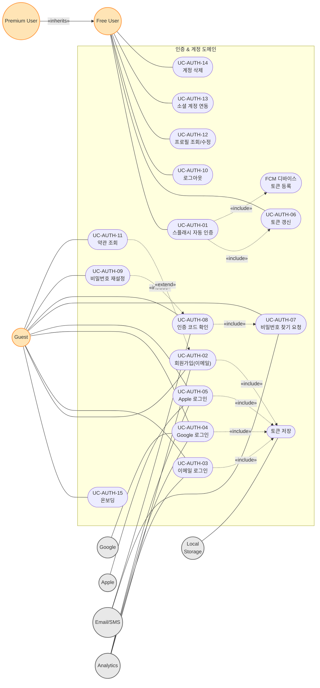

### 관계 설명

- **UC-AUTH-02..05 → 토큰 저장** (`«include»`): 모든 인증 성공 경로는 JWT를 `flutter_secure_storage`에 저장하는 단계를 공통으로 포함.
- **UC-AUTH-01 → UC-AUTH-06, FCM 디바이스 토큰 등록** (`«include»`): 스플래시는 토큰 만료 시 자동 갱신 + FCM 토큰을 백엔드에 재등록.
- **UC-AUTH-07 → 08 → 09**: 비밀번호 재설정 플로우는 직렬 의존. 08은 07을 사전 수행했어야 함, 09는 08을 사전 수행했어야 함.
- **UC-AUTH-11 약관 조회 → UC-AUTH-02 (`«extend»`)**: 회원가입 화면에서 선택적으로 약관 상세 조회가 가능 (필수 동의 vs 마케팅 동의 구분).
- **Premium → Free Generalization**: Premium User는 Free User의 모든 인증 유스케이스에 동일하게 참여.

---

## 2. 펫 관리 (Pet Management)

### 액터

- **Primary** — Free User, Premium User
- **Secondary** — Local Storage (SQLite for images), Camera/Gallery

### 유스케이스 표

| UC ID | 이름 | 백엔드 endpoint | 화면 경로 |
|---|---|---|---|
| UC-PET-01 | 펫 등록 | `POST /api/v1/pets/` | `/home/pet/add`, `/home/profile/setup` |
| UC-PET-02 | 펫 수정 | `PUT /api/v1/pets/{pet_id}` | `/home/pet/add?petId=...` |
| UC-PET-03 | 펫 삭제 | `DELETE /api/v1/pets/{pet_id}` | 펫 상세 |
| UC-PET-04 | 펫 목록 조회 | `GET /api/v1/pets/` | `/home/profile` |
| UC-PET-05 | 활성 펫 조회 | `GET /api/v1/pets/active` | (모든 메인 탭) |
| UC-PET-06 | 활성 펫 전환 | `PUT /api/v1/pets/{pet_id}/activate` | `/home/profile` |
| UC-PET-07 | 펫 프로필 이미지 저장 | (로컬 SQLite, `LocalImageStorageService`) | 펫 등록/수정 |
| UC-PET-08 | 펫 건강 요약 조회 | `GET /api/v1/pets/{pet_id}/health-summary?target_date=...` | `/home` |
| UC-PET-09 | 펫 인사이트 (주간) | `GET /api/v1/pets/{pet_id}/insights?type=weekly` | `/home` (Premium 전용, 403 시 카드 미표시) |
| UC-PET-10 | 품종 검색/조회 | `GET /api/v1/breed-standards/`, `/{breed_id}` | 펫 등록 시 |

### 다이어그램

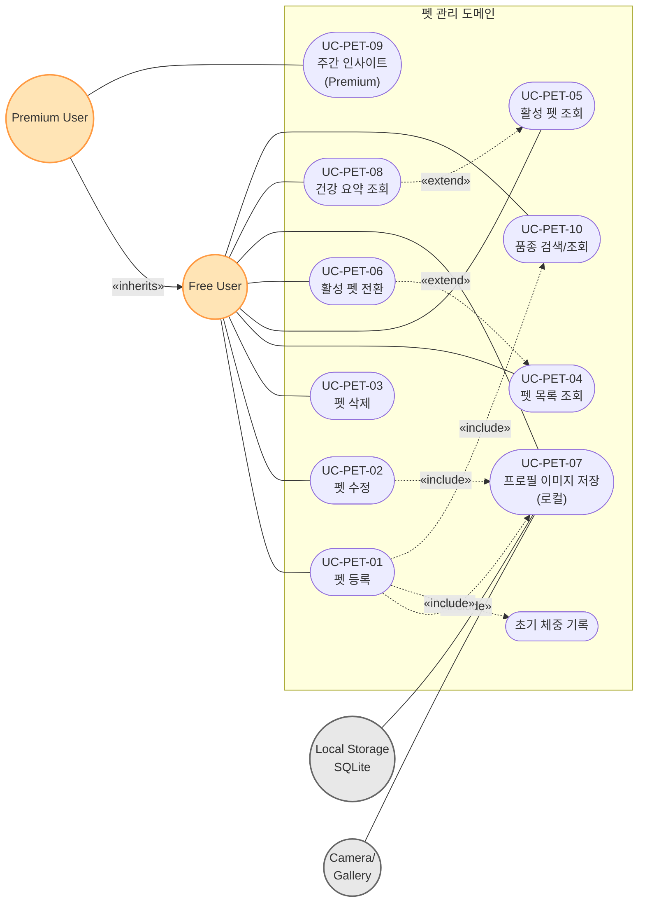

### 관계 설명

- **UC-PET-01 펫 등록**은 다음을 `«include»` 한다:
  - UC-PET-07 (이미지 저장 — 옵션이지만 흐름 일부로 통합)
  - UC-PET-10 (품종 검색 — 등록 폼에 임베드)
  - UC-WT-01 초기 체중 (펫 등록 화면에서 초기 체중 입력 시 자동 weight record 생성)
- **UC-PET-06 활성 펫 전환**은 UC-PET-04 (목록 조회)를 `«extend»` — 목록 화면에서 카드 탭으로 트리거.
- **UC-PET-09 인사이트 (Premium 전용)** — `tier != "premium"`이면 백엔드가 403 반환 (`backend/app/routers/pets.py:154-158`). Lazy generation: DB에 없으면 백그라운드로 생성하고 즉시 null 반환.

---

## 3. 일상 트래킹 (Daily Tracking)

체중 + 사료 + 음수 + 일일 기록 + BHI + 일정 + 홈 대시보드를 통합한 가장 큰 도메인. **모든 write 유스케이스는 UC-SY-01 (오프라인 큐 적재)를 `«extend»`** 로 가질 수 있음.

### 액터

- **Primary** — Free User, Premium User
- **Secondary** — Local Storage (SharedPreferences for offline queue), SyncService (백엔드 큐)

### 유스케이스 표

#### 체중 (Weight)

| UC ID | 이름 | 백엔드 endpoint |
|---|---|---|
| UC-WT-01 | 체중 기록 추가 | `POST /api/v1/weights/` |
| UC-WT-02 | 체중 기록 조회 (일별) | `GET /api/v1/weights/by-date/{date}` |
| UC-WT-03 | 체중 기록 조회 (목록/기간) | `GET /api/v1/weights/`, `/range` |
| UC-WT-04 | 월별 평균 차트 | `GET /api/v1/weights/monthly-averages` |
| UC-WT-05 | 주별 데이터 | `GET /api/v1/weights/weekly-data` |
| UC-WT-06 | 체중 기록 삭제 | `DELETE /api/v1/weights/by-date/{date}` |

#### 사료 (Food)

| UC ID | 이름 | 백엔드 endpoint |
|---|---|---|
| UC-FD-01 | 사료 기록 추가 | `POST /api/v1/food-records/` |
| UC-FD-02 | 사료 기록 조회 (일별) | `GET /api/v1/food-records/by-date/{date}` |
| UC-FD-03 | 사료 기록 조회 (기간) | `GET /api/v1/food-records/`, `/range` |
| UC-FD-04 | 사료 기록 삭제 | `DELETE /api/v1/food-records/by-date/{date}` |

#### 음수 (Water)

| UC ID | 이름 | 백엔드 endpoint |
|---|---|---|
| UC-WA-01 | 음수 기록 추가 | `POST /api/v1/water-records/` |
| UC-WA-02 | 음수 기록 조회 (일별) | `GET /api/v1/water-records/by-date/{date}` |
| UC-WA-03 | 음수 기록 조회 (기간) | `GET /api/v1/water-records/`, `/range` |
| UC-WA-04 | 음수 기록 삭제 | `DELETE /api/v1/water-records/by-date/{date}` |

#### 일일 기록 (Daily Record — 기분/배변/메모)

| UC ID | 이름 | 백엔드 endpoint |
|---|---|---|
| UC-DR-01 | 일일 기록 추가 | `POST /api/v1/daily-records/` |
| UC-DR-02 | 일일 기록 조회 (일별/기간) | `GET /api/v1/daily-records/by-date/{date}`, `/range` |
| UC-DR-03 | 일일 기록 월별 조회 | `GET /api/v1/daily-records/by-month` |
| UC-DR-04 | 일일 기록 삭제 | `DELETE /api/v1/daily-records/{id}`, `/by-date/{date}` |

#### BHI · 홈 · 일정

| UC ID | 이름 | 백엔드 endpoint |
|---|---|---|
| UC-BHI-01 | BHI 조회 | `GET /api/v1/bhi/` |
| UC-HOME-01 | 홈 대시보드 (집계) | (UC-BHI-01 + UC-PET-08 + 로컬 캐시) |
| UC-HOME-02 | 기간 선택기 (월/주 전환) | UC-BHI-01 재호출 |
| UC-HOME-03 | 홈 오프라인 모드 | (로컬 캐시) |
| UC-SCH-01 | 일정 등록 | `POST /api/v1/schedules/` |
| UC-SCH-02 | 일정 조회 (오늘) | `GET /api/v1/schedules/today` |
| UC-SCH-03 | 일정 조회 (날짜/월/전체) | `GET /api/v1/schedules/`, `/by-date/{d}`, `/by-month` |
| UC-SCH-04 | 일정 수정 | `PUT /api/v1/schedules/{id}` |
| UC-SCH-05 | 일정 삭제 | `DELETE /api/v1/schedules/{id}`, `/` |

### 다이어그램

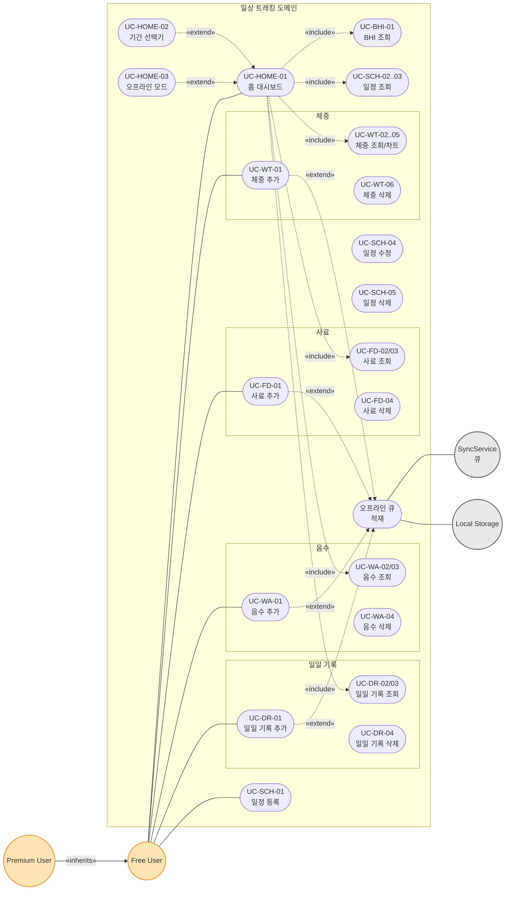

### 관계 설명

- **UC-HOME-01 홈 대시보드**는 일종의 aggregator UC. BHI + 펫 건강 요약 + 모든 일일 트래킹 데이터를 `«include»` 한다.
- **UC-HOME-02 기간 선택기** — 월/주 전환 시 BHI만 다시 로드. UC-HOME-01의 `«extend»` 동작.
- **UC-HOME-03 오프라인 모드** — 네트워크 실패 시 로컬 캐시만으로 부분 렌더. UC-HOME-01의 분기 시나리오 (`«extend»`).
- **모든 ADD 유스케이스 (UC-WT-01, FD-01, WA-01, DR-01)** — 서버 저장 실패 시 SyncService 큐에 적재 (UC-SY-01를 `«extend»`). Repository 레벨에서 자동 처리 (CLAUDE.md SyncService 섹션 참조).

---

## 4. AI 건강 체크 (Health Check Vision)

### 액터

- **Primary** — Free User (월간 vision 쿼터 제한), Premium User (무제한)
- **Secondary** — Camera/Gallery, AI Vision LLM (백엔드 프록시), Local Storage

### 유스케이스 표

| UC ID | 이름 | 백엔드 endpoint | 비고 |
|---|---|---|---|
| UC-HC-01 | 건강 체크 모드 선택 | (UI only) | full_body / part_specific / droppings / food |
| UC-HC-02 | 이미지 촬영/선택 | (`image_picker`) | HEIC→JPEG 변환, 10MB 제한 |
| UC-HC-03 | AI 분석 요청 (펫 있음) | `POST /api/v1/pets/{pet_id}/health-checks/analyze` (multipart) | 또는 `POST /api/v1/health-checks/analyze` |
| UC-HC-04 | AI 분석 요청 (food, 펫 없음) | `POST /api/v1/ai/vision/analyze` (multipart) | mode=food 전용 |
| UC-HC-05 | 결과 저장 | `POST /api/v1/health-checks/` | analyze 응답 별도 영구화 |
| UC-HC-06 | 히스토리 목록 조회 | `GET /api/v1/health-checks/`, `/recent`, `/range` | |
| UC-HC-07 | 히스토리 필터 | `GET /api/v1/health-checks/by-type/{type}`, `/by-status/{status}`, `/abnormal` | |
| UC-HC-08 | 결과 상세 조회 | `GET /api/v1/health-checks/{id}` | |
| UC-HC-09 | 히스토리 삭제 | `DELETE /api/v1/health-checks/{id}` | |
| UC-HC-10 | 이미지 업로드 (사전) | `POST /api/v1/health-checks/upload-image` | 분석과 분리된 업로드 경로 |
| UC-HC-11 | 쿼터 조회 | `GET /api/v1/ai/quota` | 백과사전과 공유 endpoint |
| UC-HC-12 | 수의사 요약 생성 | `POST /api/v1/reports/share/vet-summary/{petId}` | Premium 전용 — Diagram 8 참조 |

### 다이어그램

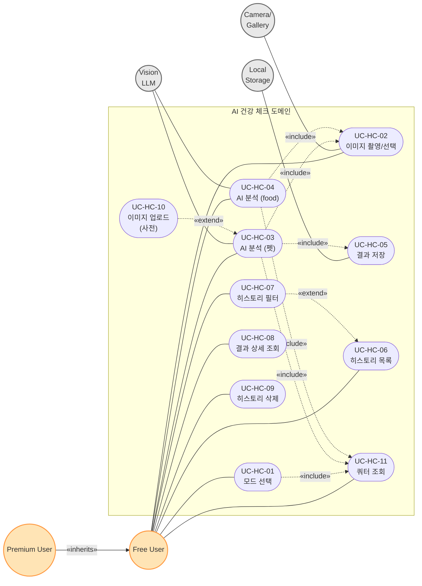

### 관계 설명

- **쿼터 게이팅**: UC-HC-03, UC-HC-04 모두 시작 시 UC-HC-11 (쿼터 조회 + 슬롯 예약)을 `«include»`. 백엔드 `check_and_reserve_vision()`에서 advisory lock으로 동시 요청 방지 (`ai.py:303-308`).
- **food 모드 분기**: 펫 컨텍스트가 필요한 일반 검사(UC-HC-03)와 펫 없이 음식만 분석하는 food 모드(UC-HC-04)는 다른 endpoint. food 모드는 결과 DB 저장 없음 (`ai.py:274` "DB 저장 없이 결과만 반환").
- **UC-HC-05 결과 저장은 UC-HC-03의 일부로 자동 호출**됨 (앱 측 워크플로). UC-HC-04(food)는 저장 안 함.
- **UC-HC-07 필터링은 UC-HC-06의 변형** — 같은 화면에서 query param만 바꿔 호출.
- **Vision LLM의 모델**: 기본 gpt-4o (`ai.py:357`). Free User도 동일 모델 사용하지만 쿼터로 제한.

---

## 5. AI 백과사전 & 채팅 (Encyclopedia & Chat)

### 액터

- **Primary** — Free User (월간 encyclopedia 쿼터), Premium User
- **Secondary** — Encyclopedia LLM (모델은 tier별 동적: Free=`gpt-4o-mini`/`deepseek-chat`, Premium=`gpt-4.1-nano`/`gpt-4o`), pgvector DB (RAG), Local Storage

### 유스케이스 표

| UC ID | 이름 | 백엔드 endpoint | 비고 |
|---|---|---|---|
| UC-AE-01 | 백과사전 단발성 질의 | `POST /api/v1/ai/encyclopedia` | 동기 응답 (전체 답변 일괄 반환) |
| UC-AE-02 | 백과사전 스트리밍 응답 | `POST /api/v1/ai/encyclopedia/stream` | SSE, token-by-token, rate limit 20/min |
| UC-AE-03 | 쿼터 조회 | `GET /api/v1/ai/quota` | Vision과 공유 |
| UC-CHAT-01 | 채팅 세션 생성 | `POST /api/v1/chat/sessions` | first_message + pet_id 옵션 |
| UC-CHAT-02 | 세션 목록 조회 | `GET /api/v1/chat/sessions?limit=50` | |
| UC-CHAT-03 | 세션 상세 조회 | `GET /api/v1/chat/sessions/{session_id}` | |
| UC-CHAT-04 | 메시지 전송 | `POST /api/v1/chat/sessions/{session_id}/messages` | 동기 응답 (스트리밍은 UC-AE-02 별도) |
| UC-CHAT-05 | 메시지 목록 조회 | `GET /api/v1/chat/sessions/{session_id}/messages?limit=200` | |
| UC-CHAT-06 | 세션 삭제 | `DELETE /api/v1/chat/sessions/{session_id}` | |

### 다이어그램

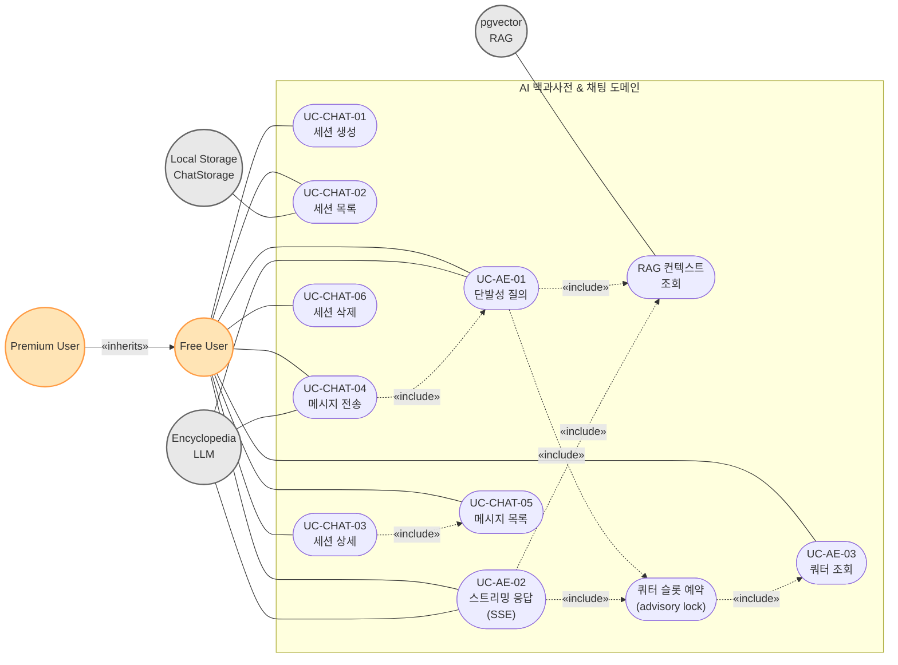

### 관계 설명

- **쿼터 슬롯 예약 (`«include»`)**: 모든 LLM 호출은 `check_and_reserve_encyclopedia()`로 슬롯을 advisory lock에 예약 → 동시 요청에서 quota race 차단 (`ai.py:60-68`). 응답 후 실측 토큰/시간으로 로그 업데이트.
- **RAG 컨텍스트 조회 (`«include»`)**: `prepare_system_message()`가 pgvector에서 관련 knowledge_chunks 검색 후 system prompt에 임베드 (`ai.py:148-156`).
- **모델 선택은 tier 함수**: `ai_service._select_model(tier)` — Free vs Premium에 다른 모델 (관리자 페이지의 `_PREMIUM_MODELS`에 정의).
- **UC-CHAT-04 메시지 전송은 UC-AE-01의 일종의 wrapping** — 세션 컨텍스트(history)를 자동 주입하여 AE-01 동일 로직 호출.
- **스트리밍 vs 동기**: 클라이언트는 `AiStreamService.streamEncyclopedia()`로 SSE 사용 (`lib/src/services/ai/ai_stream_service.dart`), 폴백으로 동기 호출 가능.

---

## 6. 프리미엄 & IAP

### 액터

- **Primary** — Free User (Paywall 진입 가능), Premium User
- **Secondary** — App Store IAP (StoreKit), Google Play Billing, Firebase Analytics, In-App Review

### 유스케이스 표

| UC ID | 이름 | 백엔드 endpoint | 비고 |
|---|---|---|---|
| UC-PR-01 | 티어 조회 | `GET /api/v1/premium/tier` | quota 정보 동시 반환 |
| UC-PR-02 | 프로모션 코드 활성화 | `POST /api/v1/premium/activate` | 5회/분 rate limit |
| UC-PR-03 | 구독 구매 검증 | `POST /api/v1/premium/purchases/verify` | store=apple\|google, 영수증 검증 |
| UC-PR-04 | 구독 복원 | `POST /api/v1/premium/purchases/restore` | 재설치/새 기기 |
| UC-PR-05 | Paywall 진입 | (UI only) | 배너/잠금/직접 진입 trigger |
| UC-PR-06 | 인앱 리뷰 요청 | (StoreKit API) | 체중 5회 기록 후 1회 호출 |

### 다이어그램

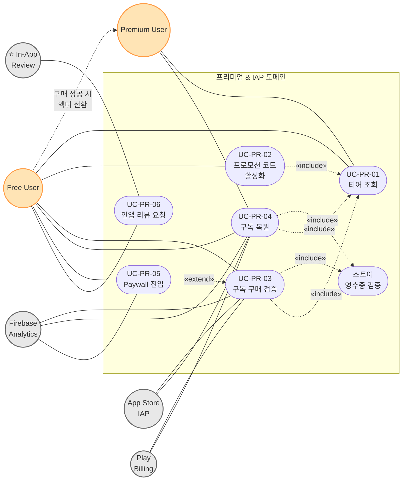

### 관계 설명

- **액터 전환**: UC-PR-03 구매 성공 시 Free User → Premium User로 액터 자체가 전환됨 (점선 화살표로 표현).
- **영수증 검증 `«include»`**: 모든 결제/복원은 백엔드 `verify_store_transaction()` 호출 (`premium.py:104-108`). 실패 시 `StoreVerificationError` → 400.
- **UC-PR-02 프로모션 코드 활성화는 별도 경로**: IAP를 거치지 않고 `PERCH-XXXX-XXXX` 형식 코드 입력 → tier 즉시 변경. 5회/분 rate limit (코드 brute force 방어).
- **UC-PR-05 Paywall**은 단순 진입 트리거. UC-PR-03을 `«extend»` (배너/잠금/직접 진입 3가지 트리거 모두 결국 UC-PR-03 호출 유도).
- **UC-PR-06 인앱 리뷰**는 체중 5회 기록 후 1회만 호출 (`analytics_service.dart:126-144`).

---

## 7. 알림 & 일정 (Notifications & Schedules)

### 액터

- **Primary** — Free User, Premium User
- **Secondary** — FCM, Backend Scheduler (`app/scheduler.py` cron)

> 일정(Schedules)은 일상 트래킹에도 있지만, **알림 발송의 trigger** 역할이 강하므로 본 다이어그램에서도 함께 표시. 트래킹 도메인(섹션 3)이 일정 CRUD를, 본 섹션은 알림 측면을 다룬다.

### 유스케이스 표

| UC ID | 이름 | 백엔드 endpoint | 비고 |
|---|---|---|---|
| UC-NT-01 | 디바이스 토큰 등록 | `POST /api/v1/users/me/device-token` | 로그인 직후 자동 호출 |
| UC-NT-02 | 디바이스 토큰 해제 | `DELETE /api/v1/users/me/device-token` | 로그아웃 시 |
| UC-NT-03 | 푸시 알림 수신 | (FCM `onMessage`/`onMessageOpenedApp`) | 포그라운드/백그라운드 |
| UC-NT-04 | 알림 목록 조회 | `GET /api/v1/notifications/` | |
| UC-NT-05 | 미읽 개수 조회 | `GET /api/v1/notifications/unread-count` | 홈 상단 뱃지 |
| UC-NT-06 | 알림 읽음 처리 | `PUT /api/v1/notifications/{id}/read` | |
| UC-NT-07 | 알림 일괄 읽음 | `PUT /api/v1/notifications/read-all` | |
| UC-NT-08 | 알림 삭제 (단건) | `DELETE /api/v1/notifications/{id}` | |
| UC-NT-09 | 알림 삭제 (전체) | `DELETE /api/v1/notifications/` | |
| UC-NT-10 | 알림 삭제 (펫별) | `DELETE /api/v1/notifications/by-pet/{pet_id}` | 펫 삭제 시 cascade |
| UC-NT-11 | 알림 생성 (서버 자동) | `POST /api/v1/notifications/` | Scheduler 호출, 사용자 직접 호출 X |

### 다이어그램

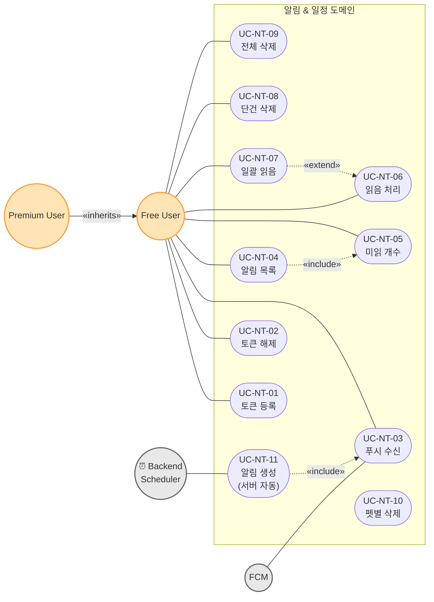

### 관계 설명

- **UC-NT-11은 사용자 액터 association 없음** — Scheduler(외부 cron 액터)가 trigger. 사용자는 결과만 UC-NT-03으로 수신.
- **UC-NT-11 → UC-NT-03 (`«include»`)**: 백엔드가 notification record 생성 후 FCM으로 push 전송 → 클라이언트가 수신.
- **UC-NT-01 로그인 시 자동 호출** — UC-AUTH-01 스플래시에서 `«include»` (Diagram 1 참조).
- **UC-NT-10 펫별 삭제는 UC-PET-03 cascade** — 펫 삭제 시 관련 알림도 정리.

---

## 8. 리포트 & 공유 (Reports)

### 액터

- **Primary** — Premium User (생성), **Public Viewer** (조회 — 미인증)
- **Secondary** — Backend Reports API

### 유스케이스 표

| UC ID | 이름 | 백엔드 endpoint | 비고 |
|---|---|---|---|
| UC-RP-01 | 건강 요약 공유 링크 생성 | `POST /api/v1/reports/share/health/{pet_id}` | Premium 전용 |
| UC-RP-02 | 수의사 요약 공유 링크 생성 | `POST /api/v1/reports/share/vet-summary/{pet_id}` | Premium 전용, AI Health Check 데이터 종합 |
| UC-RP-03 | 공개 리포트 조회 | `GET /api/v1/reports/view/{token}` | HTML 응답, **비로그인 가능** |

### 다이어그램

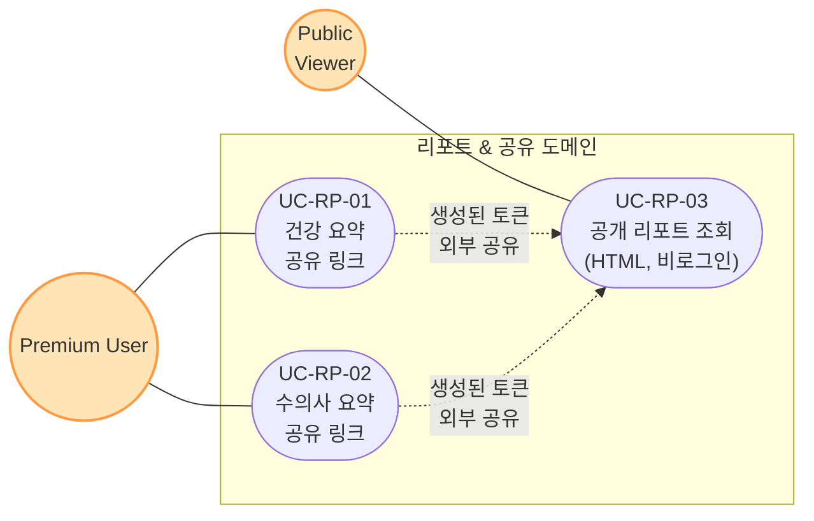

### 관계 설명

- **Public Viewer는 perch_care 미사용자**도 될 수 있음 (수의사·가족 등). 토큰 기반 인증.
- UC-RP-01, UC-RP-02는 **Premium 전용** — 백엔드에서 tier 확인.
- UC-RP-03은 HTML 응답으로 외부 브라우저에서 직접 렌더 가능.

---

## 9. 어드민 대시보드 (Admin)

### 액터

- **Primary** — Admin (단일 액터, `X-Admin-API-Key` 헤더로 인증)
- **Secondary** — Postgres (직접 집계 쿼리)

> 시스템 경계는 본 다이어그램에서 일반 앱과 **분리된 어드민 박스**로 표현. Admin은 브라우저로 `/admin` HTML 페이지에 직접 접근.

### 유스케이스 표

| UC ID | 이름 | 백엔드 endpoint |
|---|---|---|
| UC-ADM-01 | 어드민 페이지 진입 | `GET /admin` (HTML) |
| UC-ADM-02 | 프리미엄 코드 발급 | `POST /api/v1/premium/admin/generate` |
| UC-ADM-03 | 프리미엄 코드 목록 조회 | `GET /api/v1/premium/admin/codes?used=...` |
| UC-ADM-04 | 미사용 코드 삭제 | `DELETE /api/v1/premium/admin/codes/{code}` |
| UC-ADM-05 | 프리미엄 사용자 목록 | `GET /api/v1/premium/admin/users?email=&tier=` |
| UC-ADM-06 | 사용자 프리미엄 회수 | `POST /api/v1/premium/admin/users/{user_id}/revoke` |
| UC-ADM-07 | AI 사용량 요약 | `GET /api/v1/premium/admin/usage/summary?days=30` |
| UC-ADM-08 | AI 사용량 일별 | `GET /api/v1/premium/admin/usage/daily?days=30` |
| UC-ADM-09 | AI 사용량 사용자별 | `GET /api/v1/premium/admin/usage/users?days=30&limit=50` |
| UC-ADM-10 | AI 사용량 모델별 | `GET /api/v1/premium/admin/usage/models?days=30` |
| UC-ADM-11 | 구독 통계 | `GET /api/v1/premium/admin/subscriptions/stats` |
| UC-ADM-12 | 구독 거래 목록 | `GET /api/v1/premium/admin/subscriptions/transactions?store=&event_type=&days=&limit=` |
| UC-ADM-13 | 구독 요약 (KPI) | `GET /api/v1/premium/admin/subscriptions/summary?days=30` |
| UC-ADM-14 | 전환 퍼널 | `GET /api/v1/premium/admin/conversion/funnel` |
| UC-ADM-15 | AI 비용 vs 매출 분석 | `GET /api/v1/premium/admin/ai-cost?days=30` |
| UC-ADM-16 | 헬스 체크 (시스템) | `GET /health` |

### 다이어그램

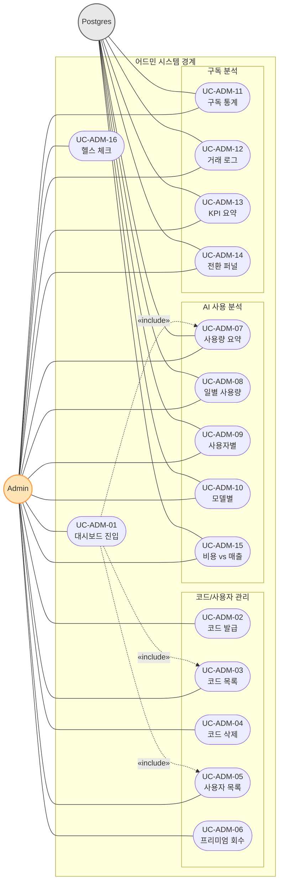

### 관계 설명

- **모든 admin endpoint는 `Depends(verify_admin_api_key)`** — `X-Admin-API-Key` 헤더로 인증 (`premium.py:14`).
- UC-ADM-02 코드 발급은 `PERCH-XXXX-XXXX` 형식 랜덤 생성, 중복 방지 10회 재시도 (`premium.py:191-220`).
- **비용 분석(UC-ADM-15)의 모델/비용 상수** — `_MODEL_COST_PER_1K`, `_MODEL_AVG_TOKENS`, `_PREMIUM_MODELS` 하드코딩 (`premium.py:371-387`).
- UC-ADM-04는 **이미 사용된 코드는 삭제 불가** (`premium.py:361-363`).
- UC-ADM-13 KPI는 `days` 파라미터로 기간별 신규/복원/만료/취소 집계.

---

## 10. 동기화 & 오프라인 (Sync — Cross-cutting)

> Cross-cutting concern. 다른 모든 도메인의 write 유스케이스에 `«extend»` 형태로 적용됨.

### 액터

- **Primary** — Free User, Premium User (모두 간접 — 사용자가 직접 트리거하지 않음)
- **Secondary** — Local Storage (SharedPreferences `sync_queue`), Backend (모든 write endpoint)

### 유스케이스 표

| UC ID | 이름 | 코드 위치 | 트리거 |
|---|---|---|---|
| UC-SY-01 | 오프라인 큐 적재 | `SyncService.enqueue()` (`lib/src/services/sync/sync_service.dart`) | 네트워크 write 실패 시 자동 |
| UC-SY-02 | 큐 재전송 | `SyncService.processQueue()` | 앱 시작 시 + 포그라운드 복귀 시 |
| UC-SY-03 | 초기 로컬→서버 백필 | `SyncService.syncLocalRecordsIfNeeded(petId)` | 펫별 최초 1회 (sync_initial_done_{petId} 플래그) |
| UC-SY-04 | Dead Letter 적재 | `_deadLetterKey` SharedPreferences | 전체 누적 20회 초과 시 |

### 다이어그램

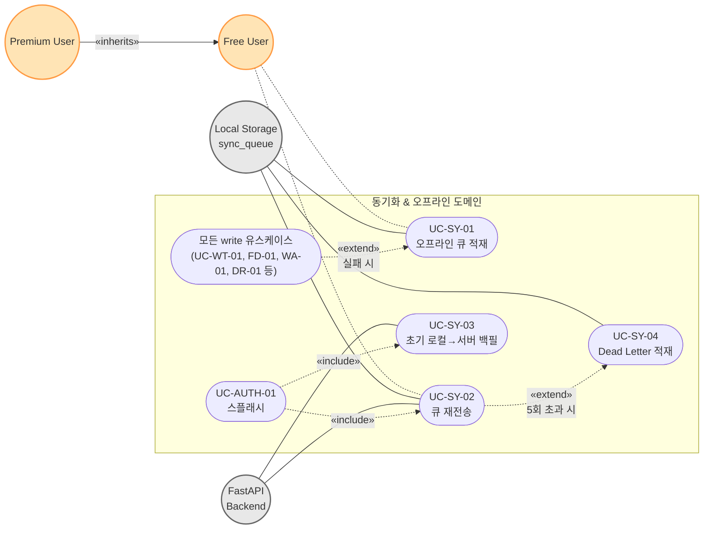

### 관계 설명

- **UC-SY-01은 사용자가 직접 트리거하지 않음** — Repository 레이어에서 자동 처리. 사용자 액터 association은 점선(`-.-`)으로 표시.
- **UC-SY-02 재전송 정책**: 세션당 최대 5회, 전체 누적 최대 20회. 실패해도 큐에서 즉시 삭제하지 않음 (CLAUDE.md SyncService 섹션).
- **UC-SY-03 초기 백필**: 펫별로 `sync_initial_done_{petId}` 플래그 관리. 한 펫당 최초 1회만.
- **UC-SY-04 Dead Letter** — 누적 실패 임계치 초과 시 별도 큐(`sync_dead_letter`)로 이동. 사용자에게 알릴지 여부는 별도 UX 결정.

---

## 부록 A. 액터 ↔ 다이어그램 매트릭스

| 액터 \ 다이어그램 | 0 | 1 | 2 | 3 | 4 | 5 | 6 | 7 | 8 | 9 | 10 |
|---|---|---|---|---|---|---|---|---|---|---|---|
| Guest | ● | ● | | | | | | | | | |
| Free User | ● | ● | ● | ● | ● | ● | ● | ● | | | ● |
| Premium User | ● | ● | ● | ● | ● | ● | ● | ● | ● | | ● |
| Admin | ● | | | | | | | | | ● | |
| Public Viewer | ● | | | | | | | | ● | | |
| Google Sign-In | ● | ● | | | | | | | | | |
| Apple Sign-In | ● | ● | | | | | | | | | |
| FCM | ● | | | | | | | ● | | | |
| Firebase Analytics | ● | ● | | | | | ● | | | | |
| App Store IAP | ● | | | | | | ● | | | | |
| Play Billing | ● | | | | | | ● | | | | |
| ⭐ In-App Review | ● | | | | | | ● | | | | |
| Vision LLM | ● | | | | ● | | | | | | |
| Encyclopedia LLM | ● | | | | | ● | | | | | |
| pgvector | ● | | | | | ● | | | | | |
| Camera/Gallery | ● | | ● | | ● | | | | | | |
| Local Storage | ● | ● | ● | ● | ● | ● | | | | | ● |
| Email/SMS | ● | ● | | | | | | | | | |
| ⏰ Backend Scheduler | ● | | | | | | | ● | | | |
| Postgres (admin 분석용) | | | | | | | | | | ● | |

---

## 부록 B. 유스케이스 ID 전체 인덱스

| UC ID | 이름 | 다이어그램 |
|---|---|---|
| UC-AUTH-01 | 스플래시 자동 인증 | 1 |
| UC-AUTH-02 | 회원가입 (이메일) | 1 |
| UC-AUTH-03 | 이메일 로그인 | 1 |
| UC-AUTH-04 | Google 로그인 | 1 |
| UC-AUTH-05 | Apple 로그인 | 1 |
| UC-AUTH-06 | 토큰 갱신 | 1 |
| UC-AUTH-07 | 비밀번호 찾기 요청 | 1 |
| UC-AUTH-08 | 인증 코드 확인 | 1 |
| UC-AUTH-09 | 비밀번호 재설정 | 1 |
| UC-AUTH-10 | 로그아웃 | 1 |
| UC-AUTH-11 | 약관 조회 | 1 |
| UC-AUTH-12 | 프로필 조회/수정 | 1 |
| UC-AUTH-13 | 소셜 계정 연동/해제 | 1 |
| UC-AUTH-14 | 계정 삭제 | 1 |
| UC-AUTH-15 | 온보딩 슬라이드 | 1 |
| UC-PET-01 | 펫 등록 | 2 |
| UC-PET-02 | 펫 수정 | 2 |
| UC-PET-03 | 펫 삭제 | 2 |
| UC-PET-04 | 펫 목록 조회 | 2 |
| UC-PET-05 | 활성 펫 조회 | 2 |
| UC-PET-06 | 활성 펫 전환 | 2 |
| UC-PET-07 | 펫 프로필 이미지 저장 (로컬) | 2 |
| UC-PET-08 | 펫 건강 요약 조회 | 2 |
| UC-PET-09 | 주간 인사이트 (Premium) | 2 |
| UC-PET-10 | 품종 검색/조회 | 2 |
| UC-WT-01 | 체중 기록 추가 | 3 |
| UC-WT-02 | 체중 기록 조회 (일별) | 3 |
| UC-WT-03 | 체중 기록 조회 (목록/기간) | 3 |
| UC-WT-04 | 월별 평균 차트 | 3 |
| UC-WT-05 | 주별 데이터 | 3 |
| UC-WT-06 | 체중 기록 삭제 | 3 |
| UC-FD-01 | 사료 기록 추가 | 3 |
| UC-FD-02 | 사료 기록 조회 (일별) | 3 |
| UC-FD-03 | 사료 기록 조회 (기간) | 3 |
| UC-FD-04 | 사료 기록 삭제 | 3 |
| UC-WA-01 | 음수 기록 추가 | 3 |
| UC-WA-02 | 음수 기록 조회 (일별) | 3 |
| UC-WA-03 | 음수 기록 조회 (기간) | 3 |
| UC-WA-04 | 음수 기록 삭제 | 3 |
| UC-DR-01 | 일일 기록 추가 | 3 |
| UC-DR-02 | 일일 기록 조회 | 3 |
| UC-DR-03 | 일일 기록 월별 조회 | 3 |
| UC-DR-04 | 일일 기록 삭제 | 3 |
| UC-BHI-01 | BHI 조회 | 3 |
| UC-HOME-01 | 홈 대시보드 (집계) | 3 |
| UC-HOME-02 | 기간 선택기 | 3 |
| UC-HOME-03 | 홈 오프라인 모드 | 3 |
| UC-SCH-01 | 일정 등록 | 3 |
| UC-SCH-02 | 일정 조회 (오늘) | 3 |
| UC-SCH-03 | 일정 조회 (날짜/월/전체) | 3 |
| UC-SCH-04 | 일정 수정 | 3 |
| UC-SCH-05 | 일정 삭제 | 3 |
| UC-HC-01 | 건강 체크 모드 선택 | 4 |
| UC-HC-02 | 이미지 촬영/선택 | 4 |
| UC-HC-03 | AI 분석 요청 (펫) | 4 |
| UC-HC-04 | AI 분석 요청 (food) | 4 |
| UC-HC-05 | 결과 저장 | 4 |
| UC-HC-06 | 히스토리 목록 조회 | 4 |
| UC-HC-07 | 히스토리 필터 | 4 |
| UC-HC-08 | 결과 상세 조회 | 4 |
| UC-HC-09 | 히스토리 삭제 | 4 |
| UC-HC-10 | 이미지 업로드 (사전) | 4 |
| UC-HC-11 | 쿼터 조회 | 4 |
| UC-HC-12 | 수의사 요약 생성 | 4, 8 |
| UC-AE-01 | 백과사전 단발성 질의 | 5 |
| UC-AE-02 | 백과사전 스트리밍 응답 | 5 |
| UC-AE-03 | 쿼터 조회 | 5 |
| UC-CHAT-01 | 채팅 세션 생성 | 5 |
| UC-CHAT-02 | 세션 목록 조회 | 5 |
| UC-CHAT-03 | 세션 상세 조회 | 5 |
| UC-CHAT-04 | 메시지 전송 | 5 |
| UC-CHAT-05 | 메시지 목록 조회 | 5 |
| UC-CHAT-06 | 세션 삭제 | 5 |
| UC-PR-01 | 티어 조회 | 6 |
| UC-PR-02 | 프로모션 코드 활성화 | 6 |
| UC-PR-03 | 구독 구매 검증 | 6 |
| UC-PR-04 | 구독 복원 | 6 |
| UC-PR-05 | Paywall 진입 | 6 |
| UC-PR-06 | 인앱 리뷰 요청 | 6 |
| UC-NT-01 | 디바이스 토큰 등록 | 7 |
| UC-NT-02 | 디바이스 토큰 해제 | 7 |
| UC-NT-03 | 푸시 알림 수신 | 7 |
| UC-NT-04 | 알림 목록 조회 | 7 |
| UC-NT-05 | 미읽 개수 조회 | 7 |
| UC-NT-06 | 알림 읽음 처리 | 7 |
| UC-NT-07 | 알림 일괄 읽음 | 7 |
| UC-NT-08 | 알림 삭제 (단건) | 7 |
| UC-NT-09 | 알림 삭제 (전체) | 7 |
| UC-NT-10 | 알림 삭제 (펫별) | 7 |
| UC-NT-11 | 알림 생성 (서버 자동) | 7 |
| UC-RP-01 | 건강 요약 공유 링크 생성 | 8 |
| UC-RP-02 | 수의사 요약 공유 링크 생성 | 8 |
| UC-RP-03 | 공개 리포트 조회 | 8 |
| UC-ADM-01 | 어드민 페이지 진입 | 9 |
| UC-ADM-02 | 프리미엄 코드 발급 | 9 |
| UC-ADM-03 | 프리미엄 코드 목록 조회 | 9 |
| UC-ADM-04 | 미사용 코드 삭제 | 9 |
| UC-ADM-05 | 프리미엄 사용자 목록 | 9 |
| UC-ADM-06 | 사용자 프리미엄 회수 | 9 |
| UC-ADM-07 | AI 사용량 요약 | 9 |
| UC-ADM-08 | AI 사용량 일별 | 9 |
| UC-ADM-09 | AI 사용량 사용자별 | 9 |
| UC-ADM-10 | AI 사용량 모델별 | 9 |
| UC-ADM-11 | 구독 통계 | 9 |
| UC-ADM-12 | 구독 거래 목록 | 9 |
| UC-ADM-13 | 구독 요약 (KPI) | 9 |
| UC-ADM-14 | 전환 퍼널 | 9 |
| UC-ADM-15 | AI 비용 vs 매출 분석 | 9 |
| UC-ADM-16 | 헬스 체크 (시스템) | 9 |
| UC-SY-01 | 오프라인 큐 적재 | 10 |
| UC-SY-02 | 큐 재전송 | 10 |
| UC-SY-03 | 초기 로컬→서버 백필 | 10 |
| UC-SY-04 | Dead Letter 적재 | 10 |

**합계: 105개 유스케이스** (5개 primary actor + 14개 secondary actor)

---

## 부록 C. 백엔드 endpoint → 유스케이스 매핑

> 모든 경로는 `/api/v1` 프리픽스 생략 (단 `/health`, `/admin`은 root).

### auth (7)

| Method | Path | UC ID |
|---|---|---|
| POST | `/auth/signup` | UC-AUTH-02 |
| POST | `/auth/login` | UC-AUTH-03 |
| POST | `/auth/refresh` | UC-AUTH-06 |
| POST | `/auth/oauth/{provider}` | UC-AUTH-04 (google), UC-AUTH-05 (apple) |
| POST | `/auth/reset-password` | UC-AUTH-07 |
| POST | `/auth/verify-reset-code` | UC-AUTH-08 |
| POST | `/auth/update-password` | UC-AUTH-09 |

### users (8)

| Method | Path | UC ID |
|---|---|---|
| GET | `/users/me/profile` | UC-AUTH-12 |
| PUT | `/users/me/profile` | UC-AUTH-12 |
| POST | `/users/me/social-accounts` | UC-AUTH-13 |
| GET | `/users/me/social-accounts` | UC-AUTH-13 |
| DELETE | `/users/me/social-accounts/{provider}` | UC-AUTH-13 |
| DELETE | `/users/me` | UC-AUTH-14 |
| POST | `/users/me/device-token` | UC-NT-01 |
| DELETE | `/users/me/device-token` | UC-NT-02 |

### pets (9)

| Method | Path | UC ID |
|---|---|---|
| GET | `/pets/` | UC-PET-04 (스플래시에서도 호출 → UC-AUTH-01 일부) |
| GET | `/pets/active` | UC-PET-05 |
| GET | `/pets/{pet_id}` | UC-PET-04 |
| POST | `/pets/` | UC-PET-01 |
| PUT | `/pets/{pet_id}` | UC-PET-02 |
| DELETE | `/pets/{pet_id}` | UC-PET-03 |
| PUT | `/pets/{pet_id}/activate` | UC-PET-06 |
| GET | `/pets/{pet_id}/health-summary` | UC-PET-08 |
| GET | `/pets/{pet_id}/insights` | UC-PET-09 |

### weights (7)

| Method | Path | UC ID |
|---|---|---|
| GET | `/weights/` | UC-WT-03 |
| GET | `/weights/by-date/{date}` | UC-WT-02 |
| GET | `/weights/range` | UC-WT-03 |
| POST | `/weights/` | UC-WT-01 |
| DELETE | `/weights/by-date/{date}` | UC-WT-06 |
| GET | `/weights/monthly-averages` | UC-WT-04 |
| GET | `/weights/weekly-data` | UC-WT-05 |

### food_records (5)

| Method | Path | UC ID |
|---|---|---|
| GET | `/food-records/` | UC-FD-03 |
| GET | `/food-records/by-date/{date}` | UC-FD-02 |
| GET | `/food-records/range` | UC-FD-03 |
| POST | `/food-records/` | UC-FD-01 |
| DELETE | `/food-records/by-date/{date}` | UC-FD-04 |

### water_records (5)

| Method | Path | UC ID |
|---|---|---|
| GET | `/water-records/` | UC-WA-03 |
| GET | `/water-records/by-date/{date}` | UC-WA-02 |
| GET | `/water-records/range` | UC-WA-03 |
| POST | `/water-records/` | UC-WA-01 |
| DELETE | `/water-records/by-date/{date}` | UC-WA-04 |

### daily_records (7)

| Method | Path | UC ID |
|---|---|---|
| GET | `/daily-records/` | UC-DR-02 |
| GET | `/daily-records/by-date/{date}` | UC-DR-02 |
| GET | `/daily-records/by-month` | UC-DR-03 |
| GET | `/daily-records/range` | UC-DR-02 |
| POST | `/daily-records/` | UC-DR-01 |
| DELETE | `/daily-records/{id}` | UC-DR-04 |
| DELETE | `/daily-records/by-date/{date}` | UC-DR-04 |

### health_checks (11)

| Method | Path | UC ID |
|---|---|---|
| GET | `/health-checks/` | UC-HC-06 |
| GET | `/health-checks/recent` | UC-HC-06 |
| GET | `/health-checks/by-type/{check_type}` | UC-HC-07 |
| GET | `/health-checks/by-status/{check_status}` | UC-HC-07 |
| GET | `/health-checks/abnormal` | UC-HC-07 |
| GET | `/health-checks/range` | UC-HC-06 |
| GET | `/health-checks/{check_id}` | UC-HC-08 |
| POST | `/health-checks/` | UC-HC-05 |
| DELETE | `/health-checks/{check_id}` | UC-HC-09 |
| POST | `/health-checks/upload-image` | UC-HC-10 |
| POST | `/health-checks/analyze` | UC-HC-03 |

### ai (4) — pets/{pet_id}/health-checks/analyze도 health_checks 측 처리

| Method | Path | UC ID |
|---|---|---|
| POST | `/ai/encyclopedia` | UC-AE-01 |
| POST | `/ai/encyclopedia/stream` | UC-AE-02 |
| POST | `/ai/vision/analyze` | UC-HC-04 |
| GET | `/ai/quota` | UC-AE-03, UC-HC-11 (공유) |

### chat (6)

| Method | Path | UC ID |
|---|---|---|
| POST | `/chat/sessions` | UC-CHAT-01 |
| GET | `/chat/sessions` | UC-CHAT-02 |
| GET | `/chat/sessions/{session_id}` | UC-CHAT-03 |
| DELETE | `/chat/sessions/{session_id}` | UC-CHAT-06 |
| POST | `/chat/sessions/{session_id}/messages` | UC-CHAT-04 |
| GET | `/chat/sessions/{session_id}/messages` | UC-CHAT-05 |

### bhi (1)

| Method | Path | UC ID |
|---|---|---|
| GET | `/bhi/` | UC-BHI-01 |

### breed_standards (2)

| Method | Path | UC ID |
|---|---|---|
| GET | `/breed-standards/` | UC-PET-10 |
| GET | `/breed-standards/{breed_id}` | UC-PET-10 |

### premium (4 user + 14 admin = 18)

| Method | Path | UC ID |
|---|---|---|
| GET | `/premium/tier` | UC-PR-01 |
| POST | `/premium/activate` | UC-PR-02 |
| POST | `/premium/purchases/verify` | UC-PR-03 |
| POST | `/premium/purchases/restore` | UC-PR-04 |
| POST | `/premium/admin/generate` | UC-ADM-02 |
| GET | `/premium/admin/codes` | UC-ADM-03 |
| GET | `/premium/admin/users` | UC-ADM-05 |
| POST | `/premium/admin/users/{user_id}/revoke` | UC-ADM-06 |
| DELETE | `/premium/admin/codes/{code}` | UC-ADM-04 |
| GET | `/premium/admin/usage/summary` | UC-ADM-07 |
| GET | `/premium/admin/usage/daily` | UC-ADM-08 |
| GET | `/premium/admin/usage/users` | UC-ADM-09 |
| GET | `/premium/admin/usage/models` | UC-ADM-10 |
| GET | `/premium/admin/subscriptions/stats` | UC-ADM-11 |
| GET | `/premium/admin/subscriptions/transactions` | UC-ADM-12 |
| GET | `/premium/admin/subscriptions/summary` | UC-ADM-13 |
| GET | `/premium/admin/conversion/funnel` | UC-ADM-14 |
| GET | `/premium/admin/ai-cost` | UC-ADM-15 |

### schedules (8)

| Method | Path | UC ID |
|---|---|---|
| GET | `/schedules/` | UC-SCH-03 |
| GET | `/schedules/by-month` | UC-SCH-03 |
| GET | `/schedules/by-date/{target_date}` | UC-SCH-03 |
| GET | `/schedules/today` | UC-SCH-02 |
| POST | `/schedules/` | UC-SCH-01 |
| PUT | `/schedules/{schedule_id}` | UC-SCH-04 |
| DELETE | `/schedules/{schedule_id}` | UC-SCH-05 |
| DELETE | `/schedules/` | UC-SCH-05 |

### notifications (8)

| Method | Path | UC ID |
|---|---|---|
| GET | `/notifications/` | UC-NT-04 |
| GET | `/notifications/unread-count` | UC-NT-05 |
| POST | `/notifications/` | UC-NT-11 |
| PUT | `/notifications/{notification_id}/read` | UC-NT-06 |
| PUT | `/notifications/read-all` | UC-NT-07 |
| DELETE | `/notifications/{notification_id}` | UC-NT-08 |
| DELETE | `/notifications/` | UC-NT-09 |
| DELETE | `/notifications/by-pet/{pet_id}` | UC-NT-10 |

### reports (3)

| Method | Path | UC ID |
|---|---|---|
| POST | `/reports/share/health/{pet_id}` | UC-RP-01 |
| POST | `/reports/share/vet-summary/{pet_id}` | UC-RP-02, UC-HC-12 |
| GET | `/reports/view/{token}` | UC-RP-03 |

### root (2)

| Method | Path | UC ID |
|---|---|---|
| GET | `/health` | UC-ADM-16 |
| GET | `/admin` | UC-ADM-01 |

**합계: 16개 라우터 + root 2개 = 111개 endpoint, 모두 105개 UC에 매핑됨.**

---

## 변경 이력

| 날짜 | 변경 | 비고 |
|---|---|---|
| 2026-05-13 | 최초 작성 | FastAPI 16라우터/101엔드포인트, Flutter 화면 전체 대상 |
