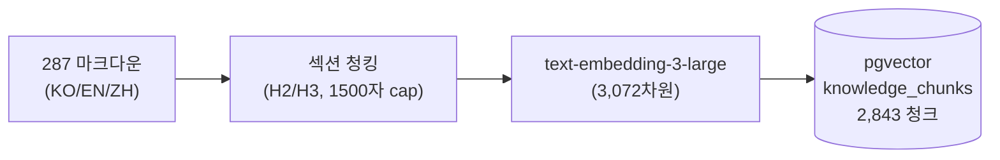
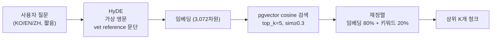

# 1편. RAG 파이프라인 — "300개 의학 문서를 0.X초 안에 정확히 찾아내기"

> 시리즈 1/4 · 비용 ⚖ 속도 ⚖ 정확도 트릴레마

Perch는 한국·영어·중국어 사용자에게 같은 정답을 줘야 한다. 그런데 단순 임베딩 검색은 언어가 다르면 의미가 같아도 유사도가 떨어진다. "我的鹦鹉拔自己的羽毛"와 "feather plucking"이 다른 청크로 매칭되면, 우리는 두 사용자에게 다른 답을 주는 셈이 된다.

이 편의 트릴레마:

| 축 | 이번 편의 결정이 미친 방향 |
| --- | --- |
| 비용 | ↑ — 매 쿼리당 LLM 콜 1회(HyDE) 추가 |
| 속도 | ↓ — HyDE로 +1초, 단 병렬화로 일부 회수 |
| 정확도 | ↑↑ — 다국어 검색 정확도 ↑, 키워드 보너스로 정확 매칭 ↑ |

지식베이스 규모는 **287개 마크다운 파일**(EN+ZH)이 청킹 후 **2,843 청크**(EN 2,306 / ZH 537), 카테고리 상위는 diseases 826, behavior 637, nutrition 543, species 474다. 임베딩 — *텍스트의 의미를 숫자 벡터로 변환한 표현* — 은 `text-embedding-3-large`(3,072차원)로 만들어 **pgvector**(*PostgreSQL이 벡터 유사도 검색을 직접 수행하게 하는 확장*)에 적재한다.

## 결정 1. 청크는 의미 단위로, 헤더는 prefix로

### 문제
의학 문서는 단순 슬라이딩 윈도우로 자르면 증상·원인·치료가 한 청크에서 잘려나간다. 검색은 적중하지만 LLM이 받는 컨텍스트는 반쪽짜리다.

### 우리가 본 선택지
- (a) 고정 길이 슬라이딩 윈도우(±오버랩) — 구현 단순, 의미 손실
- (b) 마크다운 H2/H3 섹션 단위 청킹 — 도메인 구조 활용
- (c) 문장 임베딩 후 의미 군집화 — 정밀하지만 운영 비용

선택: **(b) 섹션 기반.** 우리 KB가 사람 손으로 쓴 마크다운이고, H2가 이미 의미 경계라서 추가 ML이 필요 없다.

### 구체화
- H2 섹션을 1차 분리, H3 서브섹션은 각각 별도 청크
- 1,500자 초과 시 문단(`\n\n`) 경계로 서브 분할
- 100자 미만 청크는 스킵 (의미 부족)
- References 섹션 제외
- 모든 청크 앞에 `# 문서제목 / ## 섹션제목`을 prefix해서 컨텍스트 보존

> 코드: `agent/chunker.py:22-61`

## 결정 2. HyDE — 짧은 질문을 가짜 vet 문단으로 부풀려 검색

### 문제
"앵무새가 깃털을 뽑아요" 같은 짧은 한국어 질문은 임베딩 공간에서 영어 의학 청크와 거리가 크다. 다국어 임베딩 모델을 써도 길이·도메인 어휘 차이로 정확도가 흔들린다.

### 우리가 본 선택지
- (a) 다국어 임베딩 모델만 신뢰 — 비용 0, 정확도 한계
- (b) 질문을 LLM으로 영어로 번역 후 검색 — 의도는 유지되지만 의학 어휘는 빈약
- (c) **HyDE (Hypothetical Document Embeddings)** — *짧은 질문을 LLM이 가짜 영문 의학 문단으로 부풀려 그 문단으로 검색하는 기법.* 질문을 LLM이 "가짜 vet reference 문단"으로 부풀린 뒤 그 문단을 임베딩해서 검색

선택: **(c) HyDE.** 질문이 아니라 "이상적 답변 형태"가 KB 청크와 같은 분포에 있다.

### 비용
- LLM 콜 +1 (`gpt-4o-mini`, 150~300단어, temperature 0.0)
- 응답 +1초 내외
- 단, KB 검색·펫 RAG·DeepSeek 보충은 `asyncio.gather`로 병렬 → 실제 체감은 더 작음 (자세한 건 2편)

### 구체화
- HyDE 프롬프트는 "vet reference document excerpt"를 가장하라고 지시
- 출력 언어는 항상 영어로 강제 (KB가 EN 중심)
- 실패 시 원본 쿼리로 fallback (그레이스풀 디그라데이션 — *부품 하나가 죽어도 전체가 안 죽게 하는 운영 패턴*)

> 코드: `backend/app/services/embedding_service.py:50-69`

## 결정 3. 외부 의존성 없는 경량 재정렬

### 문제
임베딩 유사도만 쓰면 "의미상 가깝지만 단어가 다른" 결과가 상위에 오기도 한다. 의학 도메인에서는 종종 정확 단어 일치(약품명, 종 이름)가 더 중요하다.

### 선택
- (a) Cohere/Cross-encoder 재정렬 모델 — 정확도 ↑↑, 외부 API/추가 모델 비용
- (b) **임베딩 유사도 80% + 키워드 overlap 20% 가중 평균**

(b)를 골랐다. 외부 의존성 0, 추가 지연 거의 0, 그러면서도 종 이름·증상명 같은 hard term 매칭이 살아난다. 검색 자체는 `vector_search_top_k = 5`, `vector_search_min_similarity = 0.3` 기본값을 쓴다 — 너무 멀면 컨텍스트 오염이 더 위험하다.

```python
# vector_search_service.py:_rerank_results (요약)
overlap = sum(1 for term in query_terms if term in content_lower)
overlap_ratio = overlap / max(len(query_terms), 1)
r["_combined_score"] = r["similarity"] * 0.8 + overlap_ratio * 0.2
```

> 코드: `backend/app/services/vector_search_service.py:171-194`

## 흐름 — 인덱싱과 쿼리





## 결산

| 지킨 것 | 양보한 것 |
| --- | --- |
| 다국어 검색 정확도 | 매 쿼리당 LLM 콜 1회(HyDE) |
| 의학 hard term 매칭 | HyDE 응답 +1초 |
| 외부 재정렬 의존성 0 | (없음) |

KB 평균 유사도가 0.3 미만이면 "지식 공백"으로 경고 로그를 남긴다 — 어떤 토픽에 우리 KB가 약한지 운영 중 자동으로 드러난다 (4편에서 이어진다).

다음 편에서는 이 RAG 결과를 받아 LLM이 어떻게 답변을 만드는지, 그리고 **중국 사용자에게는 GPT 단독으로 답해선 안 되는 이유**를 다룬다.

— 2편: LLM 파이프라인 — 듀얼 LLM으로 문화 정확도 잡기
