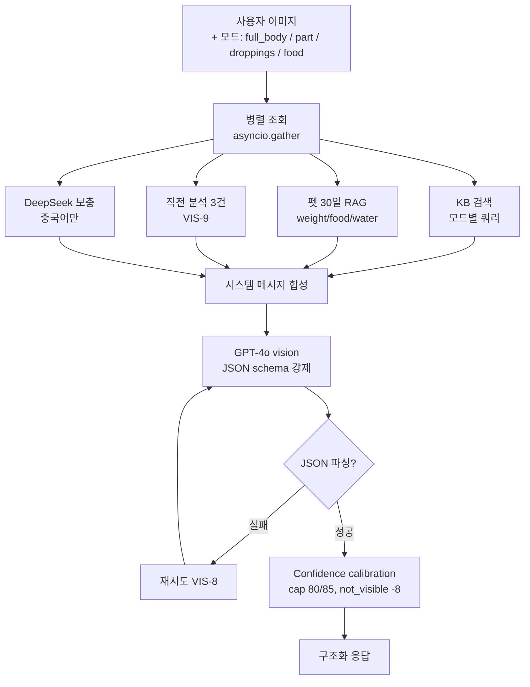

# 3편. Vision 헬스체크 — "사진 한 장이 진단을 자처하지 않게 하는 법"

> 시리즈 3/4 · 비용 ⚖ 속도 ⚖ 정확도 트릴레마

사용자가 새 사진을 올리면 LLM은 자신감 있게 답하려는 경향이 있다. 의료 도메인에서 *과신*은 *오답보다 위험*하다. 사용자는 "AI가 80%로 정상이라고 했어요"를 그대로 진실로 받아들인다. 한 장의 사진은 한 장의 사진일 뿐인데, 모델이 그걸 진단처럼 말해버리면 우리는 사용자를 잘못된 안심으로 밀어 넣는 셈이다.

| 축 | 이번 편의 결정이 미친 방향 |
| --- | --- |
| 비용 | ↑ — Vision은 멀티모달 토큰 비용이 텍스트보다 높음 |
| 속도 | ↓ — 이미지 분석 P95는 텍스트 대비 길다 |
| 정확도 | ↑↑ — confidence 보정·이전 비교로 *체감 신뢰성* 상승 |

## 결정 1. 답을 자유 서술이 아니라 JSON으로 받는다

### 문제
Vision 응답이 자유 서술이면 다운스트림이 모두 깨진다. 앱 UI는 severity를 색으로 표시해야 하고, 알림은 vet_visit_needed 같은 boolean을 봐야 하며, 이전 분석과의 비교는 같은 필드 구조를 전제로 한다. 모델이 한 번 답을 산문으로 쓰면 그 다음 분석은 사람이 다시 정리해야 한다.

### 선택지
- (a) 자유 서술 + 후처리 NLP — 후처리 규칙이 늘수록 깨지기 쉬움
- (b) **JSON schema 강제** — 모델 응답을 미리 정의한 JSON 구조로 박는 기법. 4개 모드(full_body / part_specific / droppings / food)별로 별도 시스템 프롬프트와 별도 schema
- (c) function calling 방식 — 모델 의존도 ↑, 마이그레이션 비용

선택: **(b).** 모드별로 묻는 질문이 다르기 때문에 schema도 달라야 한다. 한 schema로 모든 모드를 덮으면 필드 절반이 비어 의미가 없다.

### 구체화
```json
{
  "mode": "part_specific",
  "part": "eye",
  "findings": [
    {"aspect": "...", "observation": "...",
     "severity": "normal|caution|warning|critical",
     "possible_causes": ["..."]}
  ],
  "overall_status": "...",
  "confidence_score": 0,
  "recommendations": ["..."],
  "vet_visit_needed": false
}
```

JSON 파싱 실패 시 한 번 재시도(VIS-8). 모델이 한 번에 schema를 못 맞춰도 두 번째 호출에서 구조를 회복하면 사용자에게는 정상 응답이 나간다.

> 코드: `backend/app/services/ai_service.py:935-974` (`_get_vision_search_query`, `_build_vision_prompt`)

## 결정 2. 모델의 자신감을 그대로 믿지 않는다

### 문제
GPT-4o는 자가 보고 confidence를 *과대 추정*한다. 사용자에게 "97%"가 그대로 나가면, 사진 한 장으로는 알 수 없는 영역까지 확정 답변처럼 읽힌다. 의료 도메인에서 이 숫자는 글자보다 무겁다.

### 선택지
- (a) confidence를 UI에서 숨김 — 사용자에게 신뢰도 신호 자체가 사라짐
- (b) **confidence calibration** — 모델이 자가 보고한 자신감 점수에 상한·페널티를 박아 보정하는 기법. cap을 두고, 모델이 "이 부위는 보이지 않음(not_visible)"이라고 표시한 영역마다 페널티
- (c) 별도 calibration 모델 학습 — 데이터·운영 비용 ↑

선택: **(b).** 단일 이미지의 한계를 코드 레벨에서 명시한다.

### 구체화
- `full_body` 모드: cap **80**
- `part_specific` 등 다른 모드: cap **85**
- not_visible 영역마다 **-8** 페널티 (최저 20)

```python
# ai_service.py:_calibrate_confidence (요약)
not_visible_count = sum(
    1 for f in findings
    if isinstance(f, dict) and f.get("severity") == "not_visible"
)
if not_visible_count > 0:
    raw_confidence = max(raw_confidence - not_visible_count * 8, 20)
max_cap = 80 if mode == "full_body" else 85
result["confidence_score"] = min(raw_confidence, max_cap)
result["_confidence_raw"] = result.get("confidence_score", 50)
```

원본 점수는 `_confidence_raw`로 보존해 운영 모니터링에 쓴다. 모델의 raw 자신감과 보정값이 얼마나 벌어지는지가 calibration 정책의 다음 튜닝 신호다.

> 코드: `backend/app/services/ai_service.py:1039-1063` (`_calibrate_confidence`)

## 결정 3. 단일 사진 대신 "변화"를 본다 (VIS-9)

### 문제
한 장의 사진만 보고 절대값으로 판단하면, 정상 변이도 이상으로 보일 수 있다. 같은 새도 조명·각도·계절에 따라 깃털 상태가 달라진다. 의학적으로 더 의미 있는 신호는 *같은 새의 변화*다.

### 선택지
같은 펫의 직전 **3건**을 시스템 메시지에 주입한다(VIS-9). 모델이 절대값 대신 "지난번 대비 변화" 중심으로 답하도록 컨텍스트를 깐다.

```
[Previous 3 Health Check Results for Comparison]
- 2026-04-22: status=normal, confidence=78
  overall_status=normal
- 2026-04-15: status=caution, confidence=72
  overall_status=caution
- 2026-04-08: status=normal, confidence=80
  overall_status=normal
```

이전 분석은 펫이 없거나 이력이 없으면 None으로 빠지고(*그레이스풀*, 1편에서 정의), 시스템 메시지에서도 자동 제외된다. 단일 사진 과해석을 줄이는 게 본 목적이고, 부수적으로 모델이 자가 보고하는 confidence도 변화 폭에 따라 더 보수적으로 움직인다.

> 코드: `backend/app/services/ai_service.py:1066-1098` (`_fetch_previous_analyses`)

## 흐름 — Vision 요청 처리



KB 검색·펫 30일 RAG·직전 분석·DeepSeek 보충(2편에서 정의) 네 가지 컨텍스트는 모두 `asyncio.gather`로 병렬 조립된다. 직렬 합산이 아니라서 Vision 응답 지연을 키우지 않는다.

## 결산

| 지킨 것 | 양보한 것 |
| --- | --- |
| 의료 안전성 (과신 방지) | 모델의 자신감 표현 자유도 |
| 응답 구조 안정성 (JSON) | 모드별 schema 운영 복잡도 |
| 단일 사진 과해석 감소 (VIS-9) | 시스템 메시지 길이 ↑ |

다음 편은 운영. 위 1~3편의 결정들이 *실제 장애 상황*에서도 무너지지 않게 하는 안전장치를 본다 — KB가 죽거나 DeepSeek이 타임아웃이거나 OpenAI가 흔들려도 사용자에게 "AI가 망가졌다"가 보이면 안 된다는 운영 원칙.

— 4편: 운영·관측 — 장애가 나도 답변은 나가야 한다
