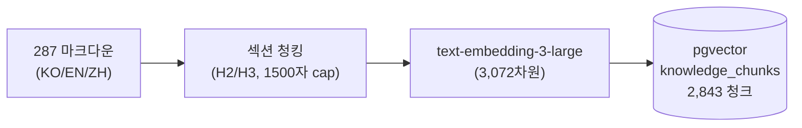

# 1편 — 인덱싱 흐름

```mermaid
flowchart LR
  MD["287 마크다운<br/>(KO/EN/ZH)"] --> CK["섹션 청킹<br/>(H2/H3, 1500자 cap)"]
  CK --> EB["text-embedding-3-large<br/>(3,072차원)"]
  EB --> PG[("pgvector<br/>knowledge_chunks<br/>2,843 청크")]
```
