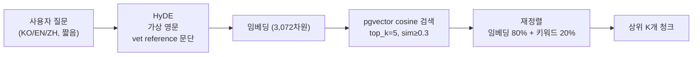

# 1편 — 쿼리 흐름

```mermaid
flowchart LR
  Q["사용자 질문<br/>(KO/EN/ZH, 짧음)"] --> H["HyDE<br/>가상 영문<br/>vet reference 문단"]
  H --> EB["임베딩 (3,072차원)"]
  EB --> S["pgvector cosine 검색<br/>top_k=5, sim≥0.3"]
  S --> R["재정렬<br/>임베딩 80% + 키워드 20%"]
  R --> O["상위 K개 청크"]
```
