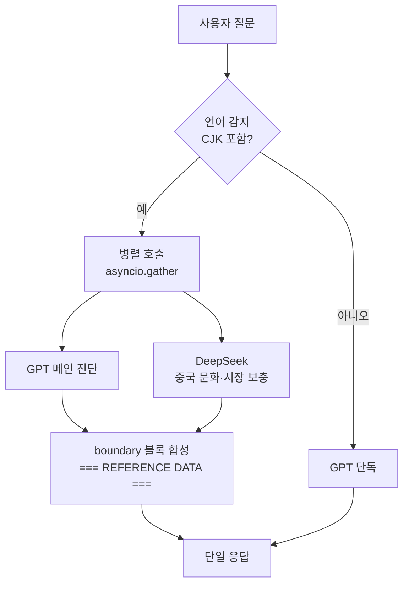

# 2편 — 듀얼 LLM 흐름

```mermaid
flowchart TD
  Q[사용자 질문] --> L{언어 감지<br/>CJK 포함?}
  L -- "예" --> P[병렬 호출<br/>asyncio.gather]
  L -- "아니오" --> G1[GPT 단독]
  P --> G2[GPT 메인 진단]
  P --> D[DeepSeek<br/>중국 문화·시장 보충]
  G2 --> M[boundary 블록 합성<br/>=== REFERENCE DATA ===]
  D --> M
  M --> A[단일 응답]
  G1 --> A
```
