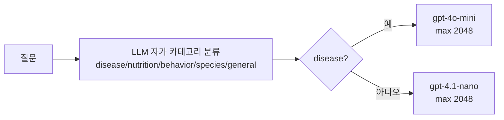

# 2편 — 카테고리 라우팅 결정 트리

```mermaid
flowchart LR
  Q[질문] --> C[LLM 자가 카테고리 분류<br/>disease/nutrition/behavior/species/general]
  C --> D{disease?}
  D -- "예" --> M1[gpt-4o-mini<br/>max 2048]
  D -- "아니오" --> M2[gpt-4.1-nano<br/>max 2048]
```
