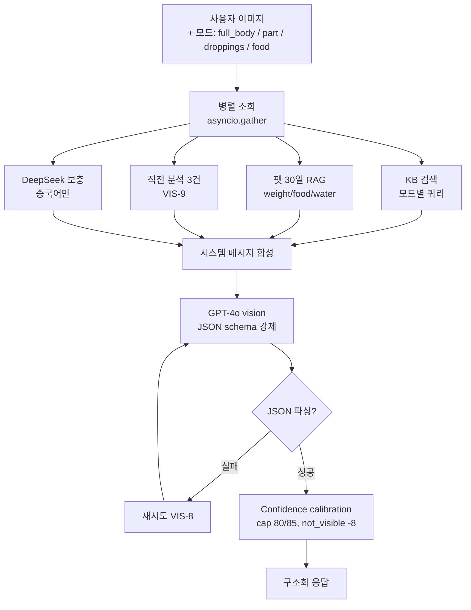

# 3편 — Vision 요청 처리 흐름

```mermaid
flowchart TD
  IMG["사용자 이미지<br/>+ 모드: full_body / part / droppings / food"] --> P[병렬 조회<br/>asyncio.gather]
  P --> KB[KB 검색<br/>모드별 쿼리]
  P --> RAG[펫 30일 RAG<br/>weight/food/water]
  P --> PREV[직전 분석 3건<br/>VIS-9]
  P --> DS[DeepSeek 보충<br/>중국어만]
  KB --> S[시스템 메시지 합성]
  RAG --> S
  PREV --> S
  DS --> S
  S --> V[GPT-4o vision<br/>JSON schema 강제]
  V --> J{JSON 파싱?}
  J -- "실패" --> R[재시도 VIS-8]
  R --> V
  J -- "성공" --> C["Confidence calibration<br/>cap 80/85, not_visible -8"]
  C --> O[구조화 응답]
```
