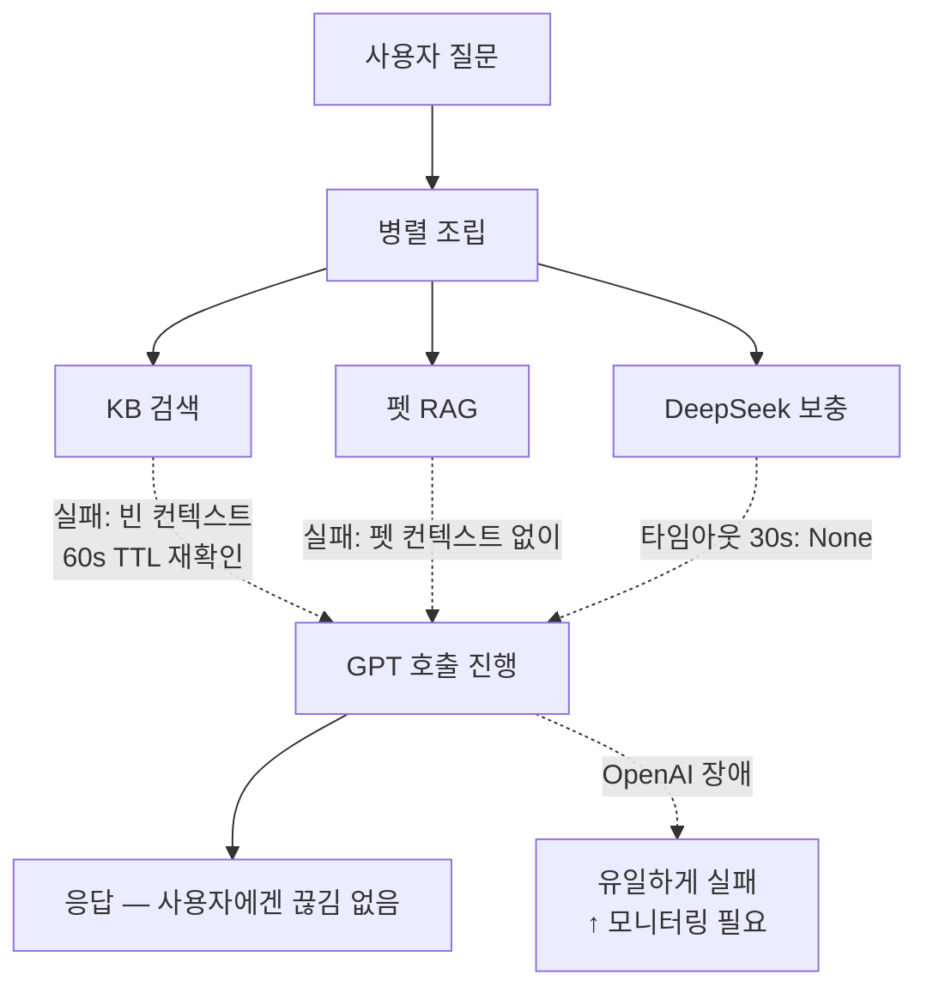

# 4편 — 장애 격리 시나리오

```mermaid
flowchart TD
  Q[사용자 질문] --> S[병렬 조립]
  S --> KB[KB 검색]
  S --> R[펫 RAG]
  S --> D[DeepSeek 보충]
  KB -.->|"실패: 빈 컨텍스트<br/>60s TTL 재확인"| F[GPT 호출 진행]
  R -.->|"실패: 펫 컨텍스트 없이"| F
  D -.->|"타임아웃 30s: None"| F
  F --> O[응답 — 사용자에겐 끊김 없음]
  F -. "OpenAI 장애" .-> E[유일하게 실패<br/>↑ 모니터링 필요]
```
